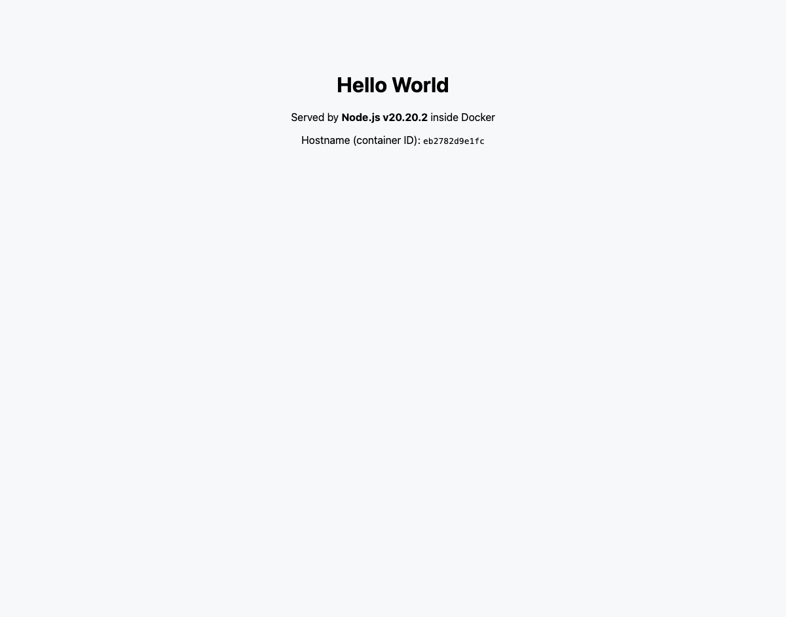
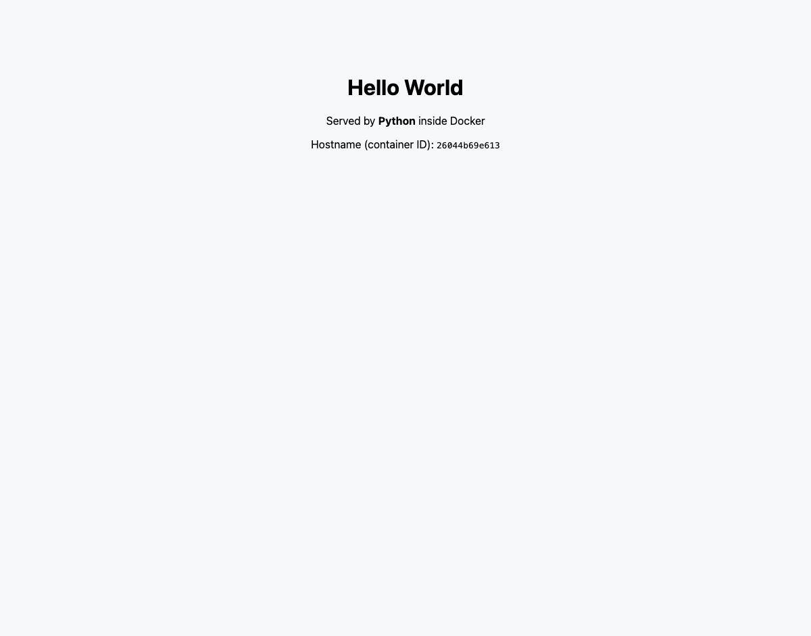
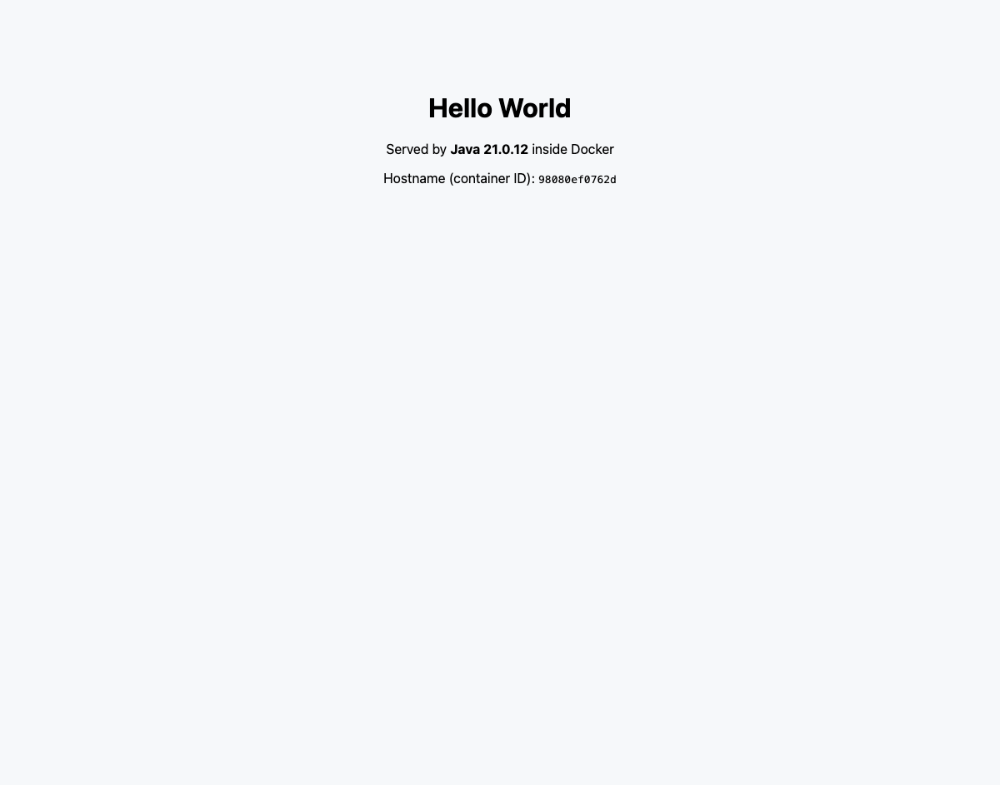
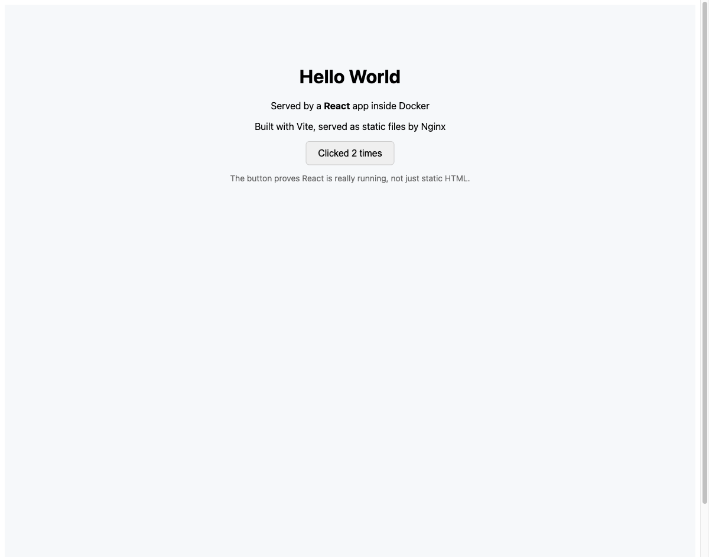

# Docker Fundamentals — Homework

## Task: Hello World Applications

Six separate Hello World web applications, each with its own folder, its own
Dockerfile, built into an image and run as a container, with **Hello World**
verified in a real browser.

### Folder structure

```
05-docker-fundamentals/
├── nodejs-app/          Node.js HTTP server
│   ├── app.js
│   ├── package.json
│   └── Dockerfile
├── python-app/          Python HTTP server
│   ├── app.py
│   ├── requirements.txt
│   └── Dockerfile
├── java-app/            Java HTTP server (multi-stage: JDK builds, JRE runs)
│   ├── src/HelloWorld.java
│   └── Dockerfile
├── apache-app/          Apache httpd serving static HTML
│   ├── public-html/index.html
│   └── Dockerfile
├── react-app/           React + Vite (multi-stage: Node builds, Nginx serves)
│   ├── src/App.jsx
│   ├── src/main.jsx
│   ├── index.html
│   ├── vite.config.js
│   ├── package.json
│   ├── nginx.conf
│   └── Dockerfile
├── nginx-app/           Nginx serving static HTML
│   ├── html/index.html
│   ├── default.conf
│   └── Dockerfile
└── screenshots/         Browser proof for all six
```

### Summary of all six

| App | Base image | Container port | Host port | Image size | Status |
|---|---|---|---|---|---|
| nodejs-app | `node:20-alpine` | 3000 | 9091 | 136 MB | Verified |
| python-app | `python:3.12-alpine` | 5000 | 9092 | 67.3 MB | Verified |
| java-app | `eclipse-temurin:21-jdk` → `21-jre` | 8080 | 9093 | 340 MB | Verified |
| apache-app | `httpd:2.4` | 80 | 9094 | 147 MB | Verified |
| react-app | `node:20-alpine` → `nginx:alpine` | 80 | 9095 | 68.4 MB | Verified |
| nginx-app | `nginx:alpine` | 80 | 9096 | 68.3 MB | Verified |

> **Why host ports 9091–9096?** Ports 8081–8090 were already in use by another
> container on this machine, and Docker refused the bind with
> `Bind for 0.0.0.0:8081 failed: port is already allocated`. Any free host port
> works — only the **right-hand** side of `-p host:container` has to match what
> the app listens on.

---

## Build and run — all six

```bash
# nodejs
docker build -t hello-nodejs:1.0 nodejs-app/
docker run -d --name hello-nodejs -p 9091:3000 hello-nodejs:1.0

# python
docker build -t hello-python:1.0 python-app/
docker run -d --name hello-python -p 9092:5000 hello-python:1.0

# java
docker build -t hello-java:1.0 java-app/
docker run -d --name hello-java -p 9093:8080 hello-java:1.0

# apache
docker build -t hello-apache:1.0 apache-app/
docker run -d --name hello-apache -p 9094:80 hello-apache:1.0

# react
docker build -t hello-react:1.0 react-app/
docker run -d --name hello-react -p 9095:80 hello-react:1.0

# nginx
docker build -t hello-nginx:1.0 nginx-app/
docker run -d --name hello-nginx -p 9096:80 hello-nginx:1.0
```

---

## Verification

```console
==================== ALL SIX CONTAINERS RUNNING ====================
$ docker ps --format 'table {{.Names}}\t{{.Image}}\t{{.Status}}\t{{.Ports}}'
NAMES               IMAGE                                                      STATUS                 PORTS
hello-nginx         hello-nginx:1.0                                            Up 9 seconds           0.0.0.0:9096->80/tcp, [::]:9096->80/tcp
hello-react         hello-react:1.0                                            Up 10 seconds          0.0.0.0:9095->80/tcp, [::]:9095->80/tcp
hello-apache        hello-apache:1.0                                           Up 10 seconds          0.0.0.0:9094->80/tcp, [::]:9094->80/tcp
hello-java          hello-java:1.0                                             Up 10 seconds          0.0.0.0:9093->8080/tcp, [::]:9093->8080/tcp
hello-python        hello-python:1.0                                           Up 10 seconds          0.0.0.0:9092->5000/tcp, [::]:9092->5000/tcp
hello-nodejs        hello-nodejs:1.0                                           Up 11 seconds          0.0.0.0:9091->3000/tcp, [::]:9091->3000/tcp
linux-practice      linux-practice                                             Up 19 minutes          
eloquent_dubinsky   rl_combined_multi_rl_boutique_strategy_consultant:latest   Up 5 hours (healthy)   0.0.0.0:80->80/tcp, [::]:80->80/tcp, 0.0.0.0:8081-8090->8081-8090/tcp, [::]:8081-8090->8081-8090/tcp

==================== IMAGE SIZES ====================
$ docker images --filter=reference='hello-*' --format 'table {{.Repository}}\t{{.Tag}}\t{{.Size}}'
REPOSITORY     TAG       SIZE
hello-react    1.0       68.4MB
hello-nginx    1.0       68.3MB
hello-apache   1.0       147MB
hello-java     1.0       340MB
hello-python   1.0       67.3MB
hello-nodejs   1.0       136MB

==================== VERIFY EACH APP SERVES HELLO WORLD ====================
-------------------- nodejs  (http://localhost:9091) --------------------
$ curl -s http://localhost:9091 | grep -i 'hello world'
    <h1>Hello World</h1>
$ curl -s -o /dev/null -w 'HTTP %{http_code}  |  %{size_download} bytes  |  %{time_total}s\n' http://localhost:9091
HTTP 200  |  354 bytes  |  0.001683s

-------------------- python  (http://localhost:9092) --------------------
$ curl -s http://localhost:9092 | grep -i 'hello world'
    <h1>Hello World</h1>
$ curl -s -o /dev/null -w 'HTTP %{http_code}  |  %{size_download} bytes  |  %{time_total}s\n' http://localhost:9092
HTTP 200  |  343 bytes  |  0.000940s

-------------------- java  (http://localhost:9093) --------------------
$ curl -s http://localhost:9093 | grep -i 'hello world'
    <h1>Hello World</h1>
$ curl -s -o /dev/null -w 'HTTP %{http_code}  |  %{size_download} bytes  |  %{time_total}s\n' http://localhost:9093
HTTP 200  |  348 bytes  |  0.001634s

-------------------- apache  (http://localhost:9094) --------------------
$ curl -s http://localhost:9094 | grep -i 'hello world'
    <h1>Hello World</h1>
$ curl -s -o /dev/null -w 'HTTP %{http_code}  |  %{size_download} bytes  |  %{time_total}s\n' http://localhost:9094
HTTP 200  |  306 bytes  |  0.002052s

-------------------- react  (http://localhost:9095) --------------------
$ curl -s http://localhost:9095 | grep -i 'hello world'
$ curl -s -o /dev/null -w 'HTTP %{http_code}  |  %{size_download} bytes  |  %{time_total}s\n' http://localhost:9095
HTTP 200  |  326 bytes  |  0.001553s

-------------------- nginx  (http://localhost:9096) --------------------
$ curl -s http://localhost:9096 | grep -i 'hello world'
    <h1>Hello World</h1>
$ curl -s -o /dev/null -w 'HTTP %{http_code}  |  %{size_download} bytes  |  %{time_total}s\n' http://localhost:9096
HTTP 200  |  280 bytes  |  0.001355s

```

### Container logs

```console
$ docker logs hello-nodejs
Node.js server listening on port 3000

$ docker logs hello-python
Python server listening on port 5000
192.168.65.1 - "GET / HTTP/1.1" 200 -
192.168.65.1 - "GET / HTTP/1.1" 200 -

$ docker logs hello-java
Java server listening on port 8080

$ docker logs hello-apache | head -3
AH00558: httpd: Could not reliably determine the server's fully qualified domain name, using 172.17.0.7. Set the 'ServerName' directive globally to suppress this message
AH00558: httpd: Could not reliably determine the server's fully qualified domain name, using 172.17.0.7. Set the 'ServerName' directive globally to suppress this message
[Thu Sep 03 16:53:20.900610 2026] [mpm_event:notice] [pid 1:tid 1] AH00489: Apache/2.4.68 (Unix) configured -- resuming normal operations

$ docker logs hello-nginx | head -3
/docker-entrypoint.sh: /docker-entrypoint.d/ is not empty, will attempt to perform configuration
/docker-entrypoint.sh: Looking for shell scripts in /docker-entrypoint.d/
/docker-entrypoint.sh: Launching /docker-entrypoint.d/10-listen-on-ipv6-by-default.sh
```

---

## Browser screenshots — Hello World displayed on a webpage

### 1. Node.js — http://localhost:9091


### 2. Python — http://localhost:9092


### 3. Java — http://localhost:9093


### 4. Apache — http://localhost:9094


### 5. React — http://localhost:9095


> The counter reads **"Clicked 2 times"** because the button was clicked twice
> in the browser before the screenshot. That is deliberate — it proves real
> React state is running client-side, not just static HTML.

### 6. Nginx — http://localhost:9096


---

## Notes on each Dockerfile

### Node.js — dependency layer caching
`package.json` is copied and `npm install` runs **before** the source is
copied. Docker caches each instruction as a layer, so editing `app.js` reuses
the cached dependency layer instead of reinstalling everything. Copying source
first would invalidate the cache on every code change — a very common mistake
that makes builds far slower than they need to be.

### Python — same pattern
`requirements.txt` before `app.py`, for the same caching reason.
`CMD ["python", "-u", "app.py"]` uses **`-u`** for unbuffered output; without
it Python buffers stdout and `docker logs` appears empty until the buffer
flushes, which is confusing when debugging.

### Java — multi-stage build
Two `FROM` lines. Stage 1 (`eclipse-temurin:21-jdk`) compiles with `javac`;
stage 2 (`eclipse-temurin:21-jre`) copies **only the compiled `.class` files**
via `COPY --from=builder`. The JDK, the compiler and the `.java` source never
reach the final image. This is the same technique explored in depth in
[`06-dockerfiles-images`](../06-dockerfiles-images/).

### Apache and Nginx — no `CMD` needed
Both official base images already define a correct `CMD`
(`httpd-foreground` / nginx in the foreground), so the Dockerfiles only copy
static files in. **A container lives exactly as long as its main process** — a
web server must run in the **foreground**, never daemonised, or the container
exits immediately.

### React — multi-stage, and why the HTML looks empty
Stage 1 runs `npm run build`, and Vite emits an optimised bundle to `/app/dist`
(the build log shows `30 modules transformed` and a 143 kB bundle, 46 kB
gzipped). Stage 2 copies only `dist/` into `nginx:alpine`.

The result is **68.4 MB versus roughly 400 MB** if Node and `node_modules` had
been shipped. There is also no reason to ship them: the built output is plain
static files.

Note that `curl http://localhost:9095` returns HTML containing only
`<div id="root"></div>` and **no "Hello World" text**. This is expected and
correct — React renders into that div in the **browser**, so the text lives in
the JavaScript bundle:

```console
$ curl -s http://localhost:9095/assets/index-V8JhT9Cw.js | grep -o "Hello World"
Hello World
```

This is exactly why the screenshot matters as evidence for an SPA: `curl` alone
cannot prove a React app works.

The `nginx.conf` uses `try_files $uri $uri/ /index.html` so client-side routes
fall back to `index.html` instead of returning 404 on refresh.

---

## Key concepts

| Term | Meaning |
|---|---|
| **Image** | The immutable template — a filesystem plus metadata. Built once. |
| **Container** | A running instance of an image. Many containers per image. |
| **Dockerfile** | The recipe used to build an image. |
| **Layer** | One filesystem diff per instruction; cached and shared between images. |
| **`EXPOSE`** | Documentation only — it does **not** publish a port. |
| **`-p host:container`** | What actually publishes a port to the host. |
| **`CMD`** | Default command; a container stops when this process exits. |

### Commands used

| Command | Purpose |
|---|---|
| `docker build -t name:tag dir/` | Build an image from a Dockerfile |
| `docker run -d --name x -p 9091:3000 img` | Run detached with a port published |
| `docker ps` | List running containers |
| `docker images` | List images |
| `docker logs <name>` | Read a container's stdout/stderr |
| `docker exec -it <name> sh` | Get a shell inside a running container |
| `docker stop` / `docker rm` | Stop / remove a container |

---

## Submission checklist

| Requirement | Status |
|---|---|
| Node.js application | Done — `nodejs-app/`, port 9091 |
| Python application | Done — `python-app/`, port 9092 |
| Java application | Done — `java-app/`, port 9093 |
| Apache web server | Done — `apache-app/`, port 9094 |
| React application | Done — `react-app/`, port 9095 |
| Nginx application | Done — `nginx-app/`, port 9096 |
| Separate folder per app | Done — six folders |
| Application code in each | Done |
| Dockerfile in each | Done — six Dockerfiles |
| Docker image built | Done — all six built successfully |
| Application run with Docker | Done — all six running, `docker ps` above |
| **Hello World shown on a webpage** | Done — six browser screenshots |
