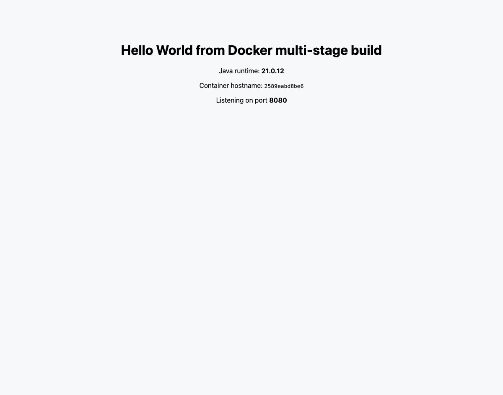

# Dockerfiles & Images — Multi-Stage Build Homework

## Task 2 — Documentation

| Field | Value |
|---|---|
| **Name** | Shaurya |
| **Enrollment Number** | `__ENROLLMENT__` |
| **GitHub** | [astro-dude](https://github.com/astro-dude) |
| **Application port** | 8080 |
| **Required message** | Hello World from Docker multi-stage build |
| **Status** | Verified — running, screenshot and `docker ps` below |

---

## What a multi-stage build is

A multi-stage Dockerfile has **more than one `FROM`**. Each `FROM` begins a new
stage with a completely fresh filesystem. The final stage becomes the image you
ship; every earlier stage is thrown away, except for the specific files you
explicitly copy forward with `COPY --from=<stage>`.

The problem it solves: **the tools you need to build software are not the tools
you need to run it.** A JDK, Maven, npm and a full source tree are all essential
at build time and pure dead weight — and extra attack surface — at runtime.

```
┌─────────────────────────────┐        ┌─────────────────────────────┐
│  STAGE 1: builder           │        │  STAGE 2: runtime           │
│  FROM eclipse-temurin:21-jdk│        │  FROM eclipse-temurin:21-jre│
│                             │        │                             │
│  • the .java source         │        │  • HelloWorld.class ONLY    │
│  • javac compiler           │──┐     │                             │
│  • full JDK (501 MB)        │  │     │  no compiler                │
│                             │  │     │  no source code             │
│  RUN javac ...              │  │     │  340 MB                     │
└─────────────────────────────┘  │     └─────────────────────────────┘
                                 │                    ▲
          discarded entirely ────┘   COPY --from=builder /build/classes ./
```

## The Dockerfile

```dockerfile
# ---------------------- Stage 1: BUILD ----------------------
FROM eclipse-temurin:21-jdk AS builder

WORKDIR /build
COPY src/HelloWorld.java ./
RUN javac -d /build/classes HelloWorld.java

# ---------------------- Stage 2: RUNTIME --------------------
FROM eclipse-temurin:21-jre

WORKDIR /app
# Copy ONLY the compiled output from the builder stage
COPY --from=builder /build/classes ./

EXPOSE 8080
CMD ["java", "HelloWorld"]
```

Source: [`app/Dockerfile`](app/Dockerfile) · application:
[`app/src/HelloWorld.java`](app/src/HelloWorld.java)

---

## Task 1 — Build, run, access and verify

```bash
# Build the image from the multi-stage Dockerfile
docker build -t multistage-app:1.0 app/

# Run a container from it, publishing port 8080
docker run -d --name multistage-app -p 8080:8080 multistage-app:1.0

# Access the application
curl http://localhost:8080
```

### Output

```console
==================== TASK 1: BUILD, RUN, ACCESS ====================
$ docker ps --filter name=multistage-app --format 'table {{.Names}}\t{{.Image}}\t{{.Status}}\t{{.Ports}}'
NAMES            IMAGE                STATUS        PORTS
multistage-app   multistage-app:1.0   Up 1 second   0.0.0.0:8080->8080/tcp, [::]:8080->8080/tcp

--- ^ CONFIRMED: container running, port 8080 ---
$ docker port multistage-app
8080/tcp -> 0.0.0.0:8080
8080/tcp -> [::]:8080

==================== ACCESSING THE APPLICATION ====================
$ curl -s http://localhost:8080
<!doctype html>
<html>
  <head><title>Docker Multi-Stage Build</title></head>
  <body style="font-family: system-ui, sans-serif; text-align:center; padding-top:70px; background:#f6f8fa;">
    <h1>Hello World from Docker multi-stage build</h1>
    <p>Java runtime: <strong>21.0.12</strong></p>
    <p>Container hostname: <code>2589eabd8be6</code></p>
    <p>Listening on port <strong>8080</strong></p>
  </body>
</html>

==================== THE REQUIRED MESSAGE ====================
$ curl -s http://localhost:8080 | grep -o 'Hello World from Docker multi-stage build'
Hello World from Docker multi-stage build

$ curl -s -o /dev/null -w 'HTTP status: %{http_code}\n' http://localhost:8080
HTTP status: 200

$ docker logs multistage-app
Multi-stage demo listening on port 8080

==================== IMAGE SIZE: MULTI-STAGE vs SINGLE-STAGE ====================
$ docker images --format 'table {{.Repository}}\t{{.Tag}}\t{{.Size}}' | grep -E 'REPOSITORY|multistage-app|hello-singlestage|temurin'
REPOSITORY                                          TAG                      SIZE
hello-singlestage                                   1.0                      501MB
multistage-app                                      1.0                      340MB
maven                                               3.9-eclipse-temurin-21   564MB
eclipse-temurin                                     21-jre                   340MB
eclipse-temurin                                     21-jdk                   501MB

==================== WHAT IS INSIDE THE FINAL IMAGE ====================
$ docker exec multistage-app ls -la /app
total 12
drwxr-xr-x 1 root root 4096 Sep  3 16:56 .
drwxr-xr-x 1 root root 4096 Sep  3 16:56 ..
-rw-r--r-- 1 root root 3833 Sep  3 16:56 HelloWorld.class

--- the .java SOURCE is gone from the final image: ---
$ docker exec multistage-app sh -c 'find / -name "*.java" 2>/dev/null | head' || echo '(no .java files found - source did not ship)'

--- the COMPILER (javac) is gone too: ---
$ docker exec multistage-app sh -c 'command -v javac || echo "javac NOT PRESENT - only the JRE shipped"'
javac NOT PRESENT - only the JRE shipped

--- but java itself is obviously present: ---
$ docker exec multistage-app java -version
openjdk version "21.0.12" 2026-07-21 LTS
OpenJDK Runtime Environment Temurin-21.0.12+8 (build 21.0.12+8-LTS)
OpenJDK 64-Bit Server VM Temurin-21.0.12+8 (build 21.0.12+8-LTS, mixed mode, sharing)

==================== COMPARE: the single-stage image DOES ship them ====================
$ docker run --rm hello-singlestage:1.0 sh -c 'echo "javac: $(command -v javac)"; echo "source: $(find / -name HelloWorld.java 2>/dev/null | head -1)"'
javac: /opt/java/openjdk/bin/javac
source: /app/HelloWorld.java

==================== IMAGE LAYER HISTORY ====================
$ docker history multistage-app:1.0 --format 'table {{.CreatedBy}}\t{{.Size}}' | head -12
CREATED BY                                      SIZE
CMD ["java" "HelloWorld"]                       0B
EXPOSE [8080/tcp]                               0B
COPY /build/classes ./ # buildkit               3.83kB
WORKDIR /app                                    0B
ENTRYPOINT ["/__cacert_entrypoint.sh"]          0B
COPY --chmod=755 entrypoint.sh /__cacert_ent…   5.98kB
RUN /bin/sh -c set -eux;     echo "Verifying…   0B
RUN /bin/sh -c set -eux;     ARCH="$(dpkg --…   165MB
ENV JAVA_VERSION=jdk-21.0.12+8                  0B
RUN /bin/sh -c set -eux;     apt-get update;…   54.9MB
ENV LANG=en_US.UTF-8 LANGUAGE=en_US:en LC_AL…   0B

```

### Screenshot — application running on port 8080



The browser shows the exact required text: **Hello World from Docker
multi-stage build**, together with the Java runtime version, the container
hostname `2589eabd8be6` and the port.

### `docker ps` — container running on port 8080

```console
$ docker ps --filter name=multistage-app --format 'table {{.Names}}\t{{.Image}}\t{{.Status}}\t{{.Ports}}'
NAMES            IMAGE                STATUS        PORTS
multistage-app   multistage-app:1.0   Up 1 second   0.0.0.0:8080->8080/tcp, [::]:8080->8080/tcp
```

`docker port` confirms the mapping independently:

```console
$ docker port multistage-app
8080/tcp -> 0.0.0.0:8080
8080/tcp -> [::]:8080
```

---

## What the multi-stage build actually achieved

I built the **same application twice** — once multi-stage, once single-stage —
so the difference is measurable rather than theoretical.

| | Single-stage | Multi-stage | Saving |
|---|---|---|---|
| Base image kept | `21-jdk` | `21-jre` | |
| **Final image size** | **501 MB** | **340 MB** | **161 MB (32%)** |
| `javac` compiler present | Yes — `/opt/java/openjdk/bin/javac` | **No** | |
| `.java` source present | Yes — `/app/HelloWorld.java` | **No** | |
| Contents of `/app` | source + classes | `HelloWorld.class` only (3,833 bytes) | |

Verified directly inside the running containers:

```console
$ docker exec multistage-app sh -c 'command -v javac || echo "javac NOT PRESENT"'
javac NOT PRESENT - only the JRE shipped

$ docker exec multistage-app ls -la /app
-rw-r--r-- 1 root root 3833 Sep  3 16:56 HelloWorld.class

$ docker run --rm hello-singlestage:1.0 sh -c 'echo "javac: $(command -v javac)"; echo "source: $(find / -name HelloWorld.java 2>/dev/null | head -1)"'
javac: /opt/java/openjdk/bin/javac
source: /app/HelloWorld.java
```

The single-stage image genuinely ships the compiler and the source code. The
multi-stage one ships neither.

`docker history` confirms the final image's own contribution is a single
**3.83 kB** layer on top of the JRE base:

```console
CREATED BY                                      SIZE
CMD ["java" "HelloWorld"]                       0B
EXPOSE [8080/tcp]                               0B
COPY /build/classes ./ # buildkit               3.83kB
WORKDIR /app                                    0B
```

### Why this matters beyond size

1. **Security.** Source code and build tooling are not in production. If someone
   gets a shell in the container there is no compiler to build an exploit with,
   and no proprietary source to read. Fewer packages also means fewer CVEs.
2. **Speed.** Smaller images push and pull faster — this compounds on every
   deploy, every node scale-up and every CI run.
3. **Cost.** Registry storage and cross-AZ transfer are billed by the byte.
4. **One reproducible file.** The build toolchain lives in the Dockerfile, so
   nobody needs a JDK installed to build the app — only Docker.

> A 32% saving is modest because the JRE is itself large. The same technique on
> a Go binary (`FROM scratch`) or the React app in
> [`05-docker-fundamentals/react-app`](../05-docker-fundamentals/react-app)
> — **68.4 MB instead of roughly 400 MB** — is far more dramatic. Bigger
> toolchain, bigger win.

### Useful extras

```bash
# Build only up to a named stage (handy for debugging the builder)
docker build --target builder -t myapp:builder app/

# Copy from an image that isn't even a stage in this Dockerfile
COPY --from=nginx:alpine /etc/nginx/nginx.conf /etc/nginx/nginx.conf
```

---

## Task 3 — Deploying multiple application types with Docker

The task asks for at least **3** different types. **Seven** containers across
**five** distinct runtimes are running, built from the Dockerfiles in
[`05-docker-fundamentals`](../05-docker-fundamentals/):

| # | Type | Image | Port | Runtime version |
|---|---|---|---|---|
| 1 | Node.js | `hello-nodejs:1.0` | 9091 | v20.20.2 |
| 2 | Python | `hello-python:1.0` | 9092 | 3.12.14 |
| 3 | Java | `hello-java:1.0` | 9093 | Temurin 21.0.12 |
| 4 | Apache httpd | `hello-apache:1.0` | 9094 | 2.4.68 |
| 5 | React (SPA) | `hello-react:1.0` | 9095 | Vite build on nginx |
| 6 | Nginx | `hello-nginx:1.0` | 9096 | 1.31.5 |
| 7 | Java multi-stage | `multistage-app:1.0` | 8080 | Temurin 21.0.12 |

```console
==================== TASK 3: MULTIPLE APP TYPES DEPLOYED ====================
$ docker ps --filter name=hello- --filter name=multistage --format 'table {{.Names}}\t{{.Image}}\t{{.Status}}\t{{.Ports}}'
NAMES            IMAGE                STATUS          PORTS
multistage-app   multistage-app:1.0   Up 37 seconds   0.0.0.0:8080->8080/tcp, [::]:8080->8080/tcp
hello-nginx      hello-nginx:1.0      Up 4 minutes    0.0.0.0:9096->80/tcp, [::]:9096->80/tcp
hello-react      hello-react:1.0      Up 4 minutes    0.0.0.0:9095->80/tcp, [::]:9095->80/tcp
hello-apache     hello-apache:1.0     Up 4 minutes    0.0.0.0:9094->80/tcp, [::]:9094->80/tcp
hello-java       hello-java:1.0       Up 4 minutes    0.0.0.0:9093->8080/tcp, [::]:9093->8080/tcp
hello-python     hello-python:1.0     Up 4 minutes    0.0.0.0:9092->5000/tcp, [::]:9092->5000/tcp
hello-nodejs     hello-nodejs:1.0     Up 4 minutes    0.0.0.0:9091->3000/tcp, [::]:9091->3000/tcp

==================== EACH ONE RESPONDING ====================
Node.js            port 9091  -> HTTP 200
Python             port 9092  -> HTTP 200
Java               port 9093  -> HTTP 200
Apache             port 9094  -> HTTP 200
React              port 9095  -> HTTP 200
Nginx              port 9096  -> HTTP 200
Java-multistage    port 8080  -> HTTP 200

==================== RUNTIME VERSIONS INSIDE EACH CONTAINER ====================
$ docker exec hello-nodejs node --version
v20.20.2

$ docker exec hello-python python --version
Python 3.12.14

$ docker exec hello-java java -version
openjdk version "21.0.12" 2026-07-21 LTS
OpenJDK Runtime Environment Temurin-21.0.12+8 (build 21.0.12+8-LTS)
OpenJDK 64-Bit Server VM Temurin-21.0.12+8 (build 21.0.12+8-LTS, mixed mode, sharing)

$ docker exec hello-apache httpd -v
Server version: Apache/2.4.68 (Unix)
Server built:   Aug 25 2026 00:21:09

$ docker exec hello-nginx nginx -v
nginx version: nginx/1.31.5

```

### One-command deployment with Docker Compose

[`docker-compose.yml`](docker-compose.yml) brings up three of the application
types together:

```bash
docker compose up -d     # build and start all three
docker compose ps        # check status
docker compose down      # stop and clean up
```

---

## Submission checklist

| Task | Requirement | Status |
|---|---|---|
| 1 | Multi-stage Dockerfile | Done — [`app/Dockerfile`](app/Dockerfile), 2 stages |
| 1 | Build the image | Done — `multistage-app:1.0`, 340 MB |
| 1 | Run a container from it | Done — `docker run -d -p 8080:8080` |
| 1 | Access the application | Done — `curl` + browser, HTTP 200 |
| 1 | Shows "Hello World from Docker multi-stage build" | Done — screenshot + `grep` match |
| 1 | Verify with `docker ps` | Done — output above |
| 1 | Confirm running on port 8080 | Done — `0.0.0.0:8080->8080/tcp`, `docker port` |
| 2 | `.md` with name | Done — top of this file |
| 2 | `.md` with enrollment number | Done — top of this file |
| 2 | Screenshot of the app running | Done |
| 2 | Screenshot of `docker ps` on port 8080 | Done |
| 3 | Deploy 3+ application types | Done — **7 containers, 5 runtimes** |
