# CI/CD & GitHub Actions — Homework

Session 16. A complete CI/CD demo project built on GitHub Actions: a small
Python/Flask **calculator API** with real unit tests, a Dockerfile, and one
workflow that tests on a matrix of GitHub-hosted runners, builds a release bundle
and a Docker image, publishes the image to **GitHub Container Registry**, and then
**deploys it to a Kubernetes (kind) cluster created on the runner**, followed by a
smoke test against the running pods.

It extends the course reference `session-16-github-actions/10-final-cicd-pipeline`
(calculator + `test → security-check / build → artifact`) with the CD half the
reference stops short of ("the next step is to connect the pipeline to a
deployment target such as Docker, Kubernetes …").

Everything below — run IDs, logs, screenshots — comes from **real runs** of this
workflow on GitHub:
<https://github.com/Astro-Dude/devops-assignments/actions/workflows/s16-ci-cd.yml>

> **Where the workflow lives.** GitHub only executes workflows stored in the
> repository-root `.github/workflows/` directory. The workflow that actually runs is
> [`/.github/workflows/s16-ci-cd.yml`](../../.github/workflows/s16-ci-cd.yml).
> An identical copy is kept here in
> [`.github/workflows/ci-cd.yml`](.github/workflows/ci-cd.yml) so the project folder
> is self-contained; that copy is **not** executed. Because this repository holds
> many assignments, the root workflow uses a `paths:` filter so it only runs when
> something under `DevOps/16-github-actions/` (or the workflow itself) changes, and
> `defaults.run.working-directory` so every `run:` step executes inside this folder.

Line numbers quoted below (`L45`) refer to the workflow file.

---

## Project layout

```
16-github-actions/
├── app/
│   ├── __init__.py          version string
│   ├── calculator.py        pure business logic: add / subtract / multiply / divide
│   └── main.py              Flask API: /, /health, /api/<operation>?a=&b=
├── tests/
│   ├── conftest.py
│   ├── test_calculator.py   6 unit tests for the logic
│   └── test_api.py          10 tests for the HTTP layer (Flask test client)
├── requirements.txt         runtime deps (flask, gunicorn) - pinned
├── requirements-dev.txt     + pytest, pytest-cov
├── pytest.ini / .coveragerc
├── build.sh                 build step: byte-compile + versioned tarball + build-info + checksums
├── Dockerfile               multi-stage, non-root, HEALTHCHECK, gunicorn
├── .dockerignore
├── k8s/
│   ├── deployment.yaml      2 replicas, probes, resource limits, imagePullSecret
│   └── service.yaml
├── .github/workflows/ci-cd.yml   reference copy of the root workflow
├── evidence/                raw transcripts (gh run list/view, job logs, artifact download)
└── screenshots/             GitHub Actions UI captured from the real runs
```

### The application

| Endpoint | Example | Response |
|---|---|---|
| `GET /` | | service name, version, **git SHA it was built from**, pod hostname |
| `GET /health` | | `{"status":"ok"}` (used by Docker HEALTHCHECK and k8s probes) |
| `GET /api/<op>` | `/api/divide?a=9&b=2` | `{"result": 4.5, ...}` |
| | `/api/divide?a=1&b=0` | HTTP 400 `Cannot divide by zero` |
| | `/api/power?a=2&b=3` | HTTP 404 unknown operation |

`GIT_SHA` is baked into the image at build time (`--build-arg GIT_SHA=${{ github.sha }}`),
which lets the CD smoke test prove that the pod running in the cluster is the exact
commit that triggered the pipeline.

### Running it locally (before pushing)

Real output, from [`evidence/local-run.txt`](evidence/local-run.txt) (host port 9201):

```bash
$ pytest -v --cov --cov-report=term
...
tests/test_calculator.py::test_divide_by_zero PASSED                     [100%]
Name                Stmts   Miss  Cover
---------------------------------------
app/__init__.py         1      0   100%
app/calculator.py      11      0   100%
app/main.py            32      0   100%
---------------------------------------
TOTAL                  44      0   100%
============================== 16 passed in 0.10s ==============================

$ docker run -d --name s16-calc -p 9201:8000 s16-calculator:local
$ docker ps --filter name=s16-calc
NAMES      IMAGE                  STATUS                    PORTS
s16-calc   s16-calculator:local   Up 18 seconds (healthy)   0.0.0.0:9201->8000/tcp, [::]:9201->8000/tcp
$ curl -s -w ' [HTTP %{http_code}]' 'localhost:9201/api/add?a=2&b=3'
{"a":2.0,"b":3.0,"operation":"add","result":5.0}
 [HTTP 200]
$ curl -s -w ' [HTTP %{http_code}]' 'localhost:9201/api/divide?a=9&b=0'
{"error":"Cannot divide by zero"}
 [HTTP 400]
```

---

## Task 1 — CI vs CD

| | **Continuous Integration (CI)** | **Continuous Delivery / Deployment (CD)** |
|---|---|---|
| Question it answers | "Is this commit correct?" | "Get this correct commit running for users." |
| Runs on | every push **and** every pull request | only for code that has landed on `main` (or a manual run) |
| Output | a verdict (✓/✗) + build artifacts | a published image + a running deployment |
| In this workflow | `test` (matrix), `test-report`, `security-check`, `build` | `publish` (GHCR), `deploy` (kind + smoke test) |

The split is enforced in the workflow, not just by naming. The first CD job has

```yaml
  publish:
    needs: build
    # Continuous Delivery only for main (or a manual run) - never for pull requests
    if: (github.event_name == 'push' && github.ref == 'refs/heads/main') || github.event_name == 'workflow_dispatch'   # L220
```

so a pull request runs the full CI half (tests, security check, build, artifacts)
and stops; nothing is published or deployed from un-reviewed code. `deploy`
`needs: publish`, so it is skipped with it.

Strictly, this pipeline is **Continuous Deployment**: a green push to `main`
goes all the way to a running cluster with no human click. Turning it into
Continuous *Delivery* would only need a required reviewer on the
`s16-kind-ephemeral` environment (Settings → Environments), which pauses the
`deploy` job until someone approves.

---

## Task 2 — The CI/CD pipeline

```
 git push ──► GitHub ──► workflow "S16 CI/CD - Calculator"
                              │
         ┌────────────────────┴───────────── CI ─────────────────────────────┐
         │  test (matrix, 5 runners) ──┬──► security-check ──► build ──┐     │
         │                             └──► test-report (always)       │     │
         └──────────────────────────────────────────────────────────────┼─────┘
                                                                         │ artifacts:
         ┌──────────────────────────────── CD (main only) ──────────────┼─────┐
         │              publish  (download docker-image, push to GHCR) ◄┘     │
         │                 │                                                  │
         │              deploy   (download calculator-build, kind cluster,    │
         │                        kubectl apply, rollout, smoke test)         │
         └────────────────────────────────────────────────────────────────────┘
```

Each stage is a gate: a stage only starts if the stages it `needs:` succeeded.
The job graph GitHub draws for a real run of this file is exactly that shape:

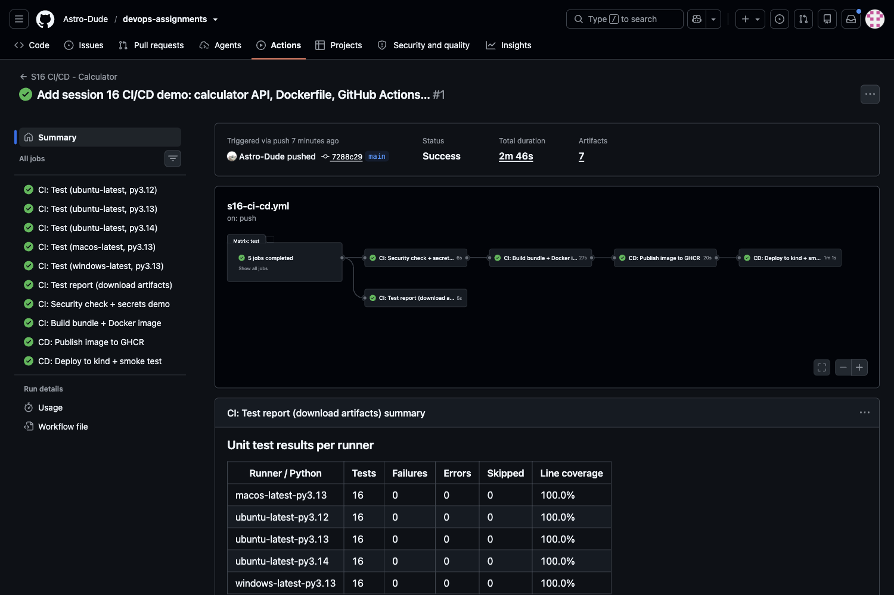

*(Run #1, `7288c29`. Left: all 10 jobs green. Graph: the 5-job test matrix fans out
to `security-check` and `test-report`; `build → publish → deploy` follow in sequence.
Below the graph is the job summary written by `test-report`.)*

---

## Task 3 — GitHub Actions

GitHub Actions is the CI/CD service built into GitHub. The vocabulary, mapped to
this repository:

| Term | Here |
|---|---|
| **Workflow** | `.github/workflows/s16-ci-cd.yml` — one YAML file, one automated process |
| **Event / trigger** | `push`, `pull_request`, `workflow_dispatch` (L11–22) |
| **Job** | `test`, `test-report`, `security-check`, `build`, `publish`, `deploy` |
| **Step** | each `- name:` entry inside a job: either `run:` (a shell command) or `uses:` (an action) |
| **Action** | reusable step published on GitHub: `actions/checkout@v7`, `actions/setup-python@v7`, `actions/upload-artifact@v7`, `actions/download-artifact@v8`, `docker/login-action@v4`, `helm/kind-action@v1.15.1` |
| **Runner** | the VM that executes a job: `ubuntu-latest`, `macos-latest`, `windows-latest` |
| **Run** | one execution of the workflow, e.g. run `37627185543` |

---

## Task 4 — Workflow

```yaml
name: S16 CI/CD - Calculator

on:
  push:
    branches: [main]
    paths:
      - "DevOps/16-github-actions/**"
      - ".github/workflows/s16-ci-cd.yml"
  pull_request:
    branches: [main]
    paths: [ same two paths ]
  workflow_dispatch:                 # "Run workflow" button in the Actions tab

permissions:
  contents: read                     # least privilege; publish/deploy ask for more

concurrency:
  group: s16-${{ github.ref }}
  cancel-in-progress: true           # a newer push to the same branch cancels the older run

env:
  APP_DIR: DevOps/16-github-actions
  IMAGE_NAME: ghcr.io/astro-dude/devops-assignments/s16-calculator

defaults:
  run:
    shell: bash                      # same shell on Linux, macOS and Windows runners
    working-directory: DevOps/16-github-actions
```

Points worth noting:

- **`paths:` filter** — this repository contains ~16 assignments; without the
  filter every commit to any of them would rebuild and redeploy this app.
- **`defaults.run.working-directory`** applies only to `run:` steps. `uses:` steps
  (upload/download-artifact) always resolve paths from the repository root, which
  is why they use `${{ env.APP_DIR }}/reports/` etc. Jobs that never check the repo
  out (`publish`, `test-report`) override it back to `.`, because a
  `working-directory` that does not exist makes every `run:` step fail.
- **`shell: bash`** — the Windows runner defaults to PowerShell; forcing bash keeps
  one set of commands for all three operating systems.

---

## Task 5 — Jobs (and `needs:`)

| Job | `needs:` | Condition | Purpose |
|---|---|---|---|
| `test` (L43) | — | always | unit tests + coverage on 5 runner/Python combinations |
| `test-report` (L100) | `test` | `if: always()` | download all test artifacts, publish a results table |
| `security-check` (L135) | `test` | default (needs success) | sensitive-file scan + secrets demo |
| `build` (L168) | `[test, security-check]` | default | release bundle + Docker image + container smoke test |
| `publish` (L216) | `build` | push to `main` / manual | push image to GHCR |
| `deploy` (L256) | `publish` | (inherits) | kind cluster, deploy, smoke test |

Jobs without a `needs:` relationship run **in parallel on separate runners**
(the five `test` legs; `security-check` and `test-report`). `needs:` turns them
into a pipeline and is also what makes a failure stop the line — see
[Task 13](#task-13--pipeline-execution-fail--fix--green).

`test-report` uses `if: always()` on purpose: when tests *fail* is exactly when you
most want the report.

---

## Task 6 — Steps

The `build` job, as an example of `uses:` and `run:` steps mixed:

```yaml
    steps:
      - name: Checkout source code             # action
        uses: actions/checkout@v7
      - name: Setup Python                     # action with inputs
        uses: actions/setup-python@v7
        with:
          python-version: "3.13"
      - name: Build release bundle             # shell, with a step-level env var
        env:
          GIT_SHA: ${{ github.sha }}
        run: ./build.sh
      - name: Upload build artifact
        uses: actions/upload-artifact@v7
        ...
      - name: Build Docker image
        run: |
          docker build --build-arg GIT_SHA=${{ github.sha }} -t s16-calculator:${{ github.sha }} .
      - name: Smoke-test the container
        ...
      - name: Save image as artifact
        ...
```

Steps in a job run **sequentially on the same runner** and share its filesystem,
which is why `build.sh` output in step 3 can be uploaded in step 4. Steps can be
conditional too: `Upload test report` has `if: always()` (L92) so it still uploads
when the test step failed, and `deploy` has a `Debug on failure` step with
`if: failure()` (L319) that only runs if something before it broke (it shows as
skipped in green runs — visible in the deploy screenshot below).

Steps also communicate with later jobs through **outputs**: `publish` writes
`image=…` to `$GITHUB_OUTPUT` and `deploy` reads it as
`${{ needs.publish.outputs.image }}`.

---

## Task 7 — Runners

All jobs run on **GitHub-hosted runners** — fresh VMs, created for the job and
destroyed afterwards. The `test` job uses a **matrix** to run the same steps on
three operating systems and three Python versions:

```yaml
  test:
    name: "CI: Test (${{ matrix.os }}, py${{ matrix.python-version }})"
    runs-on: ${{ matrix.os }}                       # L45
    strategy:
      fail-fast: false                              # let every leg finish, even if one fails
      matrix:
        os: [ubuntu-latest]
        python-version: ["3.12", "3.13", "3.14"]
        include:
          - os: macos-latest
            python-version: "3.13"
          - os: windows-latest
            python-version: "3.13"
```

That expands to 5 jobs. The `Show runner details` step printed what each one
actually got (run `37627185543`, from
[`evidence/run-37627185543-full.log`](evidence/run-37627185543-full.log)):

```
CI: Test (ubuntu-latest, py3.12)   | Runner OS   : Linux (X64)    | Image : ubuntu24 20260927.320.1    | Workspace : /home/runner/work/devops-assignments/devops-assignments
CI: Test (ubuntu-latest, py3.14)   | Runner OS   : Linux (X64)    | Image : ubuntu24 20261004.327.1    | Workspace : /home/runner/work/devops-assignments/devops-assignments
CI: Test (macos-latest, py3.13)    | Runner OS   : macOS (ARM64)  | Image : macos26 20260907.0351.1    | Workspace : /Users/runner/work/devops-assignments/devops-assignments
CI: Test (windows-latest, py3.13)  | Runner OS   : Windows (X64)  | Image : win25-vs2026 20260925.250.1 | Workspace : D:\a\devops-assignments\devops-assignments
```

*(Condensed to one line per runner; the log prints them as separate lines.)*
Three different OSes, two CPU architectures, and even two different Ubuntu image
builds — every leg reported `16 passed`. The Windows leg running the same pytest
command:

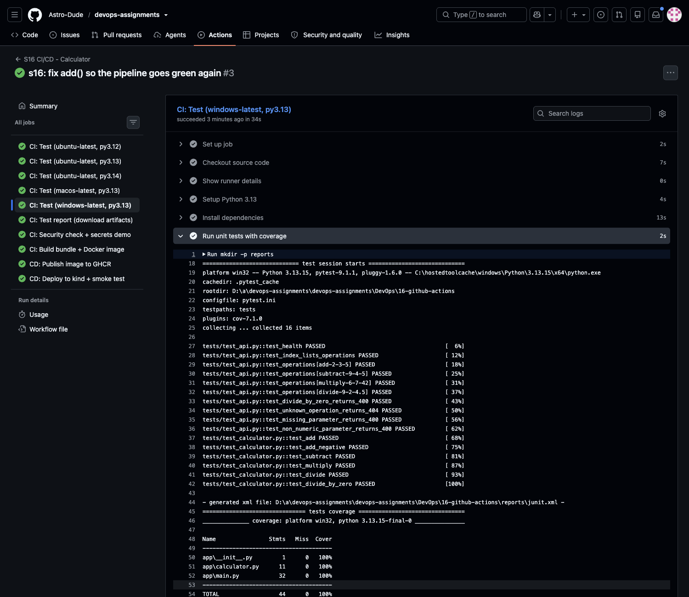

Self-hosted runners (`runs-on: [self-hosted, linux]`) were not used: they need a
machine registered to the repository with admin access, and GitHub-hosted runners
are the right choice for a public repo anyway (free minutes, clean VM each time,
no risk of a fork's PR executing code on your own hardware).

---

## Task 8 — Secrets

Secrets are encrypted values injected into a run only through the `secrets`
context; GitHub **masks** their value in the logs. This pipeline uses the
built-in `GITHUB_TOKEN` (created automatically for every run, scoped by the
`permissions:` block, expired when the job ends) and one **repository secret**,
`S16_DEMO_SECRET`, created by hand in *Settings → Secrets and variables → Actions*:

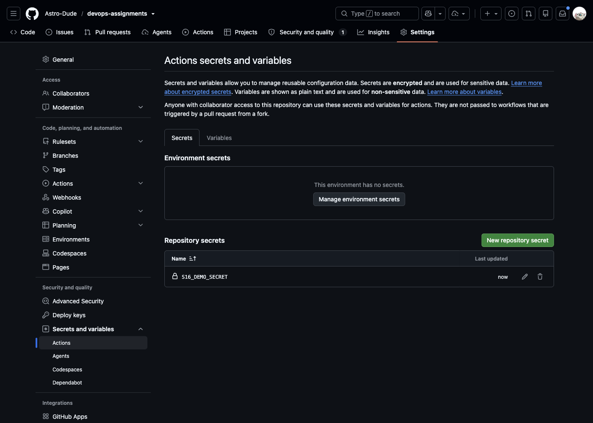

The value is a random, non-sensitive 33-character string (`s16-demo-` + 24 hex
characters). It is not in git or in this README. The secrets are used for:

| Where | What the secret is used for |
|---|---|
| `security-check` → *Secrets are masked in logs* (L155) | call the GitHub API, and deliberately `echo` it to show masking |
| `publish` → `docker/login-action` (L244) | log in to `ghcr.io` — allowed to push because the job has `packages: write` (L224) |
| `deploy` → *Create image pull secret* (L291) | turned into a Kubernetes `docker-registry` Secret so the cluster can pull from GHCR |
| `security-check` → same step (L157) | `S16_DEMO_SECRET`: echoed (masked), with its length and a sha256 prefix to prove the right value arrived |

```yaml
      - name: Secrets are masked in logs (GITHUB_TOKEN + repository secret)
        env:
          TOKEN: ${{ secrets.GITHUB_TOKEN }}
          DEMO_SECRET: ${{ secrets.S16_DEMO_SECRET }}
        run: |
          echo "Printing the secret directly -> $TOKEN"
          echo "Secret length                -> ${#TOKEN} characters"
          curl -fsS -H "Authorization: Bearer $TOKEN" "https://api.github.com/repos/$GITHUB_REPOSITORY" | jq ...
          if [ -z "$DEMO_SECRET" ]; then echo "::warning::S16_DEMO_SECRET not available (e.g. PR from a fork)"; exit 0; fi
          echo "Repository secret S16_DEMO_SECRET -> $DEMO_SECRET (length ${#DEMO_SECRET})"
          echo "sha256 prefix of S16_DEMO_SECRET  -> $(printf '%s' "$DEMO_SECRET" | sha256sum | cut -c1-12)"
```

Real log of that step (run `37648503265`,
[`evidence/run-37648503265-secrets-step.log`](evidence/run-37648503265-secrets-step.log)):

```
  TOKEN: ***
  DEMO_SECRET: ***
Printing the secret directly -> ***
Secret length                -> 377 characters
Using it to call the GitHub API as the workflow:
{
  "full_name": "Astro-Dude/devops-assignments",
  "visibility": "public",
  "default_branch": "main"
}
Repository secret S16_DEMO_SECRET -> *** (length 33)
sha256 prefix of S16_DEMO_SECRET  -> 5059e1718731
```

The length (33) and sha256 prefix (`5059e1718731`) match the values computed
locally from the string typed into the secrets form, so the runner received the
correct value, but the value itself is printed only as `***`.

The token is 377 characters long and works (the authenticated API call
succeeded), yet the log only ever shows `***` — even in the echoed command line
(`curl -fsS -H "Authorization: ***"`) and in the GHCR login step
(`password: ***`). Repository secrets are not passed to workflows triggered by
a pull request from a fork; there `S16_DEMO_SECRET` evaluates to an empty
string, so the script checks for that and only warns.

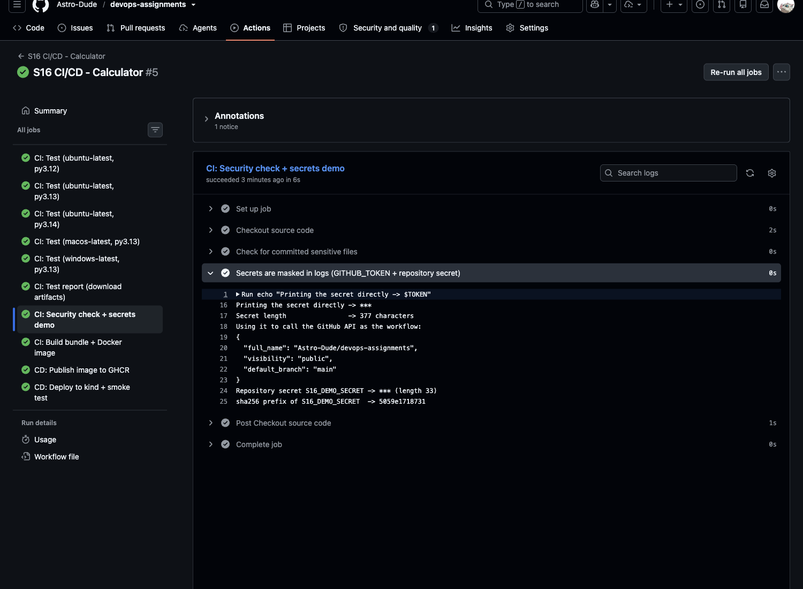

---

## Task 9 — Artifacts

Jobs run on different VMs, so files do not survive from one job to the next.
**Artifacts** are how a job hands files to later jobs (and to humans — they are
downloadable from the run page for the retention period).

| Artifact | Uploaded by | Contents | Downloaded by |
|---|---|---|---|
| `test-report-<os>-py<ver>` ×5 | each `test` leg (L93, `if: always()`) | `junit.xml`, `coverage.xml`, HTML coverage | `test-report` (L110, `pattern: test-report-*`) |
| `calculator-build` | `build` (L187) | versioned tarball, `build-info.txt`, `SHA256SUMS` | `deploy` (L270) — verifies checksum, prints build info |
| `docker-image` | `build` (L209, `retention-days: 3`) | `docker save` of the tested image, gzipped (~43 MB) | `publish` (L232) — loads and pushes it |

The `docker-image` artifact matters for CD correctness: the image pushed to GHCR
is the **same image** that was smoke-tested in the `build` job, not a rebuild.

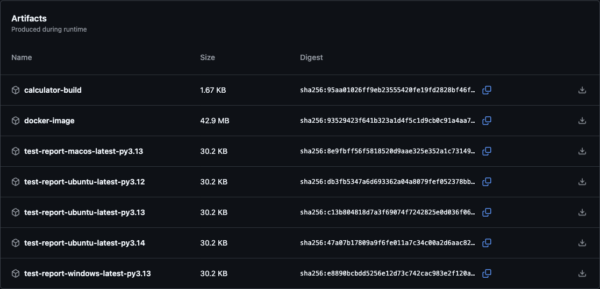

`test-report` downloading all five matrix artifacts (log excerpt):

```
Found 5 artifact(s)
Filtering artifacts by pattern 'test-report-*'
Preparing to download the following artifacts:
- test-report-ubuntu-latest-py3.14 (ID: 11485185277, Size: 30875, ...)
- test-report-ubuntu-latest-py3.13 (ID: 11485130350, Size: 30875, ...)
- test-report-ubuntu-latest-py3.12 (ID: 11484323899, Size: 30878, ...)
- test-report-macos-latest-py3.13 (ID: 11484198989, Size: 30924, ...)
- test-report-windows-latest-py3.13 (ID: 11483954532, Size: 30924, ...)
...
Total of 5 artifact(s) downloaded
```

…and turning them into the table in the run summary (`$GITHUB_STEP_SUMMARY`) —
16 tests / 0 failures / 100 % line coverage on every runner (screenshot in Task 2).

The same artifacts downloaded to this laptop afterwards with the CLI
([`evidence/artifacts-download.txt`](evidence/artifacts-download.txt)):

```bash
$ gh run download 37627185543 -R Astro-Dude/devops-assignments -n calculator-build -n test-report-windows-latest-py3.13
$ find . -maxdepth 2 | sort
./calculator-build/build-info.txt
./calculator-build/s16-calculator-1.0.0.tar.gz
./calculator-build/SHA256SUMS
./test-report-windows-latest-py3.13/coverage.xml
./test-report-windows-latest-py3.13/htmlcov
./test-report-windows-latest-py3.13/junit.xml
$ cat calculator-build/build-info.txt
Application : s16-calculator
Version     : 1.0.0
Git SHA     : aad6094c7b9df37c04216f70746f4700b94e49bd
Built at    : 2026-10-07T13:17:48Z
Built on    : GitHub Actions 1000001558 (Linux)
Workflow run: 37627185543
```

---

## Task 10 — Build

"Build" here produces two deliverables, both in the `build` job:

1. **Release bundle** — [`build.sh`](build.sh) byte-compiles the sources
   (`python -m compileall`, fails on syntax errors), tars `app/` + pinned
   requirements into `build/s16-calculator-<version>.tar.gz`, writes
   `build-info.txt` (version, SHA, runner, run ID) and `SHA256SUMS`.
2. **Docker image** — [`Dockerfile`](Dockerfile): a two-stage build (dependencies
   installed in a throw-away stage, copied into a clean `python:3.13-slim`),
   runs as non-root UID 10001, `HEALTHCHECK` on `/health`, served by gunicorn,
   with the commit SHA baked in as `GIT_SHA` and an OCI
   `org.opencontainers.image.source` label that links the GHCR package to this
   repository.

Real log (run `37627185543`; excerpt — `#` lines are my annotations, blank/BuildKit lines removed):

```
 Building s16-calculator 1.0.0 (aad6094c7b9df37c04216f70746f4700b94e49bd)
Build files:
-rw-r--r-- 1 runner runner   96 Oct  7 13:17 SHA256SUMS
-rw-r--r-- 1 runner runner  213 Oct  7 13:17 build-info.txt
-rw-r--r-- 1 runner runner 1048 Oct  7 13:17 s16-calculator-1.0.0.tar.gz
Build completed successfully.

$ docker image ls s16-calculator
REPOSITORY       TAG                                        IMAGE ID       CREATED        SIZE
s16-calculator   aad6094c7b9df37c04216f70746f4700b94e49bd   ecefd328710f   1 second ago   125MB

# Smoke-test the container
{"status":"ok"}
{"a":6.0,"b":7.0,"operation":"multiply","result":42.0}
[2026-10-07 13:17:58 +0000] [1] [INFO] Starting gunicorn 26.2.0
[2026-10-07 13:17:58 +0000] [1] [INFO] Listening at: http://0.0.0.0:8000 (1)
172.17.0.1 - - [07/Oct/2026:13:17:59 +0000] "GET /health HTTP/1.1" 200 16 "-" "curl/8.5.0"
172.17.0.1 - - [07/Oct/2026:13:17:59 +0000] "GET /api/multiply?a=6&b=7 HTTP/1.1" 200 55 "-" "curl/8.5.0"

-rw-r--r-- 1 runner runner 44M Oct  7 13:18 s16-calculator-image.tar.gz
```

(The single `curl: (56) Recv failure` line in the raw log is the first health
poll hitting the container before gunicorn was listening; the retry loop is
there for exactly that.)

---

## Task 11 — Test

```yaml
      - name: Run unit tests with coverage
        run: |
          mkdir -p reports
          pytest -v \
            --junitxml=reports/junit.xml \
            --cov --cov-report=term \
            --cov-report=xml:reports/coverage.xml \
            --cov-report=html:reports/htmlcov \
            --cov-fail-under=90
```

- 16 tests: 6 on the pure functions (`tests/test_calculator.py`), 10 on the HTTP
  API through Flask's test client (`tests/test_api.py`) — status codes, JSON
  bodies, error paths (divide by zero → 400, unknown op → 404, missing/non-numeric
  parameter → 400).
- `--cov-fail-under=90` makes **coverage** a gate too: dropping below 90 % fails
  the job even if all tests pass.
- JUnit XML + coverage XML/HTML are uploaded as artifacts and summarised by
  `test-report`.
- Testing continues after deployment: the `deploy` job's smoke test (Task 12) is
  a second, black-box test of the real image running in a real cluster.

---

## Task 12 — CD: publish to GHCR and deploy to Kubernetes

### Publish

`publish` downloads the `docker-image` artifact, loads it, logs in to
`ghcr.io` with `GITHUB_TOKEN`, and pushes two tags: the full commit SHA
(immutable, what gets deployed) and `latest`.

```
Loaded image: s16-calculator:aad6094c7b9df37c04216f70746f4700b94e49bd
##[group]Run docker/login-action@v4
  registry: ghcr.io
  username: Astro-Dude
  password: ***
Logging into ghcr.io...
Login Succeeded!
The push refers to repository [ghcr.io/astro-dude/devops-assignments/s16-calculator]
...
aad6094c7b9df37c04216f70746f4700b94e49bd: digest: sha256:eed72bd1dace6f29e5221a8c71b4952d018cd81860670cd3d189c40627ce8347 size: 1992
```

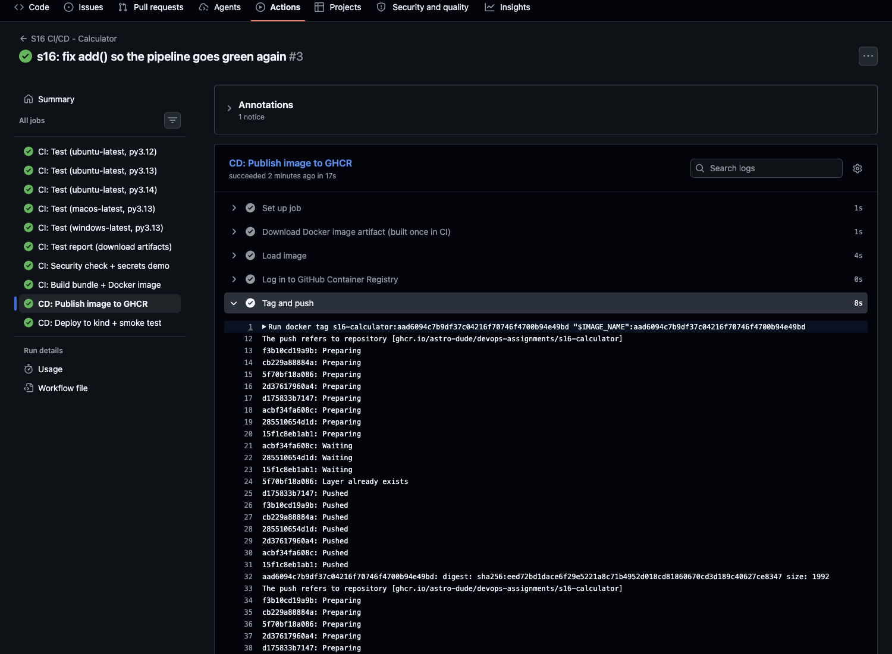

The package page on GitHub (one tag per deployed commit; `Public` because a
package linked to a public repository inherits its visibility):

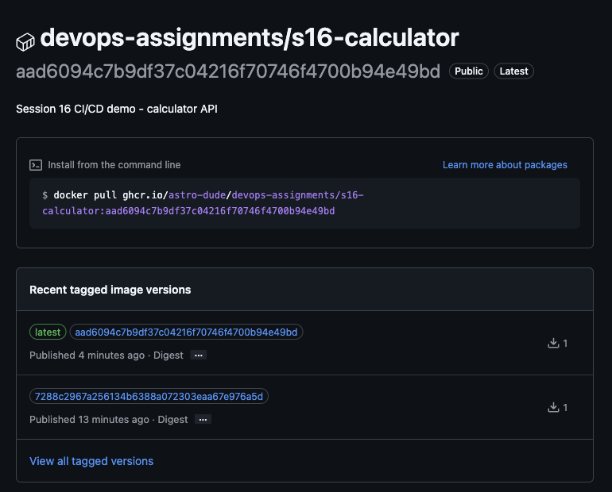

Anyone can pull it without logging in — checked from this laptop with an
anonymous registry token ([`evidence/ghcr-tags.txt`](evidence/ghcr-tags.txt)):

```bash
$ curl -s -H "Authorization: Bearer $TOKEN" https://ghcr.io/v2/astro-dude/devops-assignments/s16-calculator/tags/list
{"name":"astro-dude/devops-assignments/s16-calculator","tags":["7288c2967a256134b6388a072303eaa67e976a5d","latest","aad6094c7b9df37c04216f70746f4700b94e49bd"]}
```

### Deploy

There is no paid cloud account for this course, so the deployment target is a
**real Kubernetes cluster created inside the runner** with
[`helm/kind-action`](https://github.com/helm/kind-action). It is ephemeral (it
disappears with the VM when the job ends), but every step is what a deploy to a
long-lived cluster would do: pull the image from the registry with credentials,
`kubectl apply`, wait for the rollout, verify.

```yaml
  deploy:
    needs: publish
    permissions: { contents: read, packages: read }
    environment:
      name: s16-kind-ephemeral        # shows up under the repo's Deployments
    steps:
      - checkout (for k8s/ manifests)
      - download-artifact: calculator-build          # verify checksum, print build-info
      - uses: helm/kind-action@v1.15.1               # cluster_name: s16-ci
      - kubectl create secret docker-registry ghcr-pull ... --docker-password=${{ secrets.GITHUB_TOKEN }}
      - sed "s|IMAGE_PLACEHOLDER|${{ needs.publish.outputs.image }}|" k8s/deployment.yaml | kubectl apply -f -
        kubectl apply -f k8s/service.yaml
        kubectl rollout status deployment/s16-calculator --timeout=180s
      - smoke test through kubectl port-forward
```

Real log (run `37627185543`):

```
Application : s16-calculator
Version     : 1.0.0
Git SHA     : aad6094c7b9df37c04216f70746f4700b94e49bd
Workflow run: 37627185543
./s16-calculator-1.0.0.tar.gz: OK
Image: ghcr.io/astro-dude/devops-assignments/s16-calculator:aad6094c7b9df37c04216f70746f4700b94e49bd

secret/ghcr-pull created
deployment.apps/s16-calculator created
service/s16-calculator created
Waiting for deployment "s16-calculator" rollout to finish: 0 of 2 updated replicas are available...
Waiting for deployment "s16-calculator" rollout to finish: 1 of 2 updated replicas are available...
deployment "s16-calculator" successfully rolled out
NAME                                  READY   STATUS    RESTARTS   AGE   IP           NODE
pod/s16-calculator-6d9c69985d-8wgd2   1/1     Running   0          7s    10.244.0.5   s16-ci-control-plane
pod/s16-calculator-6d9c69985d-z4w4b   1/1     Running   0          7s    10.244.0.6   s16-ci-control-plane
```

*(Excerpt; the `kubectl get deploy,rs,pods,svc -o wide` output is trimmed to the pod rows and first columns.)*

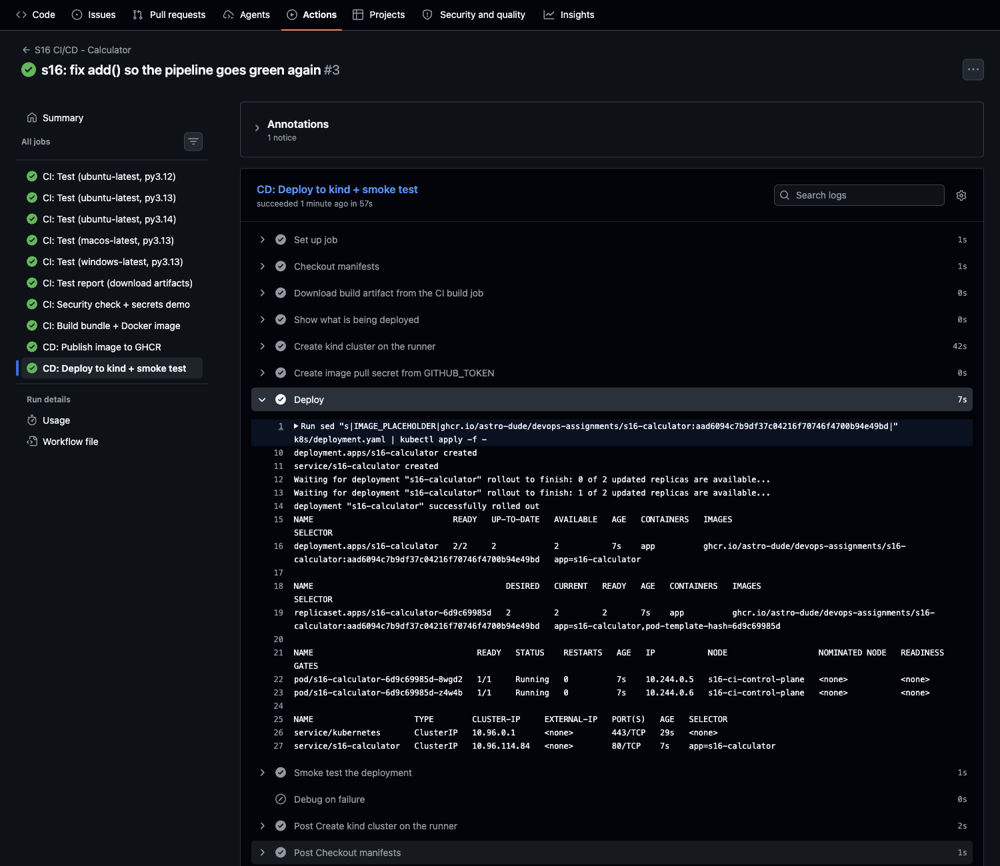

The smoke test does not just check for HTTP 200 — it asserts that the running pod
reports the **same git SHA that triggered the run**, that the API computes
correctly, and that the error path returns 400:

```bash
test "$(echo "$info" | jq -r .git_sha)" = "${{ github.sha }}"
curl -fsS "localhost:8080/api/add?a=2&b=3" | jq -e '.result == 5'
test "$code" = 400
```

```
{"status":"ok"}
{
  "git_sha": "aad6094c7b9df37c04216f70746f4700b94e49bd",
  "hostname": "s16-calculator-6d9c69985d-8wgd2",
  "operations": ["add", "divide", "multiply", "subtract"],
  "service": "s16-calculator",
  "version": "1.0.0"
}
true
divide by zero -> HTTP 400
```

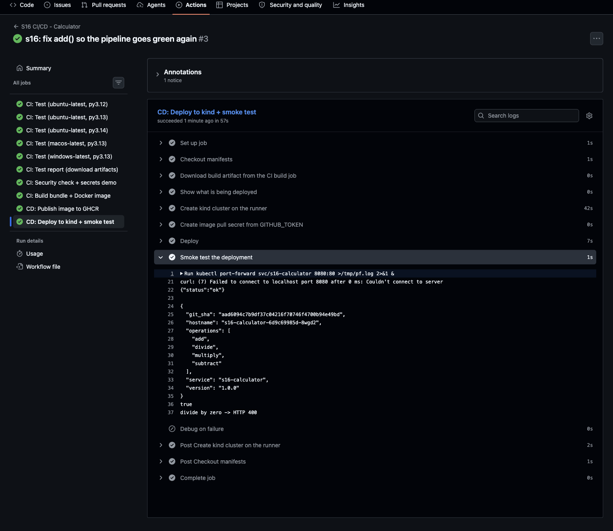

Because the job declares `environment: s16-kind-ephemeral`, GitHub records each
deploy and marks the latest as **Active**:

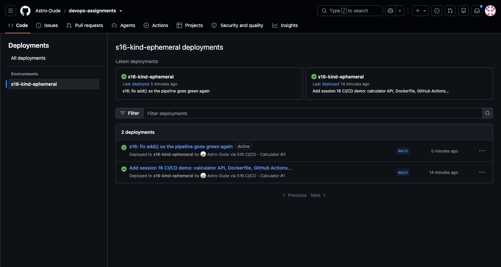

---

## Task 13 — Pipeline execution: fail → fix → green

To show the gates working, the pipeline was run three times on purpose:

1. `7288c29` — initial commit → **green**, deployed.
2. `73fe8c5` — `add()` deliberately broken (`return a + b + 1`, the failure
   scenario from the reference README) → **red**.
3. `aad6094` — `add()` restored → **green**, deployed again.
4. `c809c04` — this README + evidence (a change under the folder, so the `paths:`
   filter triggered it) → **green**, deployed again
   ([`evidence/gh-run-view-37628519499.txt`](evidence/gh-run-view-37628519499.txt)).
5. **Manual run (`workflow_dispatch`)** on `c48d34f`: started from the Actions
   UI with *Run workflow → Branch: main → Run workflow*. It ran the full CI and CD
   path → **green**, deployed. This run also uses the new repository secret
   ([`evidence/gh-run-view-37648503265.txt`](evidence/gh-run-view-37648503265.txt)).

```bash
$ gh run list -R Astro-Dude/devops-assignments --workflow s16-ci-cd.yml
completed	success	S16 CI/CD - Calculator	S16 CI/CD - Calculator	main	workflow_dispatch	37648503265	3m20s	2026-10-07T15:59:49Z
completed	success	s16: add README, run evidence and screenshots of the CI/CD pipeline	S16 CI/CD - Calculator	main	push	37628519499	2m44s	2026-10-07T13:26:39Z
completed	success	s16: fix add() so the pipeline goes green again	S16 CI/CD - Calculator	main	push	37627185543	3m11s	2026-10-07T13:16:19Z
completed	failure	s16: change add() (intentionally broken to demonstrate a failing pipe…	S16 CI/CD - Calculator	main	push	37626976777	38s	2026-10-07T13:14:44Z
completed	success	Add session 16 CI/CD demo: calculator API, Dockerfile, GitHub Actions…	S16 CI/CD - Calculator	main	push	37626090074	2m46s	2026-10-07T13:07:44Z
```

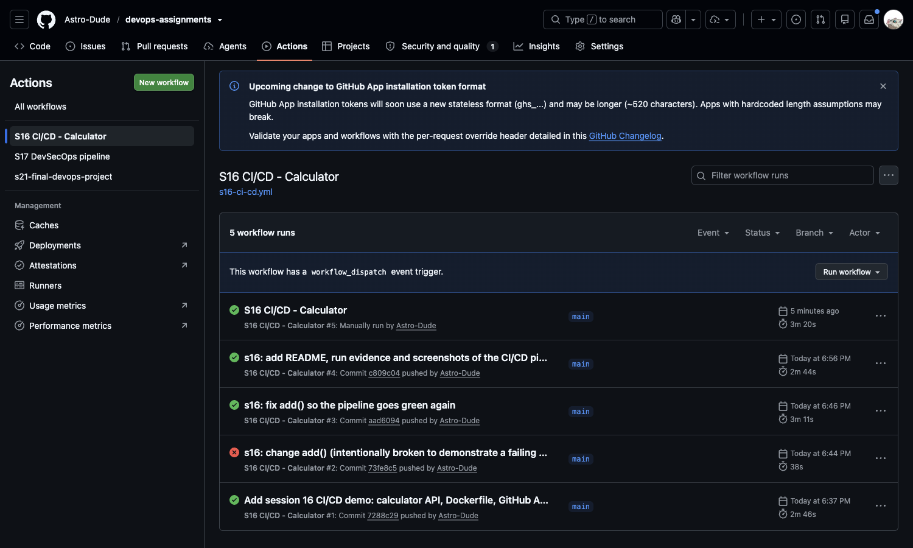

### Manual trigger (`workflow_dispatch`)

The workflow page shows a **Run workflow** button because of the
`workflow_dispatch:` trigger (L22):

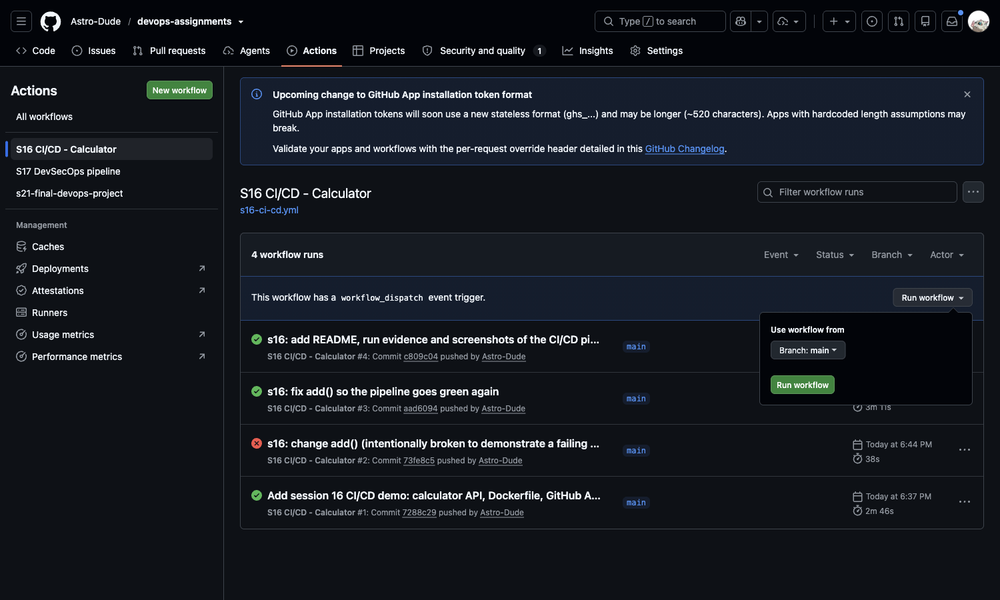

The run it started shows *"Manually triggered"* and `on: workflow_dispatch`. The
`publish` condition (`|| github.event_name == 'workflow_dispatch'`, L220) let the
CD jobs run:

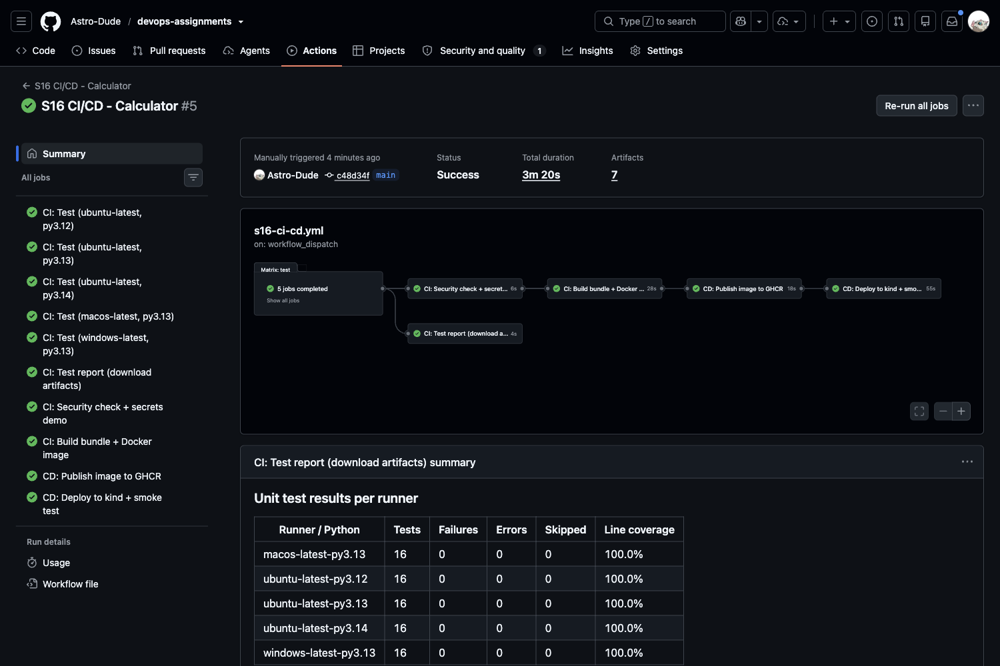

```bash
$ gh run view 37648503265 -R Astro-Dude/devops-assignments
✓ main S16 CI/CD - Calculator · 37648503265
Triggered via workflow_dispatch about 3 minutes ago

JOBS
✓ CI: Test (macos-latest, py3.13) in 18s (ID 112885420783)
✓ CI: Test (ubuntu-latest, py3.14) in 20s (ID 112885421218)
✓ CI: Test (ubuntu-latest, py3.13) in 14s (ID 112885421220)
✓ CI: Test (windows-latest, py3.13) in 1m3s (ID 112885421264)
✓ CI: Test (ubuntu-latest, py3.12) in 17s (ID 112885421357)
✓ CI: Test report (download artifacts) in 4s (ID 112885965208)
✓ CI: Security check + secrets demo in 6s (ID 112885965447)
✓ CI: Build bundle + Docker image in 28s (ID 112886049142)
✓ CD: Publish image to GHCR in 18s (ID 112886351825)
✓ CD: Deploy to kind + smoke test in 55s (ID 112886537722)
```

### The failing run (`37626976777`)

```bash
$ gh run view 37626976777 -R Astro-Dude/devops-assignments
X main S16 CI/CD - Calculator · 37626976777
X CI: Test (ubuntu-latest, py3.13) in 13s (ID 112811147513)
X CI: Test (macos-latest, py3.13) in 17s (ID 112811147906)
X CI: Test (windows-latest, py3.13) in 25s (ID 112811147975)
X CI: Test (ubuntu-latest, py3.14) in 16s (ID 112811148066)
X CI: Test (ubuntu-latest, py3.12) in 17s (ID 112811148554)
✓ CI: Test report (download artifacts) in 6s (ID 112811360775)
- CI: Security check + secrets demo (ID 112811363536)
- CD: Publish image to GHCR (ID 112811363737)
- CD: Deploy to kind + smoke test in 0s (ID 112811363813)
- CI: Build bundle + Docker image (ID 112811364273)
```

(`X` failed, `✓` passed, `-` skipped — trimmed from
[`evidence/gh-run-view-37626976777.txt`](evidence/gh-run-view-37626976777.txt).)

From the failing test step ([`evidence/run-37626976777-failed-test-log.txt`](evidence/run-37626976777-failed-test-log.txt)):

```
>       assert add(10, 5) == 15
E       assert 16 == 15
=========================== short test summary info ============================
FAILED tests/test_api.py::test_operations[add-2-3-5] - assert 6.0 == 5
FAILED tests/test_calculator.py::test_add - assert 16 == 15
FAILED tests/test_calculator.py::test_add_negative - assert -4 == -5
========================= 3 failed, 13 passed in 0.35s =========================
##[error]Process completed with exit code 1.
```

What the run proves:

- All five matrix legs failed independently (`fail-fast: false`), so the report
  shows the bug is not OS- or version-specific.
- `test-report` (`if: always()`) still ran and published **3 failures per runner**.
- `security-check`, `build`, `publish` and `deploy` were **skipped** — the broken
  code was never built, never pushed to GHCR, and the cluster kept the previous
  good version. No `docker-image` / `calculator-build` artifacts exist for this run.

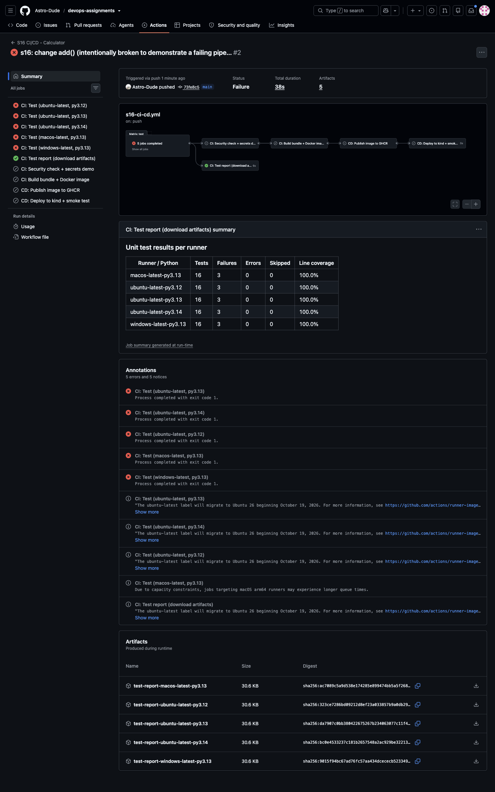

### The fix (`37627185543`)

Restoring `return a + b` turned every job green again and redeployed. Full run
page, including the per-runner test table, the publish/deploy summaries and the
artifacts list:

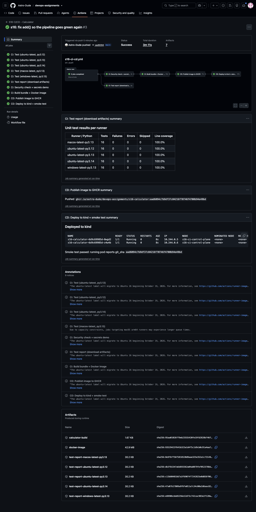

```bash
$ gh run view 37627185543 -R Astro-Dude/devops-assignments
✓ main S16 CI/CD - Calculator · 37627185543
✓ CI: Test (ubuntu-latest, py3.14) in 18s (ID 112811852343)
✓ CI: Test (macos-latest, py3.13) in 16s (ID 112811852589)
✓ CI: Test (ubuntu-latest, py3.13) in 12s (ID 112811852632)
✓ CI: Test (ubuntu-latest, py3.12) in 13s (ID 112811852736)
✓ CI: Test (windows-latest, py3.13) in 34s (ID 112811852835)
✓ CI: Test report (download artifacts) in 6s (ID 112812134523)
✓ CI: Security check + secrets demo in 4s (ID 112812134846)
✓ CI: Build bundle + Docker image in 24s (ID 112812194268)
✓ CD: Publish image to GHCR in 17s (ID 112812667264)
✓ CD: Deploy to kind + smoke test in 57s (ID 112812811793)

ARTIFACTS
test-report-ubuntu-latest-py3.14
test-report-ubuntu-latest-py3.13
calculator-build
test-report-ubuntu-latest-py3.12
test-report-macos-latest-py3.13
test-report-windows-latest-py3.13
docker-image
```

Push to `main` → 5 parallel test runners → security check and report → build
→ publish → deploy and smoke test, about 3 minutes end to end, with no manual step.

---

## Notes and limitations

- **The `pull_request` trigger was not exercised.** It is configured, but no PR
  was opened. The runs shown are four `push` events and one manual
  `workflow_dispatch` run. For a PR, the `if:` on `publish` would skip both CD
  jobs.
- The repository secret and the manual run were added after the first four
  runs, using a browser signed in to the repository owner's account.
- **Ephemeral deployment target.** The kind cluster lives only as long as the
  `deploy` job. That is the closest real alternative to a cloud cluster without a
  cloud account; swapping it for EKS/GKE/AKS would replace the `kind-action` step
  with a cloud login + `aws eks update-kubeconfig` (or equivalent), and keep every
  other step.
- The GitHub notice "*The ubuntu-latest label will migrate to Ubuntu 26 beginning
  October 19, 2026*" in the run annotations is an informational banner from
  GitHub, not a problem with the workflow.

## Evidence index

| File | Contents |
|---|---|
| [`evidence/local-run.txt`](evidence/local-run.txt) | local pytest, build.sh, docker build/run, curl checks |
| [`evidence/gh-run-list.txt`](evidence/gh-run-list.txt) | `gh run list` for this workflow |
| [`evidence/gh-run-view-37626090074.txt`](evidence/gh-run-view-37626090074.txt) | run #1 (green) |
| [`evidence/gh-run-view-37626976777.txt`](evidence/gh-run-view-37626976777.txt) | run #2 (intentional failure) |
| [`evidence/gh-run-view-37627185543.txt`](evidence/gh-run-view-37627185543.txt) | run #3 (fixed, green) |
| [`evidence/gh-run-view-37628519499.txt`](evidence/gh-run-view-37628519499.txt) | run #4 (README commit, green) |
| [`evidence/gh-run-view-37648503265.txt`](evidence/gh-run-view-37648503265.txt) | run #5 (manual `workflow_dispatch`, green) |
| [`evidence/run-37648503265-secrets-step.log`](evidence/run-37648503265-secrets-step.log) | secrets-demo job of run #5 (repository secret masked) |
| [`evidence/run-37627185543-full.log`](evidence/run-37627185543-full.log) | complete logs of every job in run #3 (`gh run view --log`) |
| [`evidence/run-37626976777-failed-test-log.txt`](evidence/run-37626976777-failed-test-log.txt) | the failing pytest step from run #2 |
| [`evidence/artifacts-download.txt`](evidence/artifacts-download.txt) | `gh run download` of two artifacts |
| [`evidence/ghcr-tags.txt`](evidence/ghcr-tags.txt) | anonymous GHCR tag listing |
