# Complete CI/CD and DevSecOps — Homework

Session 17. A complete CI/CD and DevSecOps pipeline that runs on GitHub Actions.
A small Flask service is built and unit-tested. Its code, dependencies, git
history and container image are each scanned. A single **security gate** reads
every report and decides whether the image may go to GHCR. If it may, the image
is pushed and then deployed to a Kubernetes (kind) cluster created inside the
runner, where it is smoke-tested.

The pipeline follows the expected flow from the assignment exactly. Each stage is
its own job, and each job `needs:` the one before it:

```
Code -> Build -> Unit Test -> SAST -> SCA -> Secret Scan -> Docker Build
     -> Container Image Scan -> Security Gate -> Push Image -> Deploy to Kubernetes
```

Everything below is **real output** from runs of
[`.github/workflows/s17-devsecops.yml`](../../.github/workflows/s17-devsecops.yml)
on this repository. Raw logs are under [`evidence/`](evidence/).

| Run | Commit | What it shows | Result |
|---|---|---|---|
| [37628343023](https://github.com/Astro-Dude/devops-assignments/actions/runs/37628343023) | `d17d7c3` | first push of the pipeline | success |
| [37629169373](https://github.com/Astro-Dude/devops-assignments/actions/runs/37629169373) | `3d214ab` | **intentionally insecure commit: the gate blocks push and deploy** | failure |
| [37629854333](https://github.com/Astro-Dude/devops-assignments/actions/runs/37629854333) | `52d5fa5` | code fixed, but the leaked key is **still in git history** | failure |
| [37630491334](https://github.com/Astro-Dude/devops-assignments/actions/runs/37630491334) | `1a7d243` | historical finding triaged: green, pushed, deployed | success |
| [37631434958](https://github.com/Astro-Dude/devops-assignments/actions/runs/37631434958) | `a60d3f3` | *unplanned:* the fake key ended up in a saved CI log and was re-committed. Gitleaks caught it | failure |
| [37632031493](https://github.com/Astro-Dude/devops-assignments/actions/runs/37632031493) | `a11c0e9` | **final green run** (all evidence below comes from this run unless stated) | success |

```bash
$ gh run list -R Astro-Dude/devops-assignments --workflow s17-devsecops.yml
completed	success	Session 17: redact fake demo key from saved CI log evidence, triage i…	S17 DevSecOps pipeline	main	push	37632031493	4m50s	2026-10-07T13:52:45Z
completed	failure	Session 17 workflow: print Trivy tables in logs (convert needs --scan…	S17 DevSecOps pipeline	main	push	37631434958	3m0s	2026-10-07T13:48:18Z
completed	success	Session 17: triage historical gitleaks finding for the revoked demo k…	S17 DevSecOps pipeline	main	push	37630491334	4m31s	2026-10-07T13:41:17Z
completed	failure	Session 17 gate demo fix: remove shell=True ping endpoint, read payme…	S17 DevSecOps pipeline	main	push	37629854333	3m27s	2026-10-07T13:36:34Z
completed	failure	Session 17 gate demo: add ping diagnostics endpoint, payment config a…	S17 DevSecOps pipeline	main	push	37629169373	3m19s	2026-10-07T13:31:29Z
completed	success	Session 17: add DevSecOps pipeline (app, tests, hardened Dockerfile, …	S17 DevSecOps pipeline	main	push	37628343023	4m52s	2026-10-07T13:25:18Z
```

---

## Deliverables

| Deliverable | Where |
|---|---|
| Application | [`app/main.py`](app/main.py), [`app/config.py`](app/config.py), template and CSS. Unit tests in [`tests/test_app.py`](tests/test_app.py) |
| Dockerfile | [`Dockerfile`](Dockerfile) (multi-stage, digest-pinned slim base, hash-pinned deps, non-root) + [`.dockerignore`](.dockerignore) |
| GitHub Actions workflow | [`/.github/workflows/s17-devsecops.yml`](../../.github/workflows/s17-devsecops.yml). A byte-identical copy is kept at [`ci/s17-devsecops.yml`](ci/s17-devsecops.yml) |
| Security tools configuration | [`security/`](security/): Semgrep rules, Bandit, Gitleaks, Trivy, ignore files, gate policy and gate script |
| Kubernetes manifests | [`k8s/`](k8s/): Namespace (PSS restricted), ServiceAccount, Deployment, Service, NetworkPolicy, kustomization |
| Successful pipeline output | [`evidence/run-37632031493-final-green.log.txt`](evidence/run-37632031493-final-green.log.txt), `gh` output and gate results in [`evidence/`](evidence/) |
| Screenshots | [`screenshots/`](screenshots/), embedded below |
| README | this file |

> **Why are there two copies of the workflow?** GitHub only runs workflow files in
> the repository-root `.github/workflows/` directory. A workflow placed inside
> `DevOps/17-devsecops/` would never run. The root file is the real one. The copy
> in `ci/` keeps this folder self-contained, and the Build job runs
> `diff -u` on the two so they cannot silently drift apart.

```
DevOps/17-devsecops/
├── app/                    Flask service (main.py, config.py, templates/, static/)
├── tests/test_app.py       17 pytest cases
├── Dockerfile  .dockerignore
├── requirements.in         top-level deps            -> requirements.txt (pinned + sha256 hashes)
├── requirements-dev.in     pytest, pytest-cov        -> requirements-dev.txt
├── pytest.ini
├── k8s/                    namespace, serviceaccount, deployment, service, networkpolicy, kustomization
├── security/
│   ├── semgrep/rules.yml   project SAST rules (plus registry packs p/python, p/flask)
│   ├── bandit.yaml         Bandit config
│   ├── gitleaks.toml       Gitleaks config (default rules + a custom token rule)
│   ├── .gitleaksignore     triaged historical findings (fingerprints)
│   ├── trivy.yaml          Trivy config shared by fs / config / image scans
│   ├── .trivyignore        accepted-risk CVE exceptions (currently none)
│   ├── gate-policy.toml    THE security policy: what blocks push/deploy
│   └── gate.py             the gate: reads all reports, applies the policy
├── ci/s17-devsecops.yml    copy of the root workflow
├── evidence/               gh run list/view output, cleaned run logs, gate results, GHCR tag list
└── screenshots/
```

---

## Architecture

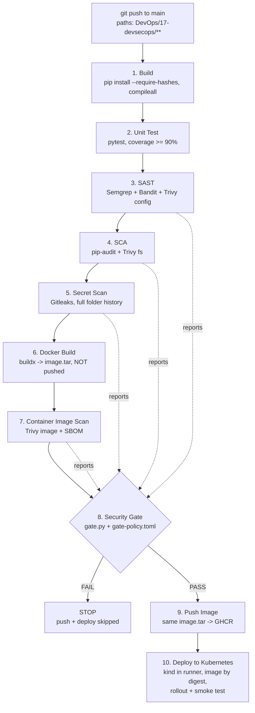

The same flow as ASCII, showing what passes between jobs:

```
 push ─▶ [1 Build] ─▶ [2 Unit Test] ─▶ [3 SAST] ─▶ [4 SCA] ─▶ [5 Secret Scan] ─▶ [6 Docker Build] ─▶ [7 Image Scan]
                         │ junit.xml      │ semgrep.json  │ pip-audit.json │ gitleaks.json     │ image.tar        │ trivy-image.json
                         │ coverage.xml   │ bandit.json   │ trivy-fs.json  │                   │ (artifact)       │ trivy-image.sarif
                         │                │ trivy-config  │                │                   │                  │ sbom.cdx.json
                         └────────────────┴───────────────┴────────────────┴───────────────────┼──────────────────┘
                                                   all reports-* artifacts                     │
                                                              ▼                                │
                                                   [8 Security Gate] ── FAIL ─▶ pipeline red,  │
                                                              │                 9 and 10 skipped
                                                            PASS                               │
                                                              ▼                                ▼
                                                   [9 Push Image]  ◀── loads the SAME image.tar, checks image ID
                                                              │ digest sha256:...
                                                              ▼
                                                   [10 Deploy]  kind cluster ─▶ kustomize set image @digest ─▶ rollout ─▶ smoke test
```

Design decisions:

* **Scanners report, the gate decides.** Every scanner job writes JSON/SARIF and
  exits 0. Only the gate job turns findings into pass/fail, using one policy file.
  This keeps the flow strictly sequential: a SAST finding does not hide the SCA or
  image results, and the gate summary shows *every* problem at once (run
  37629169373 failed six checks in a single run). The tools are still
  configured so that a *crash* fails the job, and a missing report fails the
  gate (**fail closed**).
* **Scan what you ship.** The image is built once (job 6) and saved as
  `image.tar`. The same tar is scanned (job 7) and then pushed (job 9). The push job
  checks that the loaded image ID matches the one recorded by the build job. The
  image is never rebuilt after it was scanned.
* **Deploy by digest.** The deploy job pins the Deployment to
  `ghcr.io/astro-dude/s17-devsecops-app@sha256:...`, the exact bytes that passed
  the gate. It does not use a mutable tag.
* **Least privilege.** The workflow default is `contents: read`. Only the push job
  gets `packages: write`, and only the deploy job gets `packages: read`. Every
  third-party action is pinned to a full commit SHA (with its version in a
  comment). The scanner images are pinned by tag and digest. The Gitleaks binary
  is checked against its published SHA-256.
* **Scoped triggers.** The `paths:` filter is `DevOps/17-devsecops/**` plus the
  workflow itself, with `workflow_dispatch` for manual runs. It excludes
  `*.md`, `evidence/**` and `screenshots/**`, so documentation commits do not
  trigger a run.

---

## Stage by stage

### 1. Build

Installs the pinned, hash-verified dependencies (`pip install --require-hashes --no-deps`),
then compiles and imports the app. It also checks that the workflow copy matches the root workflow.

```
pip check
No broken requirements found.
python -m compileall -q app
python -c "from app.main import app; print('routes:', sorted(r.rule for r in app.url_map.iter_rules()))"
routes: ['/', '/api/calculate', '/api/greet/<name>', '/api/status', '/health', '/ready', '/static/<path:filename>']
```

`requirements.txt` is generated from `requirements.in` with
`uv pip compile --generate-hashes`. Every package, including transitive ones, is
pinned to an exact version **and** a sha256 hash. A tampered or substituted wheel
fails the install.

### 2. Unit Test

The job runs `pytest -v` with coverage. It fails if coverage drops below 90%. `junit.xml` and `coverage.xml` are uploaded.

```
collecting ... collected 17 items
tests/test_app.py::test_home_renders PASSED                              [  5%]
tests/test_app.py::test_health PASSED                                    [ 11%]
tests/test_app.py::test_ready PASSED                                     [ 17%]
tests/test_app.py::test_status_fields PASSED                             [ 23%]
tests/test_app.py::test_security_headers PASSED                          [ 29%]
tests/test_app.py::test_greet PASSED                                     [ 35%]
tests/test_app.py::test_greet_rejects_bad_input[<script>] PASSED         [ 41%]
tests/test_app.py::test_greet_rejects_bad_input[aaaaaaaaaaaaaaaaaaaaaaaaaaaaaaaaaaaaaaaaaaaaaaaaaaaaaaaaaaaaaaaaa] PASSED [ 47%]
tests/test_app.py::test_greet_rejects_bad_input[x;rm -rf] PASSED         [ 52%]
tests/test_app.py::test_calculate[add-2-3-5] PASSED                      [ 58%]
tests/test_app.py::test_calculate[subtract-9-4-5] PASSED                 [ 64%]
tests/test_app.py::test_calculate[multiply-6-3-18] PASSED                [ 70%]
tests/test_app.py::test_calculate[divide-9-3-3] PASSED                   [ 76%]
tests/test_app.py::test_calculate_divide_by_zero PASSED                  [ 82%]
tests/test_app.py::test_calculate_bad_operation PASSED                   [ 88%]
tests/test_app.py::test_calculate_requires_json PASSED                   [ 94%]
tests/test_app.py::test_404_is_json PASSED                               [100%]
Name              Stmts   Miss  Cover   Missing
-----------------------------------------------
app/__init__.py       0      0   100%
app/config.py         3      0   100%
app/main.py          58      0   100%
-----------------------------------------------
TOTAL                61      0   100%
Required test coverage of 90% reached. Total coverage: 100.00%
============================== 17 passed in 0.24s ==============================
```

The tests cover the security behaviour too: security headers, and rejection of
`<script>`, over-long names and shell metacharacters.

### 3. SAST — Semgrep, Bandit, Trivy config

| Tool | What it checks | Config |
|---|---|---|
| **Semgrep 1.178.0** (docker image, digest-pinned) | Source code patterns. Uses 5 project rules plus the public `p/python` and `p/flask` registry packs: 156 rules in total | [`security/semgrep/rules.yml`](security/semgrep/rules.yml): `shell=True`/`os.system` (CWE-78), `eval`/`exec`, Flask `debug=True`, unsafe `yaml.load` (all **ERROR**), hardcoded credentials (**WARNING**) |
| **Bandit 1.9.4** | Python-specific security linter, all plugins enabled | [`security/bandit.yaml`](security/bandit.yaml) (excludes `tests/`, skips nothing) |
| **Trivy config 0.75.0** | IaC misconfigurations in the Dockerfile and Kubernetes manifests (99 checks on the Deployment) | [`security/trivy.yaml`](security/trivy.yaml) |

Final run:

```
  Scanning 5 files tracked by git with 156 Code rules:
  Scanning 3 files with 156 python rules.
✅ Scan completed successfully.
 • Findings: 0 (0 blocking)
 • Rules run: 156
 • Targets scanned: 3
Ran 156 rules on 3 files: 0 findings.

Test results:
	No issues identified.
Code scanned:
	Total lines of code: 94

Report Summary
┌─────────────────────────┬────────────┬───────────────────┐
│         Target          │    Type    │ Misconfigurations │
├─────────────────────────┼────────────┼───────────────────┤
│ Dockerfile              │ dockerfile │         0         │
├─────────────────────────┼────────────┼───────────────────┤
│ k8s/deployment.yaml     │ kubernetes │         0         │
├─────────────────────────┼────────────┼───────────────────┤
│ k8s/namespace.yaml      │ kubernetes │         0         │
├─────────────────────────┼────────────┼───────────────────┤
│ k8s/networkpolicy.yaml  │ kubernetes │         0         │
├─────────────────────────┼────────────┼───────────────────┤
│ k8s/service.yaml        │ kubernetes │         0         │
├─────────────────────────┼────────────┼───────────────────┤
│ k8s/serviceaccount.yaml │ kubernetes │         0         │
└─────────────────────────┴────────────┴───────────────────┘
```

Trivy config earned its place before the first push. Run locally against my first
draft of `deployment.yaml`, it reported
`KSV-0013 (MEDIUM): Container 'app' of Deployment 'hw-devsecops' should specify an image tag`
(`Tests: 99 (SUCCESSES: 98, FAILURES: 1)`). The image is now
`hw-devsecops:1.0.0` in the manifest, and CI replaces it with a digest.

### 4. SCA — pip-audit, Trivy fs

| Tool | Database | Config |
|---|---|---|
| **pip-audit 2.10.1** | PyPI advisory DB / OSV (PYSEC, GHSA) | runs with `-r requirements.txt --require-hashes --disable-pip`, so it audits the exact pinned set without installing it |
| **Trivy fs** | Trivy DB (NVD + GHSA + distro feeds), with CVSS severities | [`security/trivy.yaml`](security/trivy.yaml), `--scanners vuln` |

Two tools are used on purpose. pip-audit reports advisory IDs and fix versions
but **no severity**. Trivy adds severities, which the HIGH/CRITICAL policy needs.

```
No known vulnerabilities found
blinker        1.9.0      no known vulnerabilities
click          8.5.0      no known vulnerabilities
flask          3.1.3      no known vulnerabilities
gunicorn       26.2.0     no known vulnerabilities
itsdangerous   2.2.0      no known vulnerabilities
jinja2         3.1.6      no known vulnerabilities
markupsafe     3.0.4      no known vulnerabilities
werkzeug       3.1.9      no known vulnerabilities

Report Summary
┌──────────────────┬──────┬─────────────────┐
│      Target      │ Type │ Vulnerabilities │
├──────────────────┼──────┼─────────────────┤
│ requirements.txt │ pip  │        0        │
└──────────────────┴──────┴─────────────────┘
```

### 5. Secret Scan — Gitleaks

Config: [`security/gitleaks.toml`](security/gitleaks.toml). It extends the full
default ruleset (`useDefault = true`, about 200 rules: AWS, GitHub, Slack,
private keys, generic high-entropy keys...). It also adds a custom rule,
`hw-payment-live-key`, for an organisation-specific token format
(`pay_live_` followed by 32 alphanumerics) that the default rules would not know.

Scope: the job checks out **full history** (`fetch-depth: 0`) and runs
`gitleaks git --log-opts="-- DevOps/17-devsecops"`. Every commit that ever
touched this folder is scanned, and nothing outside it. The repository is shared
with other assignments, which must not be able to break this pipeline. Findings
are printed with `--redact`. Triaged historical findings live in
[`security/.gitleaksignore`](security/.gitleaksignore).

The binary is downloaded from the GitHub release and verified before use:

```
/tmp/gitleaks.tgz: OK
8.30.1
1:54PM INF 6 commits scanned.
1:54PM INF scanned ~571792 bytes (571.79 KB) in 239ms
1:54PM INF no leaks found
findings: 0
```

### 6. Docker Build

`docker/build-push-action` builds `linux/amd64` with the GHA layer cache. It
writes `type=docker,dest=/tmp/image.tar` (`push: false`) and uploads the tar as an
artifact. The [`Dockerfile`](Dockerfile) is hardened:

| Hardening | How |
|---|---|
| slim, pinned base | `python:3.12-slim@sha256:05cda977...` (Debian 13), so the base cannot change under the same tag |
| multi-stage | the venv is built in `builder`. The runtime stage copies only `/opt/venv` and `app/` |
| pinned + verified deps | `pip install --require-hashes --no-deps -r requirements.txt` |
| smaller attack surface | `pip`/`setuptools`/`wheel` uninstalled from the runtime image and from the venv. `.dockerignore` keeps tests, k8s, security and docs out |
| non-root | `useradd --uid 10001`, `USER 10001:10001` (numeric, so `runAsNonRoot` can verify it) |
| production server | gunicorn, not the Flask dev server. `--worker-tmp-dir /tmp` lets the pod run with a read-only root filesystem |
| traceability | OCI labels (`source`, `revision` = git SHA). `GIT_SHA` is baked in and exposed at `/api/status` |

Excerpt from the build job (the full `docker history` is in the evidence log):

```
Loaded image: ghcr.io/astro-dude/s17-devsecops-app:a11c0e9079ddcb32a840ea5c9fca009155c3622b
id=sha256:49d4c5681e1b0ae36844028e5443e462c3399af7d0e8ecd4847475297e71f02e user=10001:10001 size=126645775 cmd=["gunicorn","--bind","0.0.0.0:8000","--workers","2","--worker-tmp-dir","/tmp","--access-logfile","-","app.main:app"]
0B	USER 10001:10001
5.5kB	COPY --chown=root:root app ./app # buildkit
3.06MB	COPY /opt/venv /opt/venv # buildkit
4.15MB	RUN |2 GIT_SHA=a11c0e9079ddcb32a840ea5c9fca0…
78.8MB	# debian.sh --arch 'amd64' out/ 'trixie' '@1…
```

The app's own layers add about 7 MB on top of the base. I also ran the image
locally (`--read-only --tmpfs /tmp`, host port 9301):

```
$ docker run -d --rm --name s17-app-local --read-only --tmpfs /tmp -p 9301:8000 s17-app:local
$ curl -s localhost:9301/health
{"status":"healthy","timestamp":"2026-10-07T13:14:05.546841+00:00"}
$ curl -s -X POST localhost:9301/api/calculate -H 'Content-Type: application/json' -d '{"a":6,"b":3,"operation":"multiply"}'
{"a":6.0,"b":3.0,"operation":"multiply","result":18.0}
$ docker exec s17-app-local id
uid=10001(app) gid=10001(app) groups=10001(app)
```

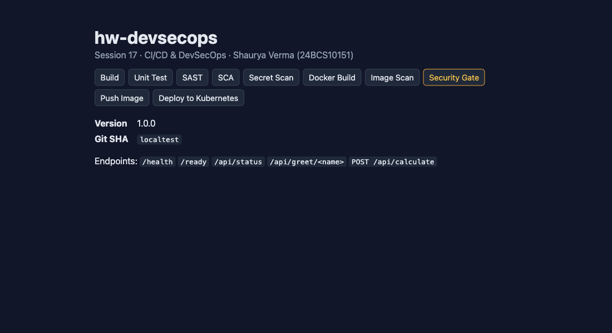

### 7. Container Image Scan — Trivy image

`trivy image --input image.tar --scanners vuln --list-all-pkgs` scans the OS
packages (Debian 13.7) and the Python packages inside `/opt/venv`. From that one
JSON report the job also produces SARIF and a CycloneDX **SBOM**
(`sbom.cdx.json`). The log prints the HIGH/CRITICAL table (excerpt; rows marked
`...` are omitted):

```
┌─────────────────────────────────────────────────────────────────────────────┬────────────┬─────────────────┐
│                                   Target                                    │    Type    │ Vulnerabilities │
├─────────────────────────────────────────────────────────────────────────────┼────────────┼─────────────────┤
│ /image.tar (debian 13.7)                                                    │   debian   │       44        │
│ opt/venv/lib/python3.12/site-packages/flask-3.1.3.dist-info/METADATA        │ python-pkg │        0        │
│ opt/venv/lib/python3.12/site-packages/gunicorn-26.2.0.dist-info/METADATA    │ python-pkg │        0        │
│ ...                                                                         │            │                 │
/image.tar (debian 13.7)
Total: 44 (HIGH: 44, CRITICAL: 0)
│ bsdutils      │ CVE-2026-76642 │ HIGH     │ affected     │ 1:2.41.5-0+deb13u1                │               │ util-linux: ...
```

All 44 HIGH findings are in Debian base packages (util-linux, ncurses, systemd
libs, acl, perl-base). Their status is `affected` / `fix_deferred` with an
**empty Fixed Version**. Debian has not shipped a fix, so no rebuild or upgrade
can remove them today. The gate policy below explains how they are handled.

### 8. Security Gate

The gate job downloads every `reports-*` artifact and runs
[`security/gate.py`](security/gate.py), which only uses the standard library,
against [`security/gate-policy.toml`](security/gate-policy.toml). It prints a
table to the log and to the GitHub job summary, writes `gate-result.json`, and
exits 1 if anything blocks. `push-image` has `needs: [docker-build, security-gate]`
and `deploy` needs `push-image`, so a red gate means **no image in the registry
and nothing in the cluster**.

**Gate policy** (`gate-policy.toml`):

| Stage | Tool | Blocks when |
|---|---|---|
| SAST | Semgrep | any finding with rule severity **ERROR** |
| SAST | Bandit | severity **HIGH** with confidence **MEDIUM or higher** |
| SAST | Trivy config | **HIGH/CRITICAL** misconfiguration |
| SCA | pip-audit | any known vulnerability **that has a fixed version** |
| SCA | Trivy fs | **HIGH/CRITICAL** vulnerability |
| Secrets | Gitleaks | **any** finding (zero tolerance) |
| Image | Trivy image | **HIGH/CRITICAL** vulnerability **with a fix available** |
| all | – | report missing or unreadable: **fail closed** |

Why "with a fix available" for the image: the 44 unfixed Debian HIGHs cannot be
fixed by anyone downstream. If they blocked the gate, every build would be red
and the gate would end up being bypassed. They are still **counted and printed**
(`44 HIGH/CRITICAL have no upstream fix (reported, not blocking)`). As soon as
Debian ships a fix, the finding gets a Fixed Version and starts blocking until
the base image is bumped. Most of them are in mount/login tooling that the app
never runs, and the pod has no capabilities (`drop: ["ALL"]`), no privilege
escalation, and a read-only root filesystem. Specific exceptions would go in
[`security/.trivyignore`](security/.trivyignore), which needs a written reason
and review date and is currently empty.

The fail-closed path was tested before the first push. A local run with two
Trivy reports missing (a zsh word-splitting slip in my test script) produced:

```
| SAST | trivy_config | 0 | 0 | FAIL | FileNotFoundError: report missing: sast/trivy-config.json |
| SCA | trivy_fs | 0 | 0 | FAIL | FileNotFoundError: report missing: sca/trivy-fs.json |
gate rc=1
```

Final green run ([`evidence/gate-results/run6-final-green-gate-summary.md`](evidence/gate-results/run6-final-green-gate-summary.md)):

```
## Security gate: PASSED
| Stage | Tool | Findings | Blocking | Result | Note |
|---|---|---:|---:|---|---|
| SAST | semgrep | 0 | 0 | PASS |  |
| SAST | bandit | 0 | 0 | PASS |  |
| SAST | trivy_config | 0 | 0 | PASS |  |
| SCA | pip_audit | 0 | 0 | PASS |  |
| SCA | trivy_fs | 0 | 0 | PASS |  |
| Secret scan | gitleaks | 0 | 0 | PASS |  |
| Image scan | trivy | 165 | 0 | PASS | H:44 M:58 L:61 U:2; 44 HIGH/CRITICAL have no upstream fix (reported, not blocking) |
```

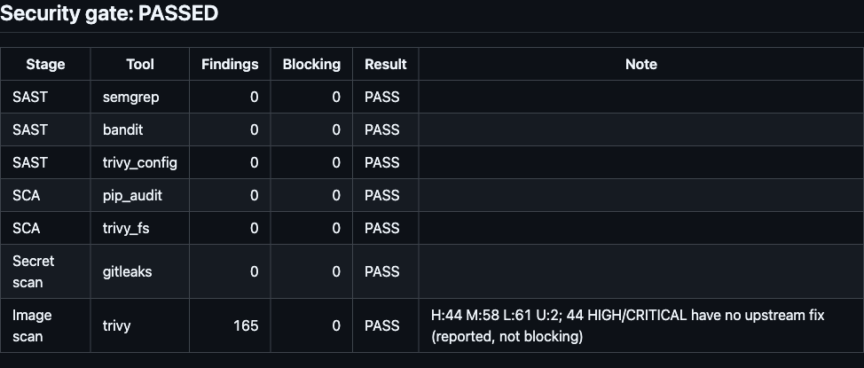

### 9. Push Image — GHCR

The job runs only after the gate passes, and only for pushes to `main` (not for
pull requests). It loads the scanned `image.tar` and verifies the image ID. It
then logs in to `ghcr.io` with the built-in `GITHUB_TOKEN` (`packages: write`)
and pushes three tags: the commit SHA, `1.0.0` and `latest`.

```
loaded   sha256:49d4c5681e1b0ae36844028e5443e462c3399af7d0e8ecd4847475297e71f02e
expected sha256:49d4c5681e1b0ae36844028e5443e462c3399af7d0e8ecd4847475297e71f02e
Login Succeeded!
ghcr.io/astro-dude/s17-devsecops-app:a11c0e9079ddcb32a840ea5c9fca009155c3622b
ghcr.io/astro-dude/s17-devsecops-app:1.0.0
ghcr.io/astro-dude/s17-devsecops-app:latest
pushed ghcr.io/astro-dude/s17-devsecops-app@sha256:b52f45a32d7e5a5c616f530b9a03e7c452a9f8120a500a939336513c7923b381
```

(The *image ID* `49d4c568…` is the digest of the image config. The *repo digest*
`b52f45a3…` is the digest of the manifest in the registry. They are different
hashes of the same image, and Kubernetes pulls by the second one.)

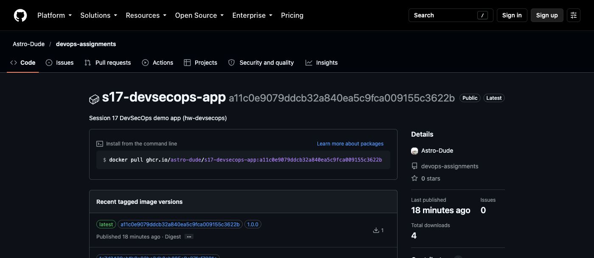

The package inherited the repository's **public** visibility, so its tags can be
listed anonymously ([`evidence/ghcr-tags.txt`](evidence/ghcr-tags.txt)):

```
$ curl -s -H "Authorization: Bearer $TOKEN" https://ghcr.io/v2/astro-dude/s17-devsecops-app/tags/list
{"name":"astro-dude/s17-devsecops-app","tags":["d17d7c34b033b8db4f6b7411eca5211bc2920f99","1.0.0","latest","1a7d2439eb1b9a83bc3db0cb005e9c27faf7891c","a11c0e9079ddcb32a840ea5c9fca009155c3622b"]}
```

Only the three commits whose gate passed (`d17d7c3`, `1a7d243`, `a11c0e9`) have
an image. There are none for the blocked commits `3d214ab`, `52d5fa5` and `a60d3f3`.

### 10. Deploy to Kubernetes

A GitHub-hosted runner cannot reach a cluster on my laptop (the course notes say
the same). The deploy job therefore creates an **ephemeral kind cluster inside
the runner** (`helm/kind-action`, Kubernetes v1.37.0) and deploys into it. The
cluster is destroyed with the runner. The same manifests work against any real
cluster with `kubectl apply -k k8s/`.

Manifests ([`k8s/`](k8s/)):

| Object | Security / reliability settings |
|---|---|
| `Namespace s17-devsecops` | `pod-security.kubernetes.io/enforce: restricted`. The API server rejects any non-compliant pod |
| `ServiceAccount` | `automountServiceAccountToken: false` (the app never talks to the API) |
| `Deployment` (2 replicas) | pod + container `securityContext`: `runAsNonRoot`, `runAsUser: 10001`, `readOnlyRootFilesystem`, `allowPrivilegeEscalation: false`, `capabilities.drop: [ALL]`, `seccompProfile: RuntimeDefault`. **Probes**: startup and liveness on `/health`, readiness on `/ready`. **Resources**: requests 50m/64Mi, limits 250m/192Mi. `RollingUpdate maxUnavailable: 0`. Memory-backed `emptyDir` for `/tmp` |
| `Service` | ClusterIP 80 -> named port `http` (8000) |
| `NetworkPolicy` | ingress only on TCP 8000, **no egress** at all |

Excerpt from the deploy job (the full log is in
[`evidence/run-37632031493-final-green.log.txt`](evidence/run-37632031493-final-green.log.txt)).
The job applies the namespace and SA, creates a `docker-registry` pull secret
from `GITHUB_TOKEN` (`packages: read`) and attaches it to the SA. It then runs
`kustomize edit set image hw-devsecops=ghcr.io/astro-dude/s17-devsecops-app@sha256:...`,
`kubectl apply -k .` and `rollout status`, followed by verification and the smoke test:

```
64:        image: ghcr.io/astro-dude/s17-devsecops-app@sha256:b52f45a32d7e5a5c616f530b9a03e7c452a9f8120a500a939336513c7923b381
service/hw-devsecops created
deployment.apps/hw-devsecops created
networkpolicy.networking.k8s.io/hw-devsecops created
Waiting for deployment "hw-devsecops" rollout to finish: 0 of 2 updated replicas are available...
Waiting for deployment "hw-devsecops" rollout to finish: 1 of 2 updated replicas are available...
deployment "hw-devsecops" successfully rolled out

NAME                                READY   STATUS    RESTARTS   AGE   IP           NODE                NOMINATED NODE   READINESS GATES
pod/hw-devsecops-695684b74d-vl92b   1/1     Running   0          8s    10.244.0.6   s17-control-plane   <none>           <none>
pod/hw-devsecops-695684b74d-zmv8r   1/1     Running   0          8s    10.244.0.5   s17-control-plane   <none>           <none>
--- image running in the pods
hw-devsecops-695684b74d-vl92b  ghcr.io/astro-dude/s17-devsecops-app@sha256:b52f45a32d7e5a5c616f530b9a03e7c452a9f8120a500a939336513c7923b381
hw-devsecops-695684b74d-zmv8r  ghcr.io/astro-dude/s17-devsecops-app@sha256:b52f45a32d7e5a5c616f530b9a03e7c452a9f8120a500a939336513c7923b381
--- process identity inside the container
uid=10001(app) gid=10001(app) groups=10001(app)
--- Pod Security admission rejects a root/privileged pod in this namespace
Error from server (Forbidden): pods "pss-probe" is forbidden: violates PodSecurity "restricted:latest": privileged (container "p" must not set securityContext.privileged=true), allowPrivilegeEscalation != false (container "p" must set securityContext.allowPrivilegeEscalation=false), unrestricted capabilities (container "p" must set securityContext.capabilities.drop=["ALL"]), runAsNonRoot != true (pod or container "p" must set securityContext.runAsNonRoot=true), seccompProfile (pod or container "p" must set securityContext.seccompProfile.type to "RuntimeDefault" or "Localhost")

+ curl -sf http://127.0.0.1:18080/health
{"status":"healthy","timestamp":"2026-10-07T13:57:29.129083+00:00"}
+ curl -sf http://127.0.0.1:18080/ready
{"status":"ready","timestamp":"2026-10-07T13:57:29.138231+00:00"}
+ curl -sf http://127.0.0.1:18080/api/status
{"app":"hw-devsecops","git_sha":"a11c0e9079ddcb32a840ea5c9fca009155c3622b","payment_api":"https://payments.example.invalid/v1","platform":"Linux","python_version":"3.12.15","status":"running","uptime_seconds":2.9,"version":"1.0.0"}
deployed git_sha matches commit
+ curl -sf -X POST http://127.0.0.1:18080/api/calculate -H 'Content-Type: application/json' -d '{"a":6,"b":7,"operation":"multiply"}'
{"a":6.0,"b":7.0,"operation":"multiply","result":42.0}
HTTP/1.1 200 OK
X-Content-Type-Options: nosniff
X-Frame-Options: DENY
Content-Security-Policy: default-src 'self'; style-src 'self'; script-src 'self'; frame-ancestors 'none'
+ code=400
+ test 400 = 400
```

The smoke test checks more than "is it up". It asserts that the running code
reports the same `git_sha` as the commit, that the security headers are present,
and that hostile input still gets a 400 in the deployed build. The PSS probe
shows the namespace really enforces `restricted`. The hardened Deployment was
admitted, and a privileged pod was refused.

Final green run: all ten stages passed, and the deploy job's steps:

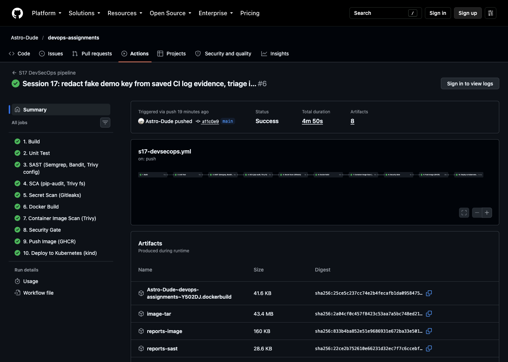
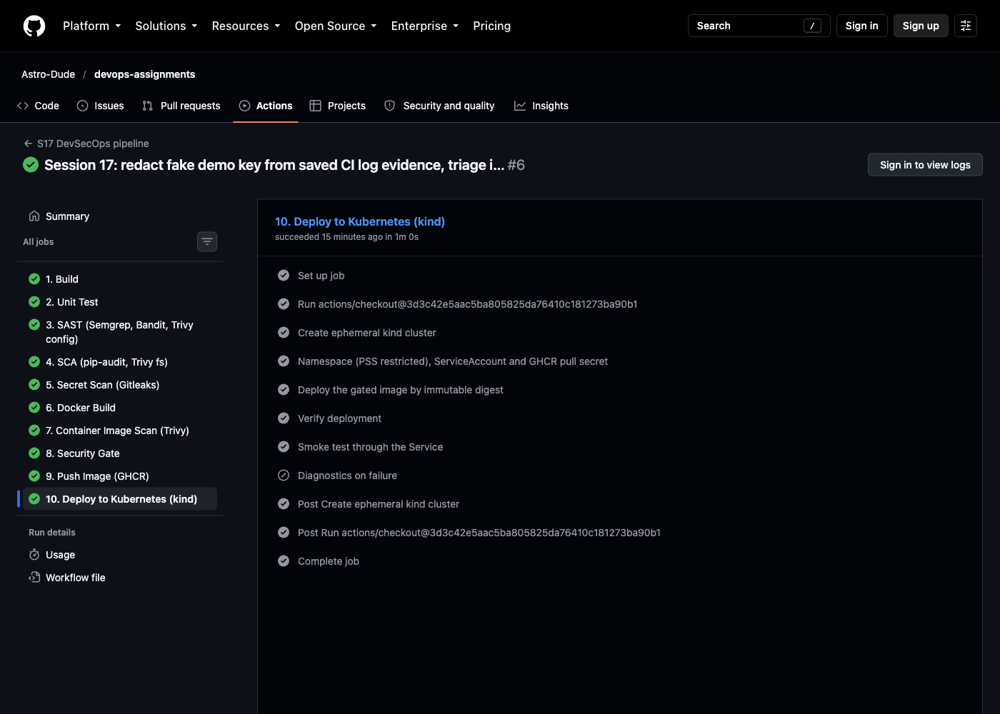

Every scan report is uploaded as an artifact (SARIF/JSON/SBOM, retained 14 days;
gate result 30 days):

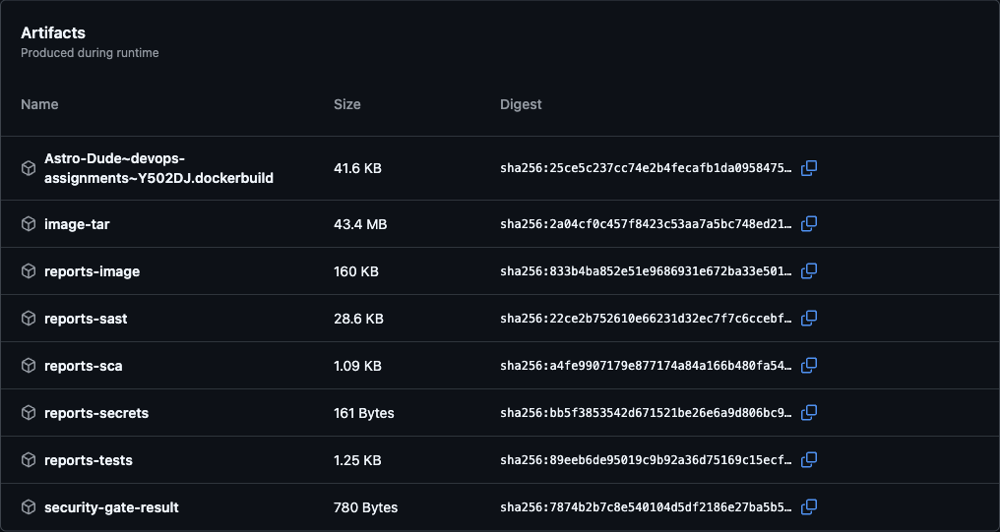

---

## Demonstrating the gate

### Run 37629169373: an insecure commit is blocked

Commit `3d214ab` deliberately introduced three realistic mistakes in one change,
while keeping the unit tests green:

1. **Command injection.** A "network diagnostics" endpoint:
   ```python
   @app.route("/api/diag/ping")
   def diag_ping():
       host = request.args.get("host", "127.0.0.1")
       out = subprocess.run(f"ping -c 1 {host}", shell=True, capture_output=True, text=True, timeout=5)
   ```
2. **Hardcoded secret.** `app/config.py` got
   `PAYMENT_API_KEY = "pay_live_…"` (32 random characters). It was an
   **obviously fake key for a made-up provider**, with a comment in the file
   saying so. No real credential was ever committed.
3. **Vulnerable dependency.** `gunicorn` was pinned to `21.2.0` (with hashes).

Unit tests passed in CI (`17 passed`, `TOTAL 66 3 95%`), so a pipeline without
security stages would have shipped it. Every scanner caught its part:

```
# Bandit
>> Issue: [B602:subprocess_popen_with_shell_equals_true] subprocess call with shell=True identified, security issue.
   Severity: High   Confidence: High
   Location: app/main.py:115:10

# pip-audit
Found 4 known vulnerabilities in 1 package
gunicorn       21.2.0     PYSEC-2026-1434 (fix 22.0.0), PYSEC-2026-1433 (fix 22.0.0), PYSEC-2026-1434 (fix 22.0.0), PYSEC-2026-1433 (fix 22.0.0)

# Trivy fs
requirements.txt (pip)
Total: 2 (UNKNOWN: 0, LOW: 0, MEDIUM: 0, HIGH: 2, CRITICAL: 0)
│ gunicorn │ CVE-2024-1135 │ HIGH     │ fixed  │ 21.2.0            │ 22.0.0        │ python-gunicorn: HTTP Request Smuggling due to improper │

# Gitleaks (--redact)
Finding:     PAYMENT_API_KEY = "REDACTED
Secret:      REDACTED
RuleID:      hw-payment-live-key
File:        DevOps/17-devsecops/app/config.py
Line:        5
Commit:      3d214abf2f7b63675fefff980e7f5677434162d8
Fingerprint: 3d214abf2f7b63675fefff980e7f5677434162d8:DevOps/17-devsecops/app/config.py:hw-payment-live-key:5
1:33PM WRN leaks found: 1
```

The gate turned that into one decision
([`evidence/gate-results/run2-gate-failed-gate-summary.md`](evidence/gate-results/run2-gate-failed-gate-summary.md)):

```
## Security gate: FAILED - push and deploy are blocked

| Stage | Tool | Findings | Blocking | Result | Note |
|---|---|---:|---:|---|---|
| SAST | semgrep | 5 | 4 | FAIL |  |
| SAST | bandit | 2 | 1 | FAIL |  |
| SAST | trivy_config | 0 | 0 | PASS |  |
| SCA | pip_audit | 4 | 4 | FAIL |  |
| SCA | trivy_fs | 2 | 2 | FAIL | H:2 |
| Secret scan | gitleaks | 1 | 1 | FAIL |  |
| Image scan | trivy | 167 | 2 | FAIL | H:46 M:58 L:61 U:2; 44 HIGH/CRITICAL have no upstream fix (reported, not blocking) |

### Blocking findings: SAST / semgrep
- ERROR s17-subprocess-shell-true at DevOps/17-devsecops/app/main.py:115
- ERROR subprocess-injection at DevOps/17-devsecops/app/main.py:115
- ERROR dangerous-subprocess-use at DevOps/17-devsecops/app/main.py:115
- ERROR subprocess-shell-true at DevOps/17-devsecops/app/main.py:115
### Blocking findings: SAST / bandit
- HIGH/HIGH B602 subprocess_popen_with_shell_equals_true at app/main.py:115
...
### Blocking findings: Secret scan / gitleaks
- hw-payment-live-key in DevOps/17-devsecops/app/config.py:5 (commit 3d214ab)
### Blocking findings: Image scan / trivy
- HIGH CVE-2024-1135 gunicorn 21.2.0 -> fixed in 22.0.0
- HIGH CVE-2024-6827 gunicorn 21.2.0 -> fixed in 22.0.0
Error: Process completed with exit code 1.
```

```
$ gh run view 37629169373 -R Astro-Dude/devops-assignments
X main S17 DevSecOps pipeline · 37629169373
JOBS
✓ 1. Build in 11s (ID 112818627300)
✓ 2. Unit Test in 18s (ID 112818738192)
✓ 3. SAST (Semgrep, Bandit, Trivy config) in 39s (ID 112818899913)
✓ 4. SCA (pip-audit, Trivy fs) in 27s (ID 112819227618)
✓ 5. Secret Scan (Gitleaks) in 6s (ID 112819457294)
✓ 6. Docker Build in 41s (ID 112819529818)
✓ 7. Container Image Scan (Trivy) in 22s (ID 112819868673)
X 8. Security Gate in 7s (ID 112820060465)
- 9. Push Image (GHCR) in 0s (ID 112820137406)
- 10. Deploy to Kubernetes (kind) in 0s (ID 112820137471)
```

`9. Push Image` and `10. Deploy` are **skipped** (`-`). The insecure image was
never published, as the GHCR tag list above confirms. The vulnerable gunicorn
was caught **three times**: by pip-audit and Trivy fs on the manifest, and again
by Trivy in the built image.

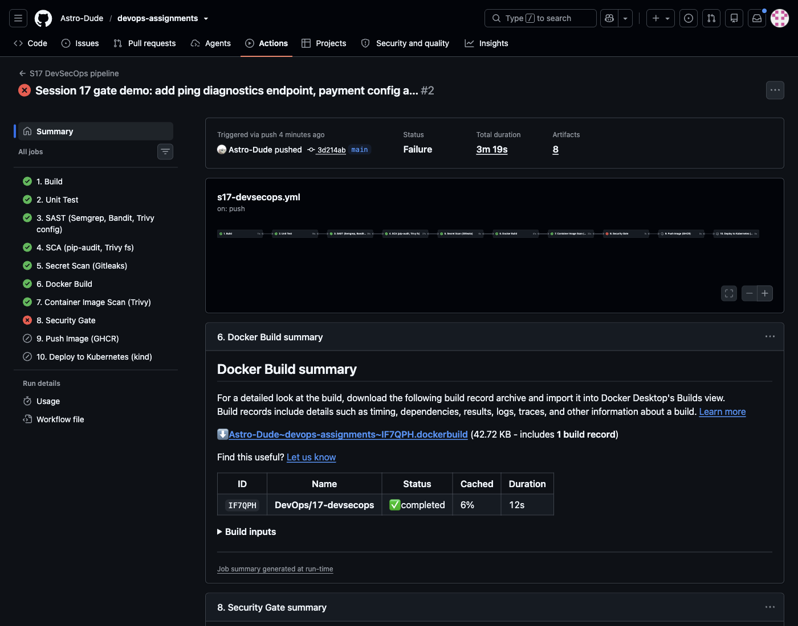
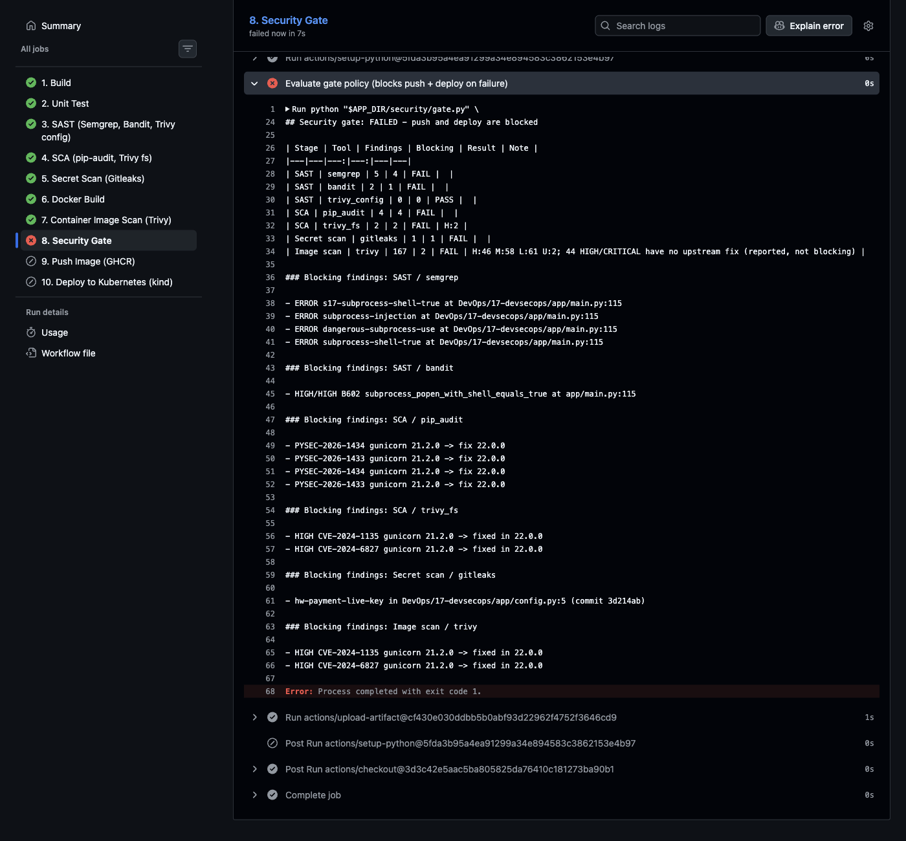
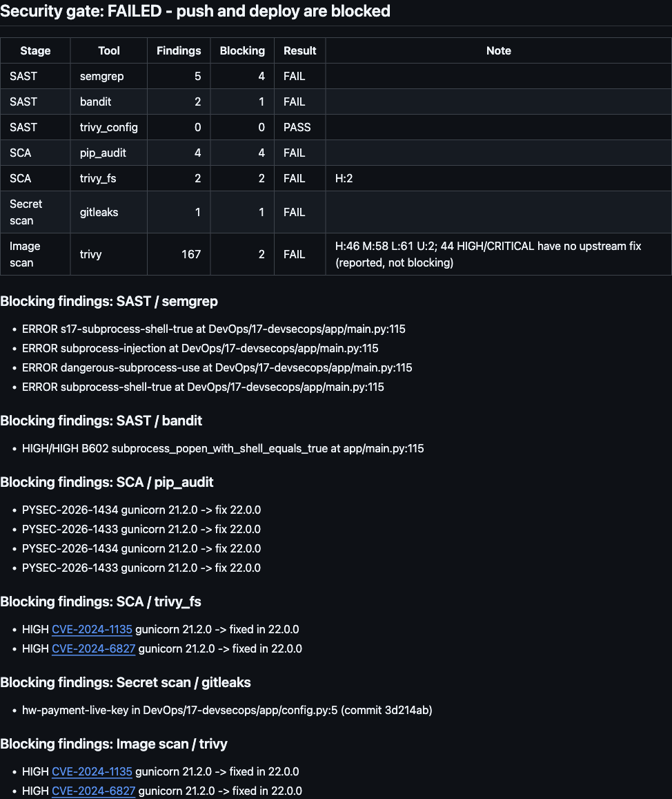

### Run 37629854333: fixing the code is not enough for a leaked secret

Commit `52d5fa5` fixed the code properly. It deleted the `shell=True` endpoint
(ops diagnostics do not belong in a public API), changed `config.py` to read
`PAYMENT_API_KEY` from the environment, and moved gunicorn back to `26.2.0`.
SAST, SCA and the image went green. **The gate still failed:**

```
| Secret scan | gitleaks | 1 | 1 | FAIL |  |
### Blocking findings: Secret scan / gitleaks
- hw-payment-live-key in DevOps/17-devsecops/app/config.py:5 (commit 3d214ab)
```

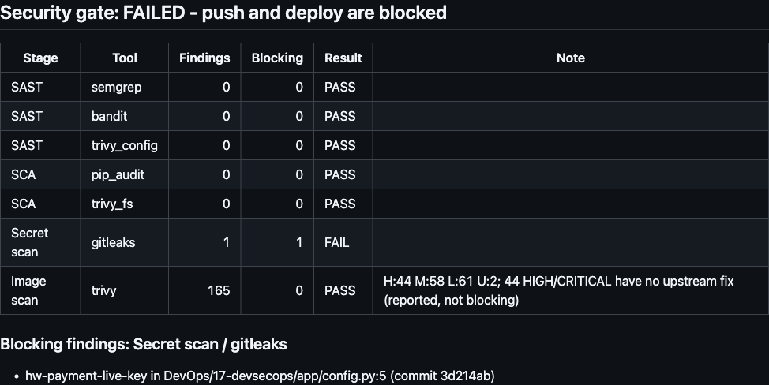

This is intended. The key is no longer in `HEAD`, but it is still in commit
`3d214ab`, and anyone can read it in the public history. In a real incident the
next step is to **revoke/rotate the credential at the provider**. Rewriting
history is not enough, and this shared repository must never be force-pushed.
Only after rotation is the historical finding acknowledged. Commit `1a7d243`
added its fingerprint to [`security/.gitleaksignore`](security/.gitleaksignore)
with the date, the reason and the fixing commit. Run
[37630491334](https://github.com/Astro-Dude/devops-assignments/actions/runs/37630491334)
then went green, pushed and deployed.

### Run 37631434958: an unplanned, real catch

While collecting evidence I saved the cleaned logs of the failed run under
`evidence/`, and they were picked up by a `git add -A`. Gitleaks redacts its own
output, but **Semgrep's text output prints the matched source line**, and that
line was `PAYMENT_API_KEY = "pay_live_…"`. The pipeline blocked my own
documentation commit:

```
| Secret scan | gitleaks | 1 | 1 | FAIL |  |
### Blocking findings: Secret scan / gitleaks
- hw-payment-live-key in DevOps/17-devsecops/evidence/run-37629169373-gate-failed.log.txt:96 (commit a60d3f3)
```

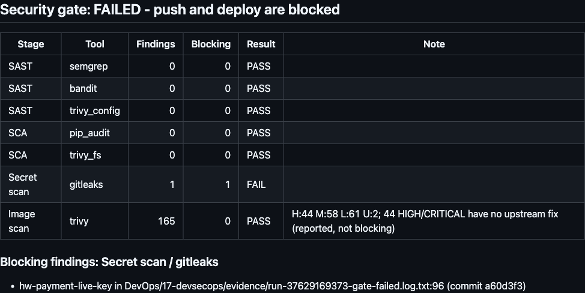

The fix (commit `a11c0e9`) redacted the value in the saved logs
(`pay_live_[REDACTED-FAKE-DEMO-KEY]`) and triaged that fingerprint too. The
following run, 37632031493, is the final green one. The key was fake and already
in history, so nothing new was exposed. Had it been real, the scanner would have
stopped me from re-publishing it.

> About the screenshots: the failed-run pages (`run-failed-gate-*`,
> `run-history-leak-gate-summary`) were taken from the live GitHub UI while
> signed in. After a machine reboot, the browser's GitHub session was gone, and
> GitHub only shows job summaries and logs to signed-in users. So
> `run-green-gate-summary.png` and `run-evidence-leak-gate-summary.png` show
> GitHub's rendering of the **downloaded `security-gate-result` artifacts**
> committed under [`evidence/gate-results/`](evidence/gate-results/). This is the
> same markdown the gate wrote to the job summary. The green-run overview,
> deploy-job and artifact screenshots are the public run pages.

---

## Run it locally

```bash
cd DevOps/17-devsecops
python3.12 -m venv .venv && . .venv/bin/activate
pip install --require-hashes --no-deps -r requirements.txt && pip install -r requirements-dev.txt
python -m pytest --cov=app                      # 17 passed, 100% coverage
docker build -t s17-app:local .
docker run --rm --read-only --tmpfs /tmp -p 9301:8000 s17-app:local

# scanners, same versions as CI
docker run --rm -v "$PWD:/src" -w /src semgrep/semgrep:1.178.0 \
  semgrep scan --config security/semgrep/rules.yml --config p/python --config p/flask --metrics=off app
bandit -c security/bandit.yaml -r app
pip-audit -r requirements.txt --require-hashes --disable-pip
docker run --rm -v "$PWD:/src" -w /src aquasec/trivy:0.75.0 config .
docker save s17-app:local -o /tmp/img.tar && \
  docker run --rm -v /tmp/img.tar:/img.tar aquasec/trivy:0.75.0 image --input /img.tar --severity HIGH,CRITICAL
python3 security/gate.py --policy security/gate-policy.toml --reports <dir with sast/ sca/ secrets/ image/ reports>

# deploy to any cluster
kubectl apply -k k8s/
```

---

## Lessons learned

1. **One gate, many scanners.** Letting each scanner fail its own job would have
   stopped at SAST and hidden the SCA, secret and image problems. Collecting all
   reports and deciding once gave a complete picture in one run (6 of 7 checks
   red in run 37629169373), plus one file to review when the policy changes.
2. **Fail closed.** A gate that passes when a report is missing is worse than no
   gate. My own broken test script produced exactly that situation, and the gate
   refused to pass.
3. **Thresholds need nuance.** A blanket "no HIGH in the image" rule would have
   blocked every build on 44 Debian CVEs that have no fix. "HIGH/CRITICAL *with a
   fix*", together with printing the unfixed count every run, is strict where
   action is possible and honest about the rest.
4. **Secrets live in history.** Deleting the line did not make run 37629854333
   pass, and it should not. Remediation means revoking the credential. Ignore
   entries are a record of that triage (fingerprint, date, reason), not a way to
   silence the scanner.
5. **Tool output can leak secrets too.** Gitleaks has `--redact`. Semgrep's text
   output does not, so a "harmless" CI log copied into the repo carried the key.
   Logs and artifacts deserve the same care as source code. Stage files
   explicitly instead of `git add -A`.
6. **Scan what you ship, deploy what you scanned.** Building once, passing the
   tar between jobs, checking the image ID before push and deploying by digest
   closes the gap where a rebuilt or re-tagged image differs from the scanned one.
7. **Defence in depth works.** The vulnerable gunicorn was caught three times
   (pip-audit, Trivy fs, Trivy image), and the injection was caught by Bandit,
   the registry Semgrep rules and my own rule. In the cluster, Pod Security
   admission would refuse a misconfigured pod even if the manifest scan missed it.
8. **Supply chain applies to the pipeline itself.** Actions are pinned to commit
   SHAs, scanner images to digests, and Gitleaks is checked against its SHA-256.
   A security pipeline that runs `@latest` tools is trusting whoever controls
   those tags.

## Notes and limitations

* The Kubernetes cluster is a **kind cluster created inside the GitHub runner**
  and destroyed with it. No persistent or cloud cluster was used, because that
  needs a paid account or exposing a home cluster to the internet. The deploy
  step is otherwise the same as for a real cluster.
* SARIF files are uploaded as artifacts only, not to GitHub code scanning. The
  gate summary and job summary are the review interface.
* The final image still contains the 44 unfixed Debian HIGH CVEs described
  above. A distroless or Chainguard-style base would remove most of them. I kept
  `python:3.12-slim` because the assignment asks for a slim base and the venv
  copies cleanly between same-distribution stages.
* pip-audit listed each gunicorn advisory twice in run 37629169373 (a quirk of
  `--disable-pip` mode). `gate.py` was changed in `52d5fa5` to de-duplicate by
  (package, version, ID). The output above is unedited.
* Workflow artifacts (scan reports, image tar) expire after 14 days (gate result:
  30 days). The gate summaries and cleaned logs are therefore copied into
  [`evidence/`](evidence/).
