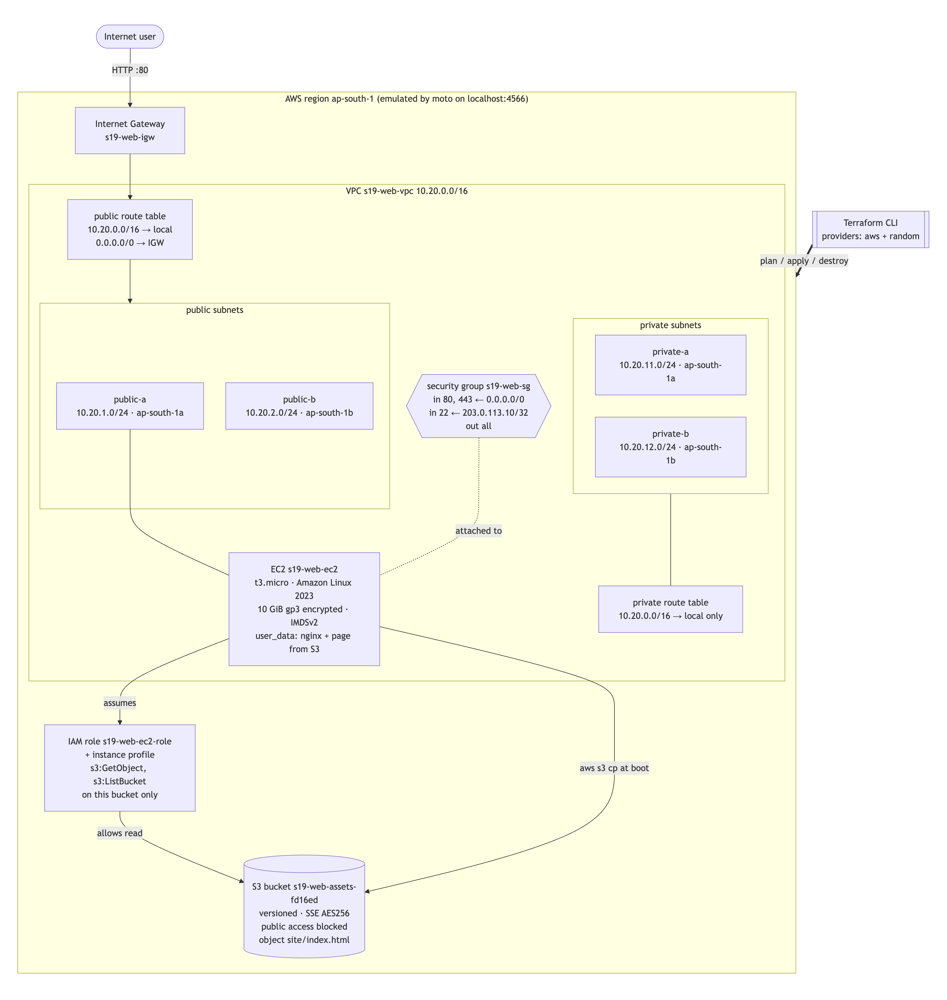
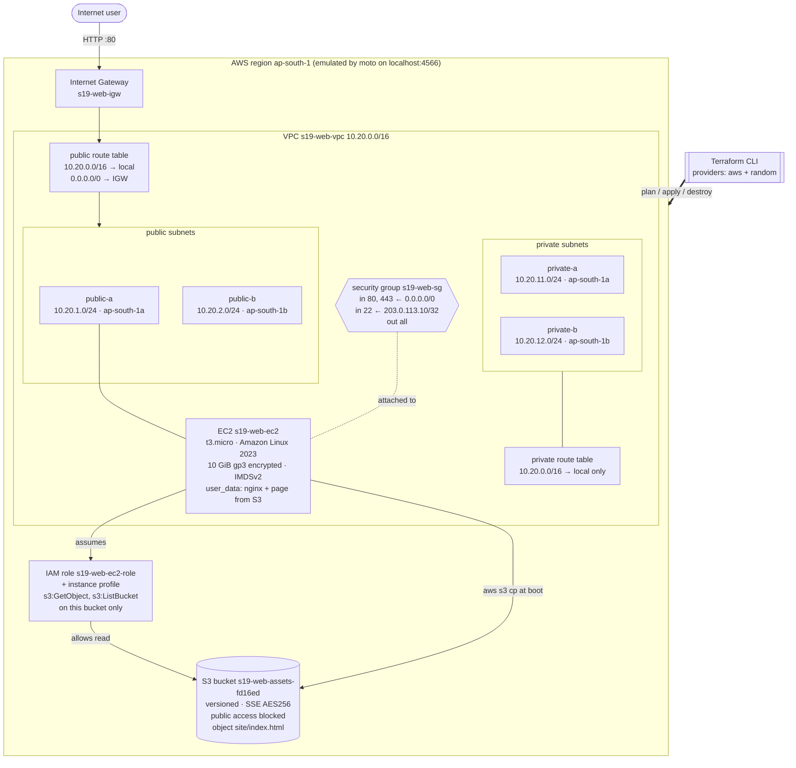
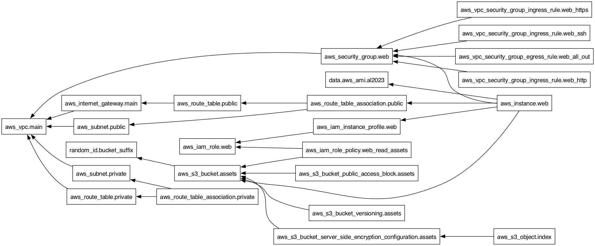
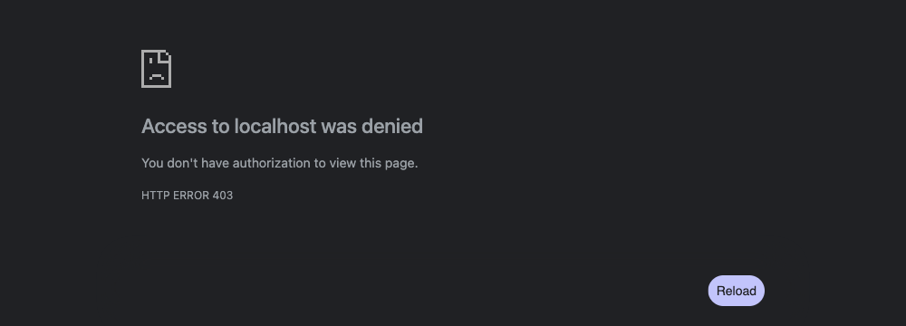
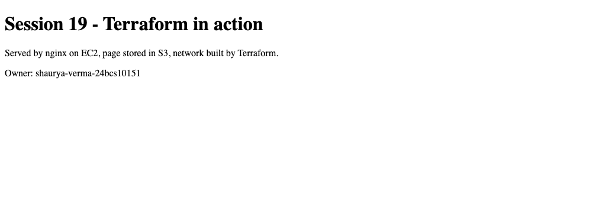

# Cloud & Terraform in Action — Homework

Session 19. An end-to-end Terraform project that builds a small but complete
AWS web stack:

**VPC → public + private subnets → Internet Gateway + route tables → security
group → EC2 (with an IAM role) → S3**

The whole lifecycle was run and captured: `init`, `validate`, `plan`, `apply`,
state inspection, AWS CLI verification, change-impact plans, and `destroy`.

> **Where the resources were created:** there is no AWS account behind this
> homework. Everything was provisioned on a **local AWS API emulator** in
> Docker (`hw-localstack` on `localhost:4566`). LocalStack's current image
> refuses to start without a licence token, so the container runs
> [**moto**](https://github.com/getmoto/moto) in server mode instead (details
> and the captured LocalStack error are in the
> [Session 18 README](../18-terraform-iac/README.md#where-the-aws-resources-were-created)).
>
> - Terraform and the AWS CLI talk to it through the real AWS APIs, so every
>   ID, plan and error below is genuine output.
> - But no VM actually boots, so nginx never runs and there is no real web
>   page at the instance's "public IP".
> - [Pointing at real AWS](#targeting-real-aws) needs only a change to the
>   provider block.

---

## Architecture



The same diagram as Mermaid source ([`diagrams/architecture.mmd`](diagrams/architecture.mmd)).
The PNG above was rendered from it in a browser.



What each piece does:

- **VPC** `10.20.0.0/16`: the private network, 65,536 addresses.
- **2 public subnets** (one per AZ). Their route table sends `0.0.0.0/0` to the
  **Internet Gateway**, which is what makes them public. The web server lives
  in `public-a`.
- **2 private subnets**. Their route table has only the `local` route, so
  there is no internet access in either direction. This is where a database
  would go. A NAT gateway was deliberately left out: on real AWS it is billed
  per hour, and the lab doesn't need outbound internet from the private tier.
- **Security group:**
  - HTTP and HTTPS from anywhere;
  - SSH only from one admin `/32`;
  - all outbound allowed.
- **EC2**:
  - Amazon Linux 2023, with the AMI looked up by a data source rather than
    hard-coded;
  - encrypted gp3 root disk;
  - IMDSv2 enforced;
  - `user_data` installs nginx and copies the page from S3.
- **IAM role + instance profile**: lets the instance read *only* this bucket,
  with no access keys anywhere.
- **S3 bucket**:
  - name made unique with a `random_id` suffix;
  - versioned, encrypted, all public access blocked;
  - holds `site/index.html`, rendered from a template.

---

## Project layout

```
19-cloud-terraform/
├── versions.tf          required Terraform version + required_providers (aws, random)
├── provider.tf          provider configuration (emulator endpoints, default_tags)
├── variables.tf         inputs, types, defaults, one validation rule
├── terraform.tfvars     values for this deployment
├── network.tf           VPC, subnets (for_each), IGW, route tables + associations
├── security.tf          security group + rules, IAM role / policy / instance profile
├── compute.tf           AMI data source + EC2 instance (depends_on lives here)
├── storage.tf           random_id, S3 bucket + versioning/encryption/public-access-block, object
├── outputs.tf           IDs, IPs, bucket name, URL
├── files/
│   ├── user_data.sh.tftpl   boot script, rendered with templatefile()
│   └── index.html.tftpl     page uploaded to S3
├── diagrams/            architecture (mmd/html/png) + terraform graph (dot/svg/png)
├── screenshots/         browser screenshots of the S3 object
├── evidence/            raw transcripts of every command below
├── .terraform.lock.hcl  provider versions pinned by init
└── .gitignore           .terraform/, *.tfstate*, tfplan
```

The files are split **by concern** (network / security / compute / storage),
not by resource type. Terraform loads every `*.tf` file in the directory as one
configuration, so file names only matter to humans.

---

## Concepts demonstrated

### 1. Providers

`versions.tf` declares **two** providers with version constraints; `init`
downloads both:

```
$ terraform init -no-color
Initializing the backend...
Initializing provider plugins...
- Finding hashicorp/random versions matching "~> 3.6"...
- Finding hashicorp/aws versions matching "~> 6.0"...
- Installing hashicorp/random v3.9.1...
- Installed hashicorp/random v3.9.1 (signed by HashiCorp)
- Installing hashicorp/aws v6.67.0...
- Installed hashicorp/aws v6.67.0 (signed by HashiCorp)
...
Terraform has been successfully initialized!
```

([`evidence/01-init.txt`](evidence/01-init.txt))

- `aws` talks to the cloud API.
- `random` never touches the network: it only generates values that are stored
  in state, here the bucket suffix.

`provider.tf` sets the region and the emulator endpoints, plus `default_tags`,
which stamps `Project / Session / ManagedBy / Owner` on every taggable resource
without repeating it 20 times.

### 2. Variables

[`variables.tf`](variables.tf) uses several kinds of variable:

- a `string` with a default (`aws_region`);
- one **with no default**, which must be set (`owner`, supplied by
  [`terraform.tfvars`](terraform.tfvars));
- `map(string)` variables that drive `for_each` (`public_subnets`,
  `private_subnets`);
- a custom **validation** rule on `vpc_cidr`, tested here:

```
$ terraform plan -no-color -var vpc_cidr=10.20.0.0/28

Planning failed. Terraform encountered an error while generating this plan.

Error: Invalid value for variable

  on variables.tf line 24:
  24: variable "vpc_cidr" {
    ├────────────────
    │ var.vpc_cidr is "10.20.0.0/28"

vpc_cidr must be a valid IPv4 CIDR block of /24 or larger.

This was checked by the validation rule at variables.tf:29,3-13.
[exit code: 1]
```

([`evidence/11-variable-validation.txt`](evidence/11-variable-validation.txt))

Values can come from several places. In order of precedence, from highest:

1. `-var` / `-var-file` on the command line
2. `*.auto.tfvars`
3. `terraform.tfvars`
4. `TF_VAR_name` environment variables
5. the variable's `default`

### 3. Resources (and a data source)

There are 27 managed resource instances (26 AWS + 1 `random_id`) plus 1 data source:

- `resource` blocks **create** things.
- `data "aws_ami" "al2023"` only **reads** something that already exists: the
  newest Amazon Linux 2023 AMI in the region.
- `for_each` turns one block into several **instances**, addressed by key:
  `aws_subnet.public["a"]`, `aws_subnet.public["b"]`.

### 4. Outputs

[`outputs.tf`](outputs.tf) exposes the values someone would need after
apply. One of them is built with a `for` expression
(`{ for k, s in aws_subnet.public : k => s.id }`):

```
$ terraform output
ami_used = "ami-0884624fc54d115f3 (al2023-ami-2023.12.20260727.0-kernel-6.1-x86_64)"
bucket_name = "s19-web-assets-fd16ed"
instance_id = "i-8698d0daf5dddb969"
instance_private_ip = "10.20.1.4"
instance_public_ip = "54.214.30.109"
private_subnet_ids = {
  "a" = "subnet-6946e3334833dc6af"
  "b" = "subnet-009573264804cc716"
}
public_subnet_ids = {
  "a" = "subnet-1af7252bc7cb1b341"
  "b" = "subnet-b85df48409da6c95b"
}
security_group_id = "sg-0865ba1db15857b76"
vpc_id = "vpc-81867c303e3b227ec"
web_url = "http://54.214.30.109/"

$ terraform output -raw instance_public_ip
54.214.30.109

$ terraform output -json public_subnet_ids
{"a":"subnet-1af7252bc7cb1b341","b":"subnet-b85df48409da6c95b"}
```

([`evidence/07-output.txt`](evidence/07-output.txt)) The private IP
`10.20.1.4` is the **first usable address** of `10.20.1.0/24`. AWS reserves
`.0`–`.3`.

### 5. Dependencies

**Implicit dependencies** come from references. Writing
`vpc_id = aws_vpc.main.id` tells Terraform that the subnet needs the VPC first.
Every arrow in the graph below comes from a reference like that, with one
exception.

**Explicit dependencies** (`depends_on`) are for ordering Terraform can't see.
In [`compute.tf`](compute.tf):

```hcl
resource "aws_instance" "web" {
  ...
  # user_data needs internet access at boot (dnf install nginx). Nothing in this
  # block references the IGW or the route-table association, so without
  # depends_on Terraform could start the instance before the public route exists.
  depends_on = [
    aws_internet_gateway.main,
    aws_route_table_association.public,
  ]
}
```

The instance references the subnet, but that says nothing about whether the
subnet can reach the internet yet. The second `depends_on`, in
[`storage.tf`](storage.tf), makes the S3 object wait for the bucket's
encryption config.

You can see this in the apply log. The VPC, IAM role, bucket and `random_id`
start immediately and in parallel. The instance is created **last**, right
after the two public route-table associations finish:

```
random_id.bucket_suffix: Creating...
random_id.bucket_suffix: Creation complete after 0s [id=_Rbt]
aws_iam_role.web: Creating...
aws_vpc.main: Creating...
aws_s3_bucket.assets: Creating...
...
aws_route_table_association.public["b"]: Creation complete after 0s [id=rtbassoc-27d64c65207073c6a]
aws_route_table_association.public["a"]: Creation complete after 0s [id=rtbassoc-2ef2d1ac237e74774]
aws_instance.web: Creating...
aws_instance.web: Still creating... [00m10s elapsed]
aws_instance.web: Creation complete after 10s [id=i-8698d0daf5dddb969]

Apply complete! Resources: 27 added, 0 changed, 0 destroyed.
```

#### `terraform graph`

`terraform graph` prints the dependency graph in Graphviz DOT format
([`diagrams/terraform-graph.dot`](diagrams/terraform-graph.dot)). I rendered it
with `dot -Tpng` (graphviz 16.1.0):

```
$ terraform graph > diagrams/terraform-graph.dot
$ dot -Tpng -Gdpi=110 diagrams/terraform-graph.dot -o diagrams/terraform-graph.png
```



Read each arrow as "depends on". `aws_vpc.main` sits at the far left, since
nearly everything leads back to it. `aws_instance.web` is on the right, with
edges to:

- the **AMI data source**,
- the **security group**,
- the **instance profile**,
- the **S3 bucket** (through `user_data`), and
- `aws_route_table_association.public`, which comes from `depends_on`.

The graph is *transitively reduced*: the instance → IGW edge isn't drawn
separately, because the instance already reaches the IGW through the route
table association → public route table. The state file still records the full
dependency list (see below).

### 6. Terraform state

After apply, `terraform.tfstate` is Terraform's record of **which real object
belongs to which resource address**, plus every attribute it last saw:

```
$ terraform state list
aws_iam_instance_profile.web
aws_iam_role.web
aws_iam_role_policy.web_read_assets
aws_instance.web
aws_internet_gateway.main
aws_route_table.private
aws_route_table.public
aws_route_table_association.private["a"]
aws_route_table_association.private["b"]
aws_route_table_association.public["a"]
aws_route_table_association.public["b"]
aws_s3_bucket.assets
aws_s3_bucket_public_access_block.assets
aws_s3_bucket_server_side_encryption_configuration.assets
aws_s3_bucket_versioning.assets
aws_s3_object.index
aws_security_group.web
aws_subnet.private["a"]
aws_subnet.private["b"]
aws_subnet.public["a"]
aws_subnet.public["b"]
aws_vpc.main
aws_vpc_security_group_egress_rule.web_all_out
aws_vpc_security_group_ingress_rule.web_http
aws_vpc_security_group_ingress_rule.web_https
aws_vpc_security_group_ingress_rule.web_ssh
data.aws_ami.al2023
random_id.bucket_suffix
```

`terraform state show` for a single resource (excerpt; full output for the
instance, a subnet and the public route table is in
[`evidence/06-state.txt`](evidence/06-state.txt)):

```
$ terraform state show -no-color aws_instance.web
# aws_instance.web:
resource "aws_instance" "web" {
    ami                                  = "ami-0884624fc54d115f3"
    arn                                  = "arn:aws:ec2:ap-south-1::instance/i-8698d0daf5dddb969"
    associate_public_ip_address          = true
    availability_zone                    = "ap-south-1a"
    iam_instance_profile                 = "s19-web-ec2-profile"
    id                                   = "i-8698d0daf5dddb969"
    instance_state                       = "running"
    instance_type                        = "t3.micro"
    primary_network_interface_id         = "eni-29722b81bb190ee92"
    private_dns                          = "ip-10-20-1-4.ap-south-1.compute.internal"
    private_ip                           = "10.20.1.4"
    public_dns                           = "ec2-54-214-30-109.ap-south-1.compute.amazonaws.com"
    public_ip                            = "54.214.30.109"
    subnet_id                            = "subnet-1af7252bc7cb1b341"
    ...
    user_data                            = <<-EOT
        #!/bin/bash
        # Rendered by Terraform templatefile(); runs once on first boot (cloud-init).
        set -euxo pipefail
        dnf install -y nginx
        aws s3 cp "s3://s19-web-assets-fd16ed/site/index.html" /usr/share/nginx/html/index.html --region "ap-south-1"
        systemctl enable --now nginx
    EOT
    vpc_security_group_ids               = [
        "sg-0865ba1db15857b76",
    ]
    ...
```

`user_data` shows the template already rendered, with the real bucket name
filled in. That name was itself only known after `random_id` ran.

Looking inside the state file itself
([`evidence/06b-state-file.txt`](evidence/06b-state-file.txt)):

```
$ ls -l terraform.tfstate*
-rw-r--r--@ 53099 terraform.tfstate
-rw-r--r--@ 50364 terraform.tfstate.backup

$ jq '{version, terraform_version, serial, lineage, resources: (.resources|length), outputs: (.outputs|keys)}' terraform.tfstate
{
  "version": 4,
  "terraform_version": "1.16.4",
  "serial": 30,
  "lineage": "062f9e7b-1b88-3f6f-aff3-a07164800d06",
  "resources": 24,
  "outputs": [ "ami_used", "bucket_name", "instance_id", ... "web_url" ]
}

$ jq '.resources[] | select(.type=="aws_instance") | {mode, type, name, provider, dependencies: .instances[0].dependencies}' terraform.tfstate
{
  "mode": "managed",
  "type": "aws_instance",
  "name": "web",
  "provider": "provider[\"registry.terraform.io/hashicorp/aws\"]",
  "dependencies": [
    "aws_iam_instance_profile.web",
    "aws_iam_role.web",
    "aws_internet_gateway.main",
    "aws_route_table.public",
    "aws_route_table_association.public",
    "aws_s3_bucket.assets",
    "aws_security_group.web",
    "aws_subnet.public",
    "aws_vpc.main",
    "data.aws_ami.al2023",
    "random_id.bucket_suffix"
  ]
}
```

(The `outputs` array is condensed above; all ten names are in the evidence
file.)

What this shows about state:

- **It is JSON.** `version` is the file format version, `serial` increases on
  every write (30 by now), and `lineage` is a UUID identifying this particular
  state's history. Terraform refuses to overwrite a state that has a different
  lineage.
- **`resources: 24`** counts resource *blocks*: the 22 AWS resource blocks,
  `random_id`, and the data source. The `for_each` blocks each hold several *instances*,
  which is why apply reported 27.
- Each resource records its **full, transitive dependency list**. This is how
  `destroy` knows the right order even after the `.tf` files have been deleted.
- `terraform.tfstate.backup` is the previous version, written automatically.
- **State is sensitive.** It contains every attribute in plain text, including
  any passwords or keys a resource returns. It also has to be shared and locked
  when a team works on the same infrastructure. That's why the
  [`.gitignore`](.gitignore) keeps it out of Git. A real project would use a
  remote backend, for example:

  ```hcl
  terraform {
    backend "s3" {
      bucket       = "astro-dude-tf-state"
      key          = "session19/terraform.tfstate"
      region       = "ap-south-1"
      encrypt      = true
      use_lockfile = true
    }
  }
  ```

Other state commands worth knowing:

| Command | Purpose |
|---|---|
| `terraform state mv` | rename an address without destroying the object (or use a `moved {}` block) |
| `terraform state rm` | stop managing an object without deleting it |
| `terraform import` / `import {}` block | adopt an existing object into state |
| `terraform apply -refresh-only` | accept real-world drift into state |

### 7. `terraform plan`

```
$ terraform fmt -check -recursive
[exit code: 0]
$ terraform validate -no-color
Success! The configuration is valid.

$ terraform plan -no-color -out=tfplan
...
  # aws_instance.web will be created
  + resource "aws_instance" "web" {
      + ami                                  = "ami-0884624fc54d115f3"
      + iam_instance_profile                 = "s19-web-ec2-profile"
      + instance_type                        = "t3.micro"
      + private_ip                           = (known after apply)
      + public_ip                            = (known after apply)
      + subnet_id                            = (known after apply)
      + user_data                            = (known after apply)
      + vpc_security_group_ids               = (known after apply)
      ...
Plan: 27 to add, 0 to change, 0 to destroy.

Saved the plan to: tfplan
```

(Full plan: [`evidence/03-plan.txt`](evidence/03-plan.txt).)

- The AMI ID is already known at plan time, because data sources are read
  during planning.
- `subnet_id` and `user_data` are `(known after apply)` because they depend on
  resources that don't exist yet.
- `-out=tfplan` saves the plan, so the apply executes **exactly** what was
  reviewed. CI pipelines use this.

#### Plans as impact analysis

Before changing anything, `plan` tells you how far a change will ripple
([`evidence/10-change-plans.txt`](evidence/10-change-plans.txt)):

```
$ terraform plan -no-color -var instance_type=t3.small
  # aws_instance.web will be updated in-place
      ~ instance_type                        = "t3.micro" -> "t3.small"
Plan: 0 to add, 1 to change, 0 to destroy.

$ terraform plan -no-color -var vpc_cidr=10.30.0.0/16 -var 'public_subnets={...}' -var 'private_subnets={...}' | grep -E "must be replaced|will be|Plan:"
  # aws_instance.web must be replaced
  # aws_internet_gateway.main will be updated in-place
  # aws_route_table.private must be replaced
  # aws_route_table.public must be replaced
  # aws_route_table_association.private["a"] must be replaced
  ...
  # aws_subnet.public["b"] must be replaced
  # aws_vpc.main must be replaced
  # aws_vpc_security_group_egress_rule.web_all_out must be replaced
  ...
Plan: 17 to add, 1 to change, 17 to destroy.
```

- Resizing the instance is an **in-place update**.
- A VPC's CIDR can't be changed after creation, so the VPC **must be
  replaced**, and replacement cascades down the dependency graph:
  - subnets, route tables, the security group and its rules, and the instance
    are all replaced;
  - the IGW is only re-attached.

That is the dependency graph doing its job, and the reason to always read a
plan before applying it.

### 8. `terraform apply`

```
$ terraform apply -no-color tfplan
...
Apply complete! Resources: 27 added, 0 changed, 0 destroyed.
```

([`evidence/04-apply.txt`](evidence/04-apply.txt)) Applying a saved plan file
doesn't ask for confirmation; reviewing the plan *was* the confirmation.

**Idempotency check.** Running `plan` again right afterwards should show "No
changes". It didn't, because of one emulator quirk: moto ignores tags sent in
the CreateBucket call, the same issue seen in Session 18. Terraform detected the
drift, one apply fixed it, and the next plan was clean
([`evidence/05-plan-after-apply.txt`](evidence/05-plan-after-apply.txt); in the
re-apply part of that file, the "Refreshing state…" lines were filtered out
with `grep -v`):

```
$ terraform plan -no-color -detailed-exitcode
  # aws_s3_bucket.assets will be updated in-place
  ~ resource "aws_s3_bucket" "assets" {
      ~ tags                        = {
          + "Name" = "s19-web-assets"
        }
...
Plan: 0 to add, 1 to change, 0 to destroy.
[exit code: 2]

$ terraform apply -no-color -auto-approve
aws_s3_bucket.assets: Modifying... [id=s19-web-assets-fd16ed]
aws_s3_bucket.assets: Modifications complete after 0s [id=s19-web-assets-fd16ed]
Apply complete! Resources: 0 added, 1 changed, 0 destroyed.

$ terraform plan -no-color -detailed-exitcode
No changes. Your infrastructure matches the configuration.
[exit code: 0]
```

### 9. AWS infrastructure: verified outside Terraform

Every resource was checked directly through the emulator's AWS API with the
AWS CLI ([`evidence/08-aws-cli-verify.txt`](evidence/08-aws-cli-verify.txt);
`aws` = `aws --endpoint-url http://localhost:4566`):

```
$ aws ec2 describe-subnets --filters Name=vpc-id,Values=vpc-81867c303e3b227ec --query ... --output table
+-------------------+----------------------------+----------------+--------------+---------+
|  s19-web-public-a |  subnet-1af7252bc7cb1b341  |  10.20.1.0/24  |  ap-south-1a |  True   |
|  s19-web-private-a|  subnet-6946e3334833dc6af  |  10.20.11.0/24 |  ap-south-1a |  False  |
|  s19-web-private-b|  subnet-009573264804cc716  |  10.20.12.0/24 |  ap-south-1b |  False  |
|  s19-web-public-b |  subnet-b85df48409da6c95b  |  10.20.2.0/24  |  ap-south-1b |  True   |
+-------------------+----------------------------+----------------+--------------+---------+

$ aws ec2 describe-internet-gateways --filters Name=attachment.vpc-id,Values=vpc-81867c303e3b227ec ...
[
    {
        "IGW": "igw-70e6dacf2c7f672ca",
        "AttachedTo": "vpc-81867c303e3b227ec",
        "State": "available"
    }
]

$ aws ec2 describe-route-tables --filters Name=vpc-id,Values=vpc-81867c303e3b227ec Name=tag:Project,Values=s19-web ...
[
    {
        "Name": "s19-web-private-rt",
        "Routes": [ "10.20.0.0/16-> local" ],
        "Subnets": [ "subnet-6946e3334833dc6af", "subnet-009573264804cc716" ]
    },
    {
        "Name": "s19-web-public-rt",
        "Routes": [ "10.20.0.0/16-> local", "0.0.0.0/0-> igw-70e6dacf2c7f672ca" ],
        "Subnets": [ "subnet-b85df48409da6c95b", "subnet-1af7252bc7cb1b341" ]
    }
]

$ aws ec2 describe-security-group-rules --filters Name=group-id,Values=sg-0865ba1db15857b76 ... --output table
+-------+------+------+------+------------------+------------------------------------+
|  True |  -1  |  -1  |  -1  |  0.0.0.0/0       |  All outbound                      |
|  False|  tcp |  22  |  22  |  203.0.113.10/32 |  SSH from the admin address only   |
|  False|  tcp |  80  |  80  |  0.0.0.0/0       |  HTTP from anywhere                |
|  False|  tcp |  443 |  443 |  0.0.0.0/0       |  HTTPS from anywhere               |
+-------+------+------+------+------------------+------------------------------------+

$ aws ec2 describe-instances --instance-ids i-8698d0daf5dddb969 --query ...
{
    "Id": "i-8698d0daf5dddb969",
    "State": "running",
    "Type": "t3.micro",
    "AMI": "ami-0884624fc54d115f3",
    "Subnet": "subnet-1af7252bc7cb1b341",
    "PrivateIp": "10.20.1.4",
    "PublicIp": "54.214.30.109",
    "SGs": [ "sg-0865ba1db15857b76" ],
    "Profile": "arn:aws:iam::123456789012:instance-profile/s19-web-ec2-profile",
    "IMDS": "required"
}

$ aws ec2 describe-volumes --filters Name=attachment.instance-id,Values=i-8698d0daf5dddb969 ... --output table
+------------------------+-----+------+-------+-------------+
|  vol-6260eed306e112bfa |  10 |  gp3 |  True |  /dev/xvda  |
+------------------------+-----+------+-------+-------------+

$ aws iam get-role-policy --role-name s19-web-ec2-role --policy-name read-site-assets --query PolicyDocument
{
    "Version": "2012-10-17",
    "Statement": [
        { "Action": [ "s3:ListBucket" ], "Effect": "Allow", "Resource": "arn:aws:s3:::s19-web-assets-fd16ed" },
        { "Action": [ "s3:GetObject" ],  "Effect": "Allow", "Resource": "arn:aws:s3:::s19-web-assets-fd16ed/*" }
    ]
}

$ aws s3api get-bucket-versioning --bucket s19-web-assets-fd16ed
{
    "Status": "Enabled"
}
$ aws s3 ls s3://s19-web-assets-fd16ed --recursive
2026-10-07 19:58:55        279 site/index.html
```

(Some JSON arrays and objects are condensed onto one line here; the evidence
file has the exact output, plus encryption, the public-access block, the
decoded `user_data`, and the object body.)

#### Screenshots: the S3 object in a browser

The bucket is private, so an anonymous request is refused, while a
**pre-signed URL** (signed with credentials, valid for 10 minutes) works
([`evidence/09-s3-access.txt`](evidence/09-s3-access.txt)):

```
$ curl -s -o /dev/null -w "%{http_code}\n" http://localhost:4566/s19-web-assets-fd16ed/site/index.html      # anonymous
403
$ URL=$(aws --endpoint-url http://localhost:4566 s3 presign s3://s19-web-assets-fd16ed/site/index.html --expires-in 600)
$ curl -s -o /dev/null -w "%{http_code} %{content_type}\n" "$URL"      # signed
200 text/html
```

| Anonymous GET → 403 (public access blocked) | Pre-signed GET → the page Terraform uploaded |
|---|---|
|  |  |

These show the page **object as stored in S3**, fetched directly from the
emulated S3 API. On real AWS, the instance's `user_data` would copy this file
into nginx and serve it at `http://<instance_public_ip>/`. The emulator boots
no VM, so that last hop could not be shown.

### 10. `terraform destroy`

```
$ terraform destroy -no-color      # typed "yes" at the prompt
...
Plan: 0 to add, 0 to change, 27 to destroy.
...
  Enter a value: 
aws_s3_bucket_public_access_block.assets: Destroying... [id=s19-web-assets-fd16ed]
aws_iam_role_policy.web_read_assets: Destroying... [id=s19-web-ec2-role:read-site-assets]
...
aws_instance.web: Destroying... [id=i-8698d0daf5dddb969]
...
aws_instance.web: Destruction complete after 10s
aws_route_table_association.public["b"]: Destroying... [id=rtbassoc-27d64c65207073c6a]
aws_iam_instance_profile.web: Destroying... [id=s19-web-ec2-profile]
aws_security_group.web: Destroying... [id=sg-0865ba1db15857b76]
aws_s3_bucket.assets: Destroying... [id=s19-web-assets-fd16ed]
...
aws_vpc.main: Destroying... [id=vpc-81867c303e3b227ec]
aws_vpc.main: Destruction complete after 0s

Destroy complete! Resources: 27 destroyed.

$ terraform state list
[exit code: 0]

$ aws ec2 describe-vpcs --filters Name=tag:Project,Values=s19-web --query Vpcs
[]
$ aws ec2 describe-instances --filters Name=tag:Project,Values=s19-web --query ... --output text
i-8698d0daf5dddb969	terminated
$ aws s3 ls

$ aws iam get-role --role-name s19-web-ec2-role --query Role.Arn
aws: [ERROR]: An error occurred (NoSuchEntity) when calling the GetRole operation: Role s19-web-ec2-role not found
```

([`evidence/12-destroy.txt`](evidence/12-destroy.txt)) Destroy runs the graph
**backwards**:

1. Dependents go first: rules, associations, the object, the instance.
2. The instance profile, security group and public route-table associations
   wait until the instance has terminated.
3. The VPC goes last.

The terminated instance stays visible for a while, as it does on real AWS;
everything else is gone. The state is empty.

---

## Command summary

```bash
docker run -d --name hw-localstack -p 4566:5000 motoserver/moto:latest   # local AWS emulator
cd DevOps/19-cloud-terraform
terraform init
terraform fmt -check -recursive
terraform validate
terraform plan -out=tfplan
terraform apply tfplan
terraform plan -detailed-exitcode        # idempotency / drift check
terraform state list
terraform state show aws_instance.web
terraform output
terraform graph > diagrams/terraform-graph.dot && dot -Tpng diagrams/terraform-graph.dot -o diagrams/terraform-graph.png
terraform destroy
```

## Targeting real AWS

Replace the provider block in [`provider.tf`](provider.tf):

```hcl
provider "aws" {
  region = var.aws_region
  default_tags {
    tags = { Project = var.project, Session = "19", ManagedBy = "Terraform", Owner = var.owner }
  }
}
```

and drop the `aws_endpoint` variable. Credentials then come from
`aws configure`, `AWS_PROFILE`, SSO, or an assumed role. Everything else stays
the same.

On a real account:

- the `t3.micro` and 10 GiB gp3 volume are Free-Tier-eligible;
- the public IPv4 address is billed hourly;
- set `admin_cidr` to your own IP before applying.

## Evidence index

| File | Content |
|---|---|
| [01-init.txt](evidence/01-init.txt) | `terraform init` |
| [02-fmt-validate.txt](evidence/02-fmt-validate.txt) | `fmt -check`, `validate` |
| [03-plan.txt](evidence/03-plan.txt) | full plan, 27 to add |
| [04-apply.txt](evidence/04-apply.txt) | apply of the saved plan |
| [05-plan-after-apply.txt](evidence/05-plan-after-apply.txt) | drift → re-apply → clean plan |
| [06-state.txt](evidence/06-state.txt) | `state list`, `state show` (instance, subnet, route table) |
| [06b-state-file.txt](evidence/06b-state-file.txt) | state-file metadata and recorded dependencies |
| [07-output.txt](evidence/07-output.txt) | `terraform output` |
| [08-aws-cli-verify.txt](evidence/08-aws-cli-verify.txt) | AWS CLI checks of every resource |
| [09-s3-access.txt](evidence/09-s3-access.txt) | anonymous 403 vs pre-signed 200 |
| [10-change-plans.txt](evidence/10-change-plans.txt) | in-place vs replace impact plans |
| [11-variable-validation.txt](evidence/11-variable-validation.txt) | validation rule rejecting a /28 |
| [12-destroy.txt](evidence/12-destroy.txt) | destroy + post-destroy checks |
