# Monitoring, Observability & GitOps — Homework

Session 20. One single-node kind cluster (`hw-s20`) running a complete stack:
**Prometheus + Alertmanager + Grafana** (kube-prometheus-stack), **metrics-server**,
**Loki + Grafana Alloy** for logs, **Jaeger** for traces, and **Argo CD** for GitOps,
plus a small two-service demo app written for this assignment that emits all three
signals.

Everything below is **real captured output** from that cluster (raw transcripts in
[`evidence/`](evidence/), browser screenshots in [`screenshots/`](screenshots/)).
All `kubectl`/`helm` commands were run with `--context kind-hw-s20` /
`--kube-context kind-hw-s20`. The transcripts print them without the flag (see
[`scripts/run.sh`](scripts/run.sh)) so they read the same as the course material.

| Component | Version |
|---|---|
| kind / Kubernetes | v0.33.0 / v1.37.0 (arm64) |
| kube-prometheus-stack chart | 92.1.0 (Prometheus v3.15.0, Alertmanager v0.34.1, Grafana 13.2.3, operator v0.94.1) |
| metrics-server chart | 3.14.0 (app 0.9.0) |
| Loki chart / Alloy chart | 7.3.0 (Loki 3.6) / 1.13.0 (Alloy v1.20.0) |
| Jaeger | 2.22.0 all-in-one (OTLP in, in-memory storage) |
| Argo CD chart | 10.9.7 (Argo CD v3.5.4) |

```
20-monitoring-observability-gitops/
├── kind/kind-config.yaml                single node, NodePorts 31080-31081 on 127.0.0.1
├── monitoring/
│   ├── helm-values/                     values for every Helm release (all trimmed for a shared machine)
│   │   ├── kube-prometheus-stack.yaml
│   │   ├── metrics-server.yaml
│   │   ├── loki.yaml
│   │   └── alloy.yaml
│   ├── demo-app/                        app.py + Dockerfile: Flask, prometheus_client, OpenTelemetry
│   └── k8s/
│       ├── 01-shop-app.yaml             shop-web -> shop-inventory, probes, requests/limits
│       ├── 02-servicemonitor.yaml       tells Prometheus to scrape /metrics
│       ├── 03-prometheusrule.yaml       4 alert rules (CPU, memory, app down, error rate)
│       ├── 04-loadgen.yaml              steady traffic + a CPU burner (replicas: 0 by default)
│       └── 05-grafana-dashboard.yaml    the "Shop demo - Session 20" dashboard as a ConfigMap
├── tracing/jaeger.yaml
├── gitops/
│   ├── argocd-values.yaml               Argo CD Helm values
│   ├── argocd-application.yaml          the Application (applied once, lives OUTSIDE the synced path)
│   └── app/                             <- the path Argo CD watches on GitHub
│       ├── namespace.yaml  configmap.yaml  deployment.yaml  service.yaml
├── scripts/                             tiny helpers used to query Prometheus/Loki/Jaeger and take screenshots
├── evidence/                            raw transcripts, numbered in the order they were taken
└── screenshots/
```

---

## 0. Building the stack

```bash
kind create cluster --config kind/kind-config.yaml          # cluster "hw-s20"

helm repo add prometheus-community https://prometheus-community.github.io/helm-charts
helm repo add grafana https://grafana.github.io/helm-charts
helm repo add argo https://argoproj.github.io/argo-helm
helm repo add metrics-server https://kubernetes-sigs.github.io/metrics-server/

helm upgrade --install metrics-server metrics-server/metrics-server -n kube-system \
  -f monitoring/helm-values/metrics-server.yaml --version 3.14.0
helm upgrade --install kps prometheus-community/kube-prometheus-stack -n monitoring --create-namespace \
  -f monitoring/helm-values/kube-prometheus-stack.yaml --version 92.1.0
helm upgrade --install loki grafana/loki -n logging --create-namespace \
  -f monitoring/helm-values/loki.yaml --version 7.3.0
helm upgrade --install alloy grafana/alloy -n logging \
  -f monitoring/helm-values/alloy.yaml --version 1.13.0
helm upgrade --install argocd argo/argo-cd -n argocd --create-namespace \
  -f gitops/argocd-values.yaml --version 10.9.7 --timeout 15m --wait

docker build -t shop-demo:1.1.0 monitoring/demo-app
kind load docker-image shop-demo:1.1.0 --name hw-s20
kubectl apply -f tracing/jaeger.yaml -f monitoring/k8s/
```

What was trimmed to keep the footprint small (another agent runs a similar stack on
the same Docker engine): the kube-prometheus-stack control-plane scrapes kind does
not expose (etcd, scheduler, controller-manager, kube-proxy) and their rules, the
operator admission webhooks, 1 day retention; Loki in **SingleBinary** mode with
filesystem storage and no gateway/caches/canary/minio; Alloy as one Deployment that
tails logs through the Kubernetes API (no hostPath); Argo CD without Dex,
notifications or the ApplicationSet controller. Every pod has small requests.

Result ([`evidence/01-stack.txt`](evidence/01-stack.txt)):

```
$ helm list -A
NAME          	NAMESPACE  	REVISION	UPDATED                             	STATUS  	CHART                       	APP VERSION
alloy         	logging    	1       	2026-10-07 18:47:39.953791 +0530 IST	deployed	alloy-1.13.0                	v1.20.0
argocd        	argocd     	2       	2026-10-07 18:56:14.747994 +0530 IST	deployed	argo-cd-10.9.7              	v3.5.4
kps           	monitoring 	1       	2026-10-07 18:39:13.318876 +0530 IST	deployed	kube-prometheus-stack-92.1.0	v0.94.1
loki          	logging    	1       	2026-10-07 18:46:23.551486 +0530 IST	deployed	loki-7.3.0                  	3.6.12
metrics-server	kube-system	1       	2026-10-07 18:37:54.051526 +0530 IST	deployed	metrics-server-3.14.0       	0.9.0

$ kubectl get pods -n monitoring
NAME                                      READY   STATUS    RESTARTS   AGE
alertmanager-kps-alertmanager-0           2/2     Running   0          17m
kps-grafana-57d586b6cb-js4jk              3/3     Running   0          17m
kps-kube-state-metrics-5fff95b88d-2vtxv   1/1     Running   0          17m
kps-operator-749b4b6c96-6dvn6             1/1     Running   0          17m
kps-prometheus-node-exporter-dbfgh        1/1     Running   0          17m
prometheus-kps-prometheus-0               2/2     Running   0          17m

$ kubectl get pods -n logging
NAME                     READY   STATUS    RESTARTS   AGE
alloy-5df8f64b54-2gptt   2/2     Running   0          9m8s
loki-0                   2/2     Running   0          10m

$ kubectl get pods -n demo -o wide
NAME                             READY   STATUS    RESTARTS   AGE     IP            NODE
loadgen-6c9ff65b8f-d85p6         1/1     Running   0          11m     10.244.0.14   hw-s20-control-plane
shop-inventory-b86c856bf-9gl94   1/1     Running   0          2m17s   10.244.0.20   hw-s20-control-plane
shop-web-8499cdf9b-fqnqz         1/1     Running   0          2m17s   10.244.0.21   hw-s20-control-plane
shop-web-8499cdf9b-k66b6         1/1     Running   0          2m17s   10.244.0.22   hw-s20-control-plane
```

UIs were reached with port-forwards on 19000–19099 (Prometheus `:19090`, Grafana
`:19030`, Alertmanager `:19093`, Loki API `:19100`, Jaeger `:19686`, Argo CD `:19080`);
the demo app is also on NodePort `31080`.

### The demo app

[`monitoring/demo-app/app.py`](monitoring/demo-app/app.py) is one image run in two roles:

```
loadgen ──GET /order──▶ shop-web ──GET /check──▶ shop-inventory ──(simulated 20-150 ms "db.query", 5% fail)
```

| Signal | How the app emits it |
|---|---|
| Metrics | `/metrics` via `prometheus_client`: `http_requests_total{app,method,path,status}`, `http_request_duration_seconds` histogram, `shop_orders_total{result}`, `http_requests_in_flight`, `app_info` |
| Logs | one JSON line per request on stdout, including `level`, `status`, `duration_ms` and **`trace_id`** |
| Traces | OpenTelemetry SDK + Flask/requests auto-instrumentation, exported over OTLP/HTTP to Jaeger; plus a manual `db.query` span |
| Health | `/healthz` (liveness) and `/readyz` (readiness) |

---

## Task 1 — Monitoring

### 1.1 Metrics: the `/metrics` endpoint and scrape targets

([`evidence/02-app-metrics-endpoint.txt`](evidence/02-app-metrics-endpoint.txt))

```
$ curl -s http://localhost:31080/order
{"item":"keyboard","order":"placed","stock":3}

$ curl -s http://localhost:31080/metrics | grep -E "^(# (HELP|TYPE) )?(http_requests_total|shop_orders_total|app_info|http_requests_in_flight)"
# HELP http_requests_total HTTP requests
# TYPE http_requests_total counter
http_requests_total{app="shop-web",method="GET",path="/",status="200"} 172.0
http_requests_total{app="shop-web",method="GET",path="/order",status="200"} 171.0
http_requests_total{app="shop-web",method="GET",path="/order",status="502"} 10.0
# HELP shop_orders_total Orders placed
# TYPE shop_orders_total counter
shop_orders_total{result="ok"} 171.0
shop_orders_total{result="failed"} 10.0
...
http_request_duration_seconds_bucket{app="shop-web",le="0.1",path="/order"} 111.0
http_request_duration_seconds_bucket{app="shop-web",le="0.25",path="/order"} 179.0
http_request_duration_seconds_bucket{app="shop-web",le="+Inf",path="/order"} 179.0
```

That is the raw Prometheus text format: a counter only ever goes up, a histogram is
a set of cumulative `le` ("less than or equal") buckets. The 502s are the ~5% of
inventory lookups the backend fails on purpose.

Prometheus finds the pods through the [`ServiceMonitor`](monitoring/k8s/02-servicemonitor.yaml)
(the operator turns it into scrape config). All three shop pods are `UP`, next to the
stack's own targets (kubelet/cAdvisor, node-exporter, kube-state-metrics, apiserver,
CoreDNS, ...):

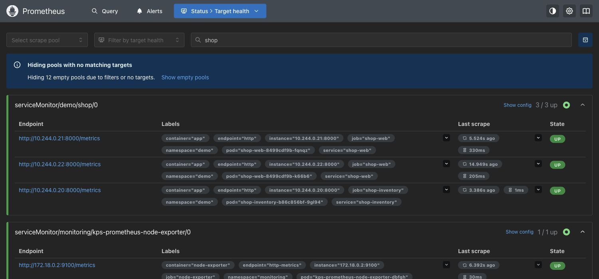

Full target list: [`screenshots/prometheus-targets-all.png`](screenshots/prometheus-targets-all.png) (every target UP).

### 1.2 Metrics: PromQL with real results

The `RED` view of the service (Rate, Errors, Duration) from
[`evidence/03-promql.txt`](evidence/03-promql.txt) (queries run through the HTTP API
by [`scripts/q.py`](scripts/q.py)):

```
PromQL> sum by (job, path) (rate(http_requests_total{namespace="demo"}[1m]))
  {job="shop-web", path="/"}  =>  2.577750617887504
  {job="shop-web", path="/order"}  =>  2.5555279018490946
  {job="shop-inventory", path="/check"}  =>  2.4888888888888885

PromQL> sum by (status) (rate(http_requests_total{namespace="demo", job="shop-web", path="/order"}[5m]))
  {status="200"}  =>  1.1037724266628102
  {status="502"}  =>  0.06245231342292484

PromQL> sum(rate(http_requests_total{namespace="demo", job="shop-web", path="/order", status=~"5.."}[5m])) / sum(rate(http_requests_total{namespace="demo", job="shop-web", path="/order"}[5m]))
  {}  =>  0.05355088947370837

PromQL> histogram_quantile(0.95, sum by (le, job, path) (rate(http_request_duration_seconds_bucket{namespace="demo"}[5m])))
  {job="shop-web", path="/"}  =>  0.0095
  {job="shop-web", path="/order"}  =>  0.23125384281346537
  {job="shop-inventory", path="/check"}  =>  0.23056521739130434

PromQL> sum by (result) (increase(shop_orders_total{namespace="demo"}[10m]))
  {result="ok"}  =>  331.5222310697007
  {result="failed"}  =>  18.757846980209614
```

- ~2.5 req/s per endpoint is the load generator (`/order` + `/` every 0.3 s).
- The error ratio is **5.4%**, matching the backend's configured `ERROR_RATE=0.05`.
- p95 of `/order` (231 ms) ≈ p95 of `/check` (231 ms): nearly all of the frontend's
  latency is spent waiting for the backend. The trace in Task 2 shows the same thing.

### 1.3 CPU utilisation

```
PromQL> sum by (pod) (rate(container_cpu_usage_seconds_total{namespace="demo", container="app"}[2m])) / sum by (pod) (kube_pod_container_resource_limits{namespace="demo", container="app", resource="cpu"})
  {pod="shop-web-8499cdf9b-fqnqz"}  =>  0.012902532410828239
  {pod="shop-inventory-b86c856bf-9gl94"}  =>  0.011578960653159493
  {pod="shop-web-8499cdf9b-k66b6"}  =>  0.013369893476555907

PromQL> 1 - avg(rate(node_cpu_seconds_total{mode="idle"}[2m]))
  {}  =>  0.11522331958716492

PromQL> topk(5, sum by (namespace) (rate(container_cpu_usage_seconds_total{container!=""}[2m])))
  {namespace="kube-system"}  =>  0.2422336354260934
  {namespace="monitoring"}  =>  0.052588220158084634
  {namespace="demo"}  =>  0.04042907091695451
  {namespace="logging"}  =>  0.033366651914464335
  {namespace="argocd"}  =>  0.02396696746631979
```

`container_cpu_usage_seconds_total` comes from cAdvisor inside the kubelet and is a
counter of CPU-seconds, so `rate()` gives "cores in use". Divided by the container's
limit (from kube-state-metrics) it becomes **% of limit**: idle, each shop pod uses
~1.3% of its 500m. The node's CPU (node-exporter) is 11.5% busy.
metrics-server answers the same question for `kubectl top`
([`evidence/04-kubectl-top.txt`](evidence/04-kubectl-top.txt)):

```
$ kubectl top nodes
NAME                   CPU(cores)   CPU(%)   MEMORY(bytes)   MEMORY(%)
hw-s20-control-plane   539m         3%       3833Mi          24%

$ kubectl top pods -n demo --containers
POD                              NAME   CPU(cores)   MEMORY(bytes)
loadgen-6c9ff65b8f-d85p6         curl   21m          1Mi
shop-inventory-b86c856bf-9gl94   app    6m           39Mi
shop-web-8499cdf9b-fqnqz         app    7m           36Mi
shop-web-8499cdf9b-k66b6         app    6m           36Mi
```

> metrics-server holds only the *latest* sample in memory (for `kubectl top` and the
> HPA). Prometheus stores *history* and can alert on it. That is why both exist.

Under load (section 1.6) the same query climbs to ~99% of the limit:

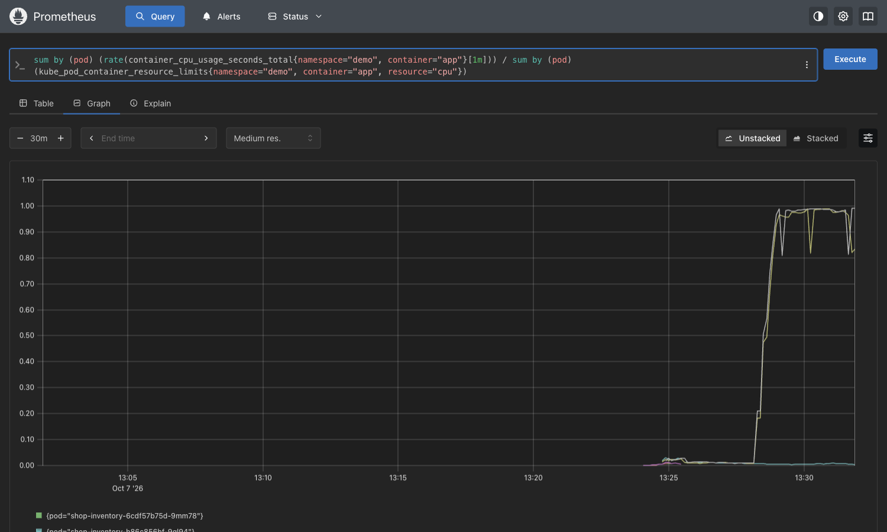

### 1.4 Memory utilisation

```
PromQL> sum by (pod) (container_memory_working_set_bytes{namespace="demo", container!=""})
  {pod="loadgen-6c9ff65b8f-d85p6"}  =>  2002944
  {pod="shop-web-8499cdf9b-fqnqz"}  =>  37900288
  {pod="shop-inventory-b86c856bf-9gl94"}  =>  41783296
  {pod="shop-web-8499cdf9b-k66b6"}  =>  38563840

PromQL> sum by (pod) (container_memory_working_set_bytes{namespace="demo", container="app"}) / sum by (pod) (kube_pod_container_resource_limits{namespace="demo", container="app", resource="memory"})
  {pod="shop-web-8499cdf9b-fqnqz"}  =>  0.18825276692708334
  {pod="shop-inventory-b86c856bf-9gl94"}  =>  0.20753987630208334
  {pod="shop-web-8499cdf9b-k66b6"}  =>  0.19154866536458334

PromQL> 1 - node_memory_MemAvailable_bytes / node_memory_MemTotal_bytes
  {... job="node-exporter" ...}  =>  0.5549143566505836

PromQL> topk(5, sum by (namespace) (container_memory_working_set_bytes{container!=""}))
  {namespace="kube-system"}  =>  1370370048
  {namespace="monitoring"}  =>  1135927296
  {namespace="argocd"}  =>  252784640
  {namespace="logging"}  =>  235024384
  {namespace="demo"}  =>  120250368
```

**Working set** is the metric the kubelet uses for OOM/eviction decisions, so it is
the one to compare against the limit: each Python pod sits at ~37 MiB, ~19% of its
192 Mi limit. The stack itself (`monitoring`) is ~1.1 GB, mostly Grafana and Prometheus.

The built-in Grafana dashboard *Kubernetes / Compute Resources / Namespace (Pods)*,
filtered to `demo`, shows the same CPU/memory against requests and limits (the CPU
spike is the load test):

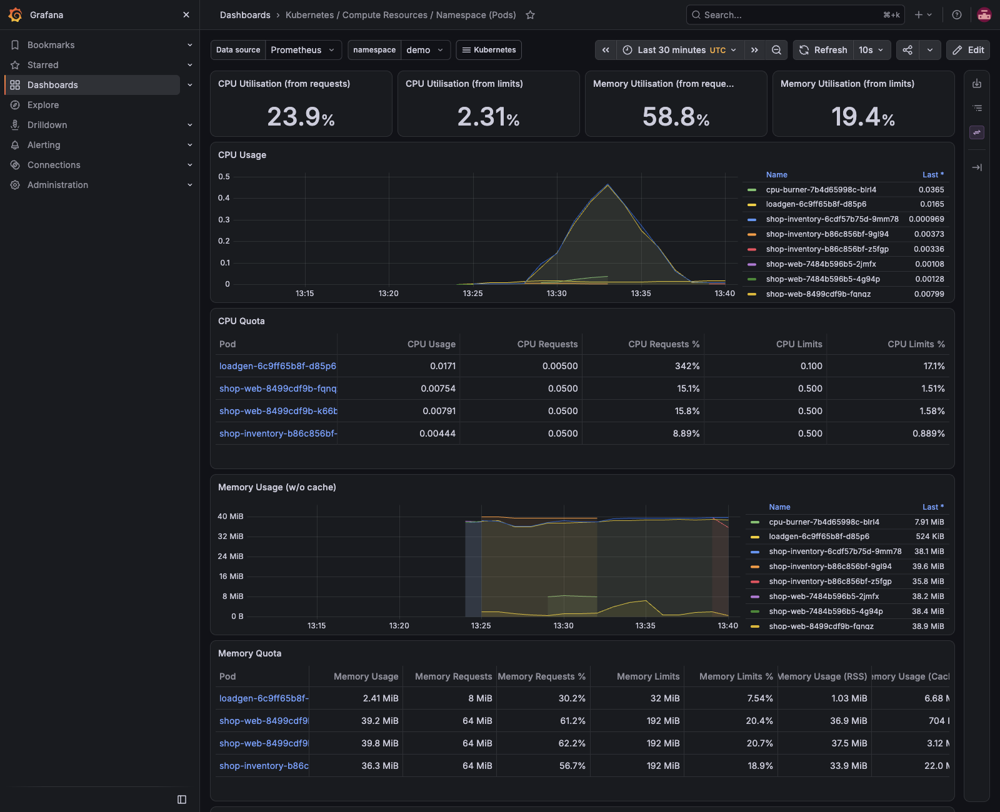

### 1.5 Application health

Three layers, each answering a different question:

```
PromQL> up{namespace="demo"}                                   # can Prometheus scrape it?
  up{... job="shop-web", pod="shop-web-8499cdf9b-fqnqz" ...}  =>  1
  up{... job="shop-inventory", pod="shop-inventory-b86c856bf-9gl94" ...}  =>  1
  up{... job="shop-web", pod="shop-web-8499cdf9b-k66b6" ...}  =>  1

PromQL> kube_pod_container_status_ready{namespace="demo"}      # is the readiness probe passing?
  kube_pod_container_status_ready{container="app", ... pod="shop-web-8499cdf9b-fqnqz" ...}  =>  1
  kube_pod_container_status_ready{container="app", ... pod="shop-inventory-b86c856bf-9gl94" ...}  =>  1
  ...

PromQL> kube_deployment_status_replicas_available{namespace="demo"}
  {deployment="shop-inventory" ...}  =>  1
  {deployment="shop-web" ...}  =>  2
  {deployment="cpu-burner" ...}  =>  0

PromQL> sum by (pod, probe_type, result) (increase(prober_probe_total{namespace="demo"}[5m]))   # kubelet probe results
  {pod="shop-web-8499cdf9b-fqnqz", probe_type="Liveness", result="successful"}  =>  16.289603597357317
  {pod="shop-web-8499cdf9b-fqnqz", probe_type="Readiness", result="failed"}  =>  0
  {pod="shop-web-8499cdf9b-fqnqz", probe_type="Readiness", result="successful"}  =>  32.579207194714634
  ...

PromQL> sum by (pod) (kube_pod_container_status_restarts_total{namespace="demo"})
  {pod="shop-web-8499cdf9b-fqnqz"}  =>  0
  ...
```

The probes themselves ([`01-shop-app.yaml`](monitoring/k8s/01-shop-app.yaml)):

```
$ kubectl describe pod -n demo -l app=shop-web | grep -E "Liveness|Readiness|Restart Count"
    Restart Count:  0
    Liveness:   http-get http://:http/healthz delay=0s timeout=1s period=10s successThreshold=1 failureThreshold=3
    Readiness:  http-get http://:http/readyz delay=0s timeout=1s period=5s successThreshold=1 failureThreshold=3
```

A failing **liveness** probe restarts the container (restart count goes up); a
failing **readiness** probe only removes the pod from the Service endpoints. Because
the ServiceMonitor scrapes through those endpoints, an unready pod also disappears
from Prometheus. That is why the "app down" alert below uses `absent(up == 1)` and
not `up == 0`.

### 1.6 Alerts

[`monitoring/k8s/03-prometheusrule.yaml`](monitoring/k8s/03-prometheusrule.yaml)
defines four rules; the operator loads them into Prometheus, Prometheus evaluates
them every 15 s and sends firing alerts to Alertmanager.

| Alert | Expression (shortened) | for |
|---|---|---|
| `ShopHighCPU` | CPU rate / CPU limit > 0.8 per pod | 1m |
| `ShopHighMemory` | working set / memory limit > 0.9 per pod | 2m |
| `ShopInventoryDown` | `absent(up{job="shop-inventory"} == 1)` | 30s |
| `ShopHighErrorRate` | 5xx share of `/order` > 20% | 1m |

Baseline ([`evidence/06-alerts-baseline.txt`](evidence/06-alerts-baseline.txt)):

```
ShopHighCPU          state=inactive  health=ok
ShopHighMemory       state=inactive  health=ok
ShopInventoryDown    state=inactive  health=ok
ShopHighErrorRate    state=inactive  health=ok
```

#### Alert 1: high CPU from a load generator

`cpu-burner` runs 6 parallel loops of `GET /work?ms=400`, which burns CPU in
`shop-web` ([`evidence/07-alert-cpu.txt`](evidence/07-alert-cpu.txt)):

```
# 18:58:00 start CPU load
$ kubectl scale deploy/cpu-burner -n demo --replicas=1
deployment.apps/cpu-burner scaled

$ kubectl top pods -n demo
NAME                             CPU(cores)   MEMORY(bytes)
cpu-burner-7b4d65998c-blrl4      36m          7Mi
loadgen-6c9ff65b8f-d85p6         10m          0Mi
shop-inventory-b86c856bf-9gl94   4m           39Mi
shop-web-8499cdf9b-fqnqz         497m         37Mi
shop-web-8499cdf9b-k66b6         499m         38Mi

PromQL> sum by (pod) (rate(container_cpu_usage_seconds_total{...}[1m])) / sum by (pod) (kube_pod_container_resource_limits{... resource="cpu"})
  {pod="shop-web-8499cdf9b-fqnqz"}  =>  0.987685129164944
  {pod="shop-inventory-b86c856bf-9gl94"}  =>  0.00901043291914958
  {pod="shop-web-8499cdf9b-k66b6"}  =>  0.9904789892632359

PromQL> sum by (pod) (rate(container_cpu_cfs_throttled_periods_total{...}[1m])) / sum by (pod) (rate(container_cpu_cfs_periods_total{...}[1m]))
  {pod="shop-web-8499cdf9b-fqnqz"}  =>  0.9782135076252724
  {pod="shop-inventory-b86c856bf-9gl94"}  =>  0
  {pod="shop-web-8499cdf9b-k66b6"}  =>  0.9837587006960556

# Prometheus rule state, 19:00:29
ShopHighCPU          state=firing    health=ok
    -> FIRING   since 2026-10-07T13:29:00Z value=0.989 labels={'pod': 'shop-web-8499cdf9b-k66b6', 'severity': 'warning'}
    -> FIRING   since 2026-10-07T13:29:00Z value=0.990 labels={'pod': 'shop-web-8499cdf9b-fqnqz', 'severity': 'warning'}

$ curl -s localhost:19093/api/v2/alerts?filter=namespace="demo"   (Alertmanager)
ShopHighCPU shop-web-8499cdf9b-fqnqz active 2026-10-07T13:30:00.517Z | shop-web-8499cdf9b-fqnqz is using 99.03% of its CPU limit
ShopHighCPU shop-web-8499cdf9b-k66b6 active 2026-10-07T13:30:00.517Z | shop-web-8499cdf9b-k66b6 is using 98.87% of its CPU limit
```

Both web pods are pinned at their 500m limit (`kubectl top` shows 497m/499m) and
throttled in ~98% of CFS periods. The alert went `pending` when the expression first
became true (13:29:00Z) and `firing` once it had stayed true for the full `for: 1m`.
The stack's built-in `CPUThrottlingHigh` rule also went pending. Times in the API
are UTC; the machine is IST (+05:30).

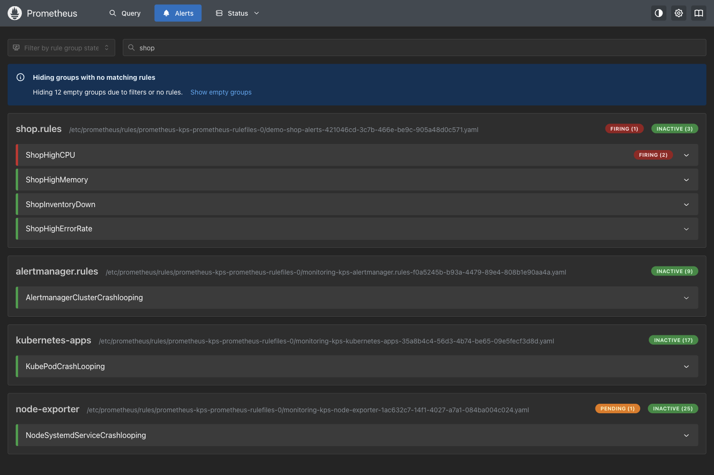

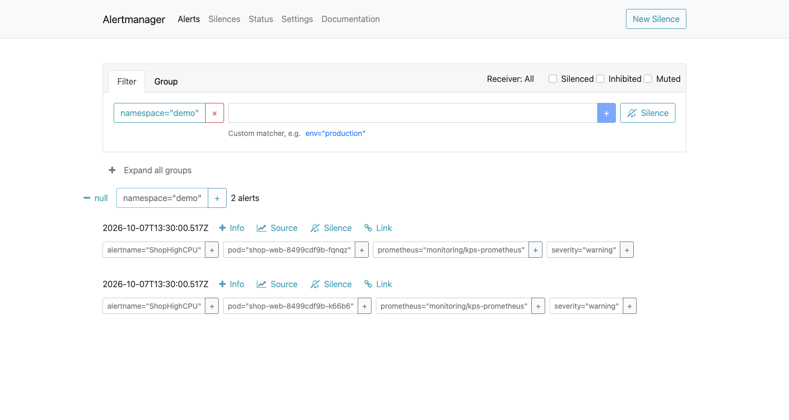

#### Alert 2: application down → error-rate alert follows

The backend is taken away completely ([`evidence/08-alert-app-down.txt`](evidence/08-alert-app-down.txt)):

```
# 19:02:11 stop CPU load
$ kubectl scale deploy/cpu-burner -n demo --replicas=0
# 19:02:11 simulate an outage of the backend
$ kubectl scale deploy/shop-inventory -n demo --replicas=0

$ for i in 1 2 3; do curl -s -w " HTTP %{http_code}\n" http://localhost:31080/order | tail -c 120; done
unable to complete your request. Either the server is overloaded or there is an error in the application.</p>
 HTTP 500
...

PromQL> absent(up{namespace="demo", job="shop-inventory"} == 1)
  {}  =>  1

PromQL> sum(rate(http_requests_total{... path="/order", status=~"5.."}[1m])) / sum(rate(http_requests_total{... path="/order"}[1m]))
  {}  =>  1

ShopInventoryDown    state=firing    health=ok
    -> FIRING   since 2026-10-07T13:32:30Z value=1.000 labels={'severity': 'critical'}
ShopHighErrorRate    state=firing    health=ok
    -> FIRING   since 2026-10-07T13:33:15Z value=1.000 labels={'severity': 'critical'}

$ curl -s "localhost:19093/api/v2/alerts?filter=alertname=~\"Shop.*\""
ShopHighErrorRate critical active 2026-10-07T13:34:15.517Z | 100% of /order requests are failing
ShopInventoryDown critical active 2026-10-07T13:33:00.517Z | No healthy shop-inventory instance is up
```

This is the usual order in a real incident: the **cause** (backend gone) fires first,
and the **symptom** users feel (100% of orders failing) follows 45 s later.

> While doing this I found that `absent()` and a bare `sum()` return a series with
> **no labels**, so these two alerts had no `namespace` and were missing from a
> `namespace="demo"` filter. I added a static `namespace: demo` label to both rules
> (the committed file has it) and re-applied. The screenshots below are after that change.

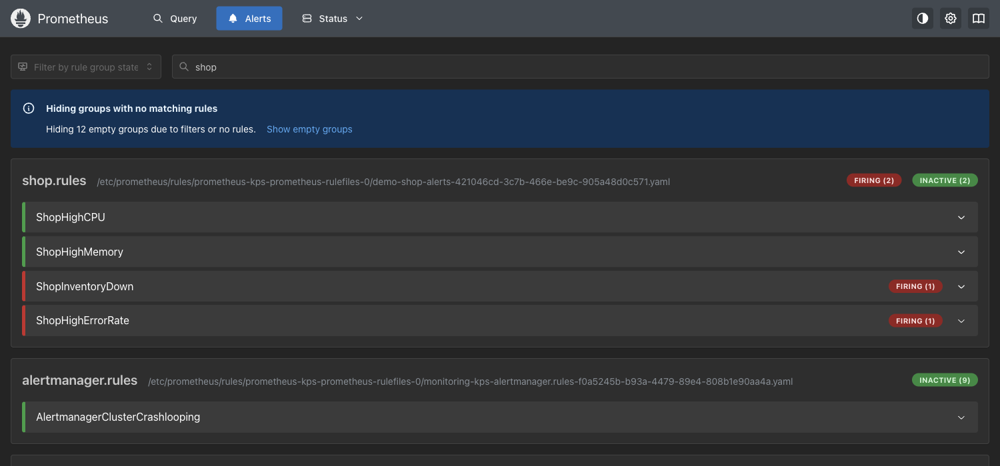

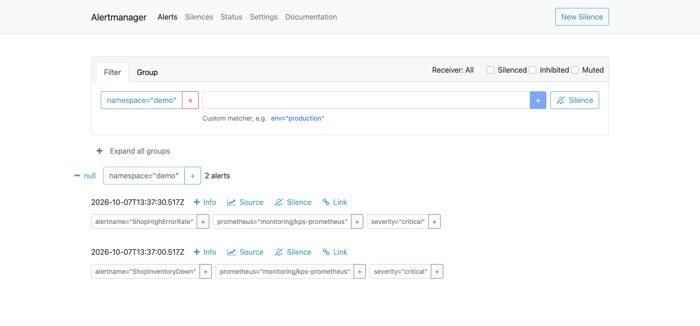

Recovery:

```
# 19:08:11 restore the backend
$ kubectl scale deploy/shop-inventory -n demo --replicas=1
deployment "shop-inventory" successfully rolled out

# Prometheus rule state after recovery, 19:09:19
ShopHighCPU          state=inactive  health=ok
ShopHighMemory       state=inactive  health=ok
ShopInventoryDown    state=inactive  health=ok
ShopHighErrorRate    state=inactive  health=ok
```

`ShopHighMemory` was never triggered: the app never got near 90% of its memory limit.
The rule is loaded and evaluated (`health=ok`), but it did not fire in this demo.

### 1.7 Logs

**`kubectl logs`** reads the container's stdout from the node. It works with no extra
software, but it only covers pods that still exist and one pod/deployment at a time
([`evidence/05-logs.txt`](evidence/05-logs.txt)):

```
$ kubectl logs -n demo deploy/shop-web --tail=6
Found 2 pods, using pod/shop-web-8499cdf9b-fqnqz
{"ts": "2026-10-07T13:27:34Z", "level": "INFO", "service": "shop-web", "method": "GET", "path": "/", "status": 200, "duration_ms": 0.0, "trace_id": "330a8c13928a93ea97e25e85049a17ff"}
{"ts": "2026-10-07T13:27:34Z", "level": "INFO", "service": "shop-web", "method": "GET", "path": "/order", "status": 200, "duration_ms": 147.3, "trace_id": "0ae93b90e8b3a7468894e031e98044bf"}
...

$ kubectl logs -n demo -l app=shop-inventory --tail=2000 | grep "\"level\": \"ERROR\"" | tail -3
{"ts": "2026-10-07T13:27:28Z", "level": "ERROR", "service": "shop-inventory", "method": "GET", "path": "/check", "status": 500, "duration_ms": 46.0, "trace_id": "97274247046ef78eb58a8f0d76149d91"}
...
```

**Loki + Alloy** keep the logs centrally. Alloy discovers every pod, attaches
`namespace/pod/container/app` labels, promotes the JSON `level` field to a label,
and pushes to Loki. Querying with LogQL ([`scripts/lq.py`](scripts/lq.py)):

```
$ curl -s localhost:19100/loki/api/v1/label/namespace/values
{"status": "success", "data": ["argocd", "demo", "gitops-demo", "kube-system", "local-path-storage", "logging", "monitoring", "tracing"]}

LogQL> {namespace="demo", level="ERROR"}
  18:57:29 shop-web-8499cdf9b-k66b6  {"ts": "2026-10-07T13:27:29Z", "level": "ERROR", "service": "shop-web", "method": "GET", "path": "/order", "status": 502, "duration_ms": 121.1, "trace_id": "0b41d33a7b372769c30e828315d1216f"}
  18:57:29 shop-web-8499cdf9b-k66b6  {"level": "ERROR", "service": "shop-web", "msg": "inventory check failed", "item": "keyboard", "upstream_status": 500, "trace_id": "0b41d33a7b372769c30e828315d1216f"}
  18:57:29 shop-inventory-b86c856bf-9gl94  {"ts": "2026-10-07T13:27:29Z", "level": "ERROR", "service": "shop-inventory", "method": "GET", "path": "/check", "status": 500, "duration_ms": 118.2, "trace_id": "0b41d33a7b372769c30e828315d1216f"}

LogQL> {namespace="demo", app="shop-inventory"} | json | status >= 500
  18:57:29 shop-inventory-b86c856bf-9gl94  {... "status": 500, "duration_ms": 118.2, "trace_id": "0b41d33a7b372769c30e828315d1216f"}
  ...

LogQL> sum by (app, level) (count_over_time({namespace="demo"} | json | __error__="" [5m]))
  {'app': 'shop-inventory', 'level': 'ERROR'}  last=23
  {'app': 'shop-inventory', 'level': 'INFO'}  last=450
  {'app': 'shop-web', 'level': 'ERROR'}  last=46
  {'app': 'shop-web', 'level': 'INFO'}  last=907

LogQL> sum by (namespace) (rate({namespace=~".+"}[5m]))
  {'namespace': 'demo'}  last=4.47
  {'namespace': 'monitoring'}  last=6.756666666666667
  ...
```

One `LogQL` query covers both services and all pods. The three ERROR lines above
share a `trace_id`, so they belong to the same failed request (the inventory
returned 500, the web tier turned it into a 502). Logs can also become metrics
(`count_over_time`): shop-web has twice the ERROR lines of inventory because it logs
both the 502 and the "inventory check failed" line.

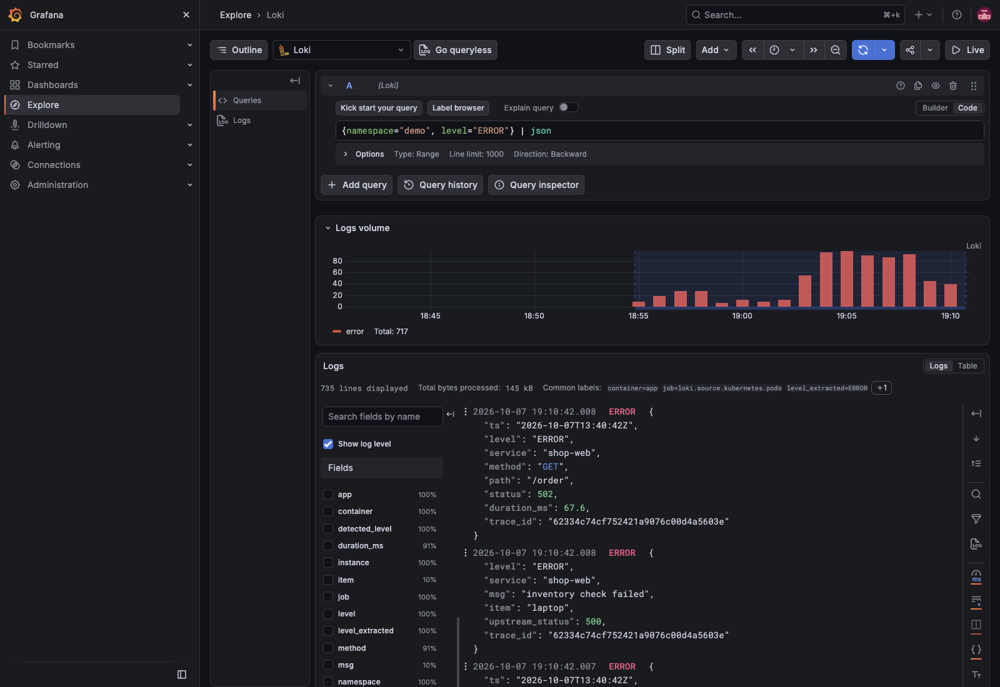

### 1.8 Grafana dashboard

[`05-grafana-dashboard.yaml`](monitoring/k8s/05-grafana-dashboard.yaml) is a ConfigMap
labelled `grafana_dashboard=1`. Grafana's sidecar loads it automatically, so the
dashboard is code too. It puts every Task 1 bullet on one screen: health (targets
`up`, ready containers, firing alerts), request rate, error ratio, p95 latency, CPU %
of limit, memory, node CPU/memory, and the Loki ERROR log stream. Data sources
(Prometheus, Loki, Jaeger) are provisioned from the Helm values.

During the CPU test (both `ShopHighCPU` alerts firing, CPU panel at ~100%, `/work`
traffic visible):

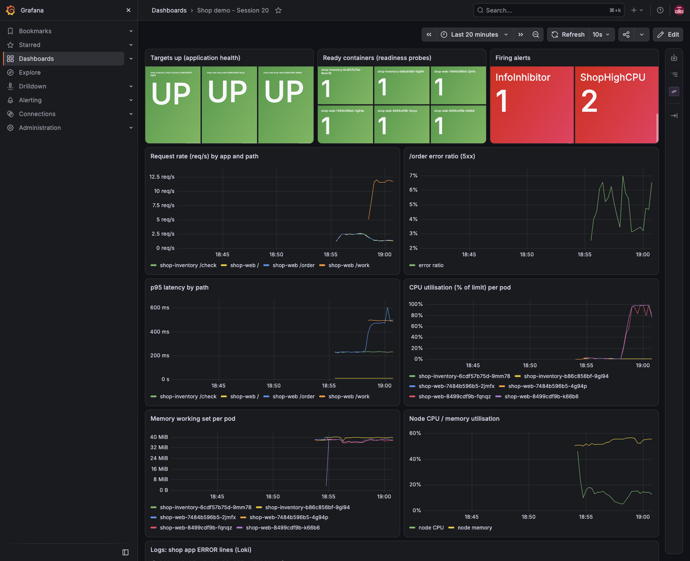

During the backend outage (the inventory target has disappeared from the `up` panel,
error ratio at 100%, `ShopInventoryDown` + `ShopHighErrorRate` firing, and the
matching 500 log lines at the bottom from Loki):

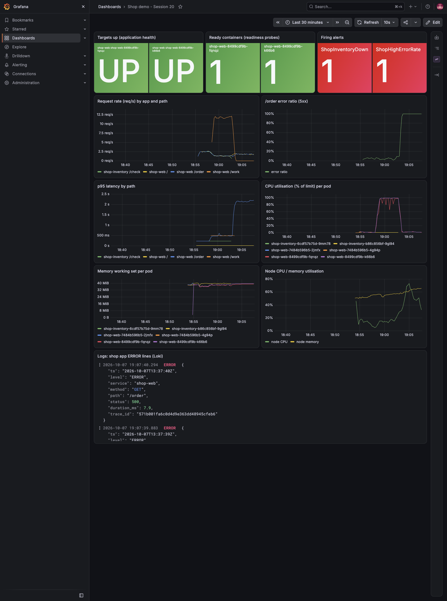

---

## Task 2 — Observability

### Monitoring vs observability

**Monitoring** watches for problems you already know about and answers *"is the
system healthy?"*: CPU > 80%, error ratio > 20%, target down. The four alerts in
Task 1 are monitoring.

**Observability** is a property of the system: how well you can work out *why* it is
behaving a certain way from the data it emits, including failures nobody predicted.
The alert said "100% of orders failing". To find out *why*, you need the logs and
traces.

| | Monitoring | Observability |
|---|---|---|
| Question | Is something wrong? | Why is it wrong? |
| Failure modes | known, pre-defined | unknown, explored after the fact |
| Output | dashboards, alerts | metrics + logs + traces you can slice freely |
| Example here | `ShopHighErrorRate` fired | the trace shows `shop-inventory /check` returned 500 under `/order` |

Production systems need both: monitoring tells you *when* to look, observability
lets you *find the cause*.

### The three pillars

| Pillar | What it is | Answers | Cost / shape | In this lab |
|---|---|---|---|---|
| **Metrics** | numbers sampled over time, identified by a name + labels (`http_requests_total{path="/order",status="502"}`) | *how much? how often? is it getting worse?* | very cheap, fixed size per series no matter the traffic; aggregated, so no per-request detail | Prometheus, PromQL, Grafana |
| **Logs** | timestamped records of individual events, ideally structured (JSON) | *what exactly happened, with which inputs?* | grows with traffic; full detail for each event | stdout → Alloy → Loki, LogQL |
| **Traces** | the path of **one request** through every service, as a tree of timed *spans* that share a trace ID | *where did this request spend its time, and which hop failed?* | per request; usually sampled | OpenTelemetry SDK → OTLP → Jaeger |

Each pillar does one job well and the others poorly:

- A **metric** shows that p95 latency of `/order` is 231 ms but not which request or why.
- A **log** shows that one request got a 500 but not how long each downstream hop took.
- A **trace** shows the full path of one request but cannot tell you whether that
  path is typical.

The useful part is **linking them**: alert on a metric, go to the logs for that
time window, take a `trace_id` from a log line, open the trace.

#### Real trace demo (OpenTelemetry → Jaeger)

The app uses the OpenTelemetry SDK with Flask and requests auto-instrumentation.
The `traceparent` header is injected into the outgoing call to inventory, so both
services' spans join the same trace. Jaeger received spans from both services
([`evidence/09-traces.txt`](evidence/09-traces.txt), Jaeger `api/v3`, printed as a
tree by [`scripts/jq.py`](scripts/jq.py)):

```
$ curl -s localhost:19686/api/v3/services
{"services":["shop-inventory","shop-web","jaeger"]}

trace d92c61f8795a40b7d890b6555199a70a  (4 spans)
  shop-web        GET /order                       70.7 ms  200
    shop-web        GET                              69.8 ms  200
      shop-inventory  GET /check                       68.3 ms  200
        shop-inventory  db.query                         67.5 ms  SELECT stock FROM inventory WHERE item = $1
```

Out of 70.7 ms, 67.5 ms is the `db.query` span. Network and Flask overhead is about
3 ms. The trace shows where the time went, which the p95 metric cannot.

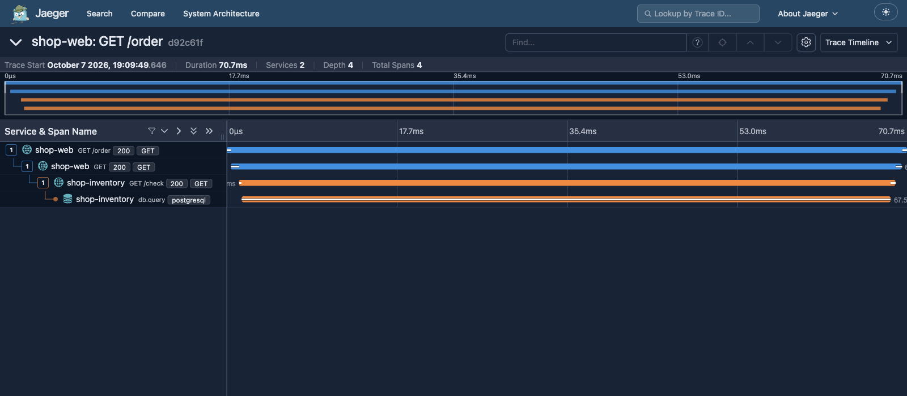

**Log → trace correlation** on a real failure: take the `trace_id` of an inventory
ERROR line from Loki, then open that same request in Jaeger:

```
# Log -> trace correlation: take the trace_id of an inventory ERROR log line from Loki ...
LogQL> {namespace="demo"} |= "a7bf57d2649de813cab134b3c286bae1"
  19:09:49 shop-web-8499cdf9b-fqnqz  {"ts": "2026-10-07T13:39:49Z", "level": "ERROR", "service": "shop-web", "method": "GET", "path": "/order", "status": 502, "duration_ms": 116.2, "trace_id": "a7bf57d2649de813cab134b3c286bae1"}
  19:09:49 shop-web-8499cdf9b-fqnqz  {"level": "ERROR", "service": "shop-web", "msg": "inventory check failed", "item": "keyboard", "upstream_status": 500, "trace_id": "a7bf57d2649de813cab134b3c286bae1"}
  19:09:49 shop-inventory-b86c856bf-z5fgp  {"ts": "2026-10-07T13:39:49Z", "level": "ERROR", "service": "shop-inventory", "method": "GET", "path": "/check", "status": 500, "duration_ms": 113.3, "trace_id": "a7bf57d2649de813cab134b3c286bae1"}

# ... and open that exact request in Jaeger:
GET /api/v3/traces/a7bf57d2649de813cab134b3c286bae1
  shop-web        GET /order        116.7 ms  status=2 http=502
  shop-web        GET               115.6 ms  status=2 http=500
  shop-inventory  GET /check        113.7 ms  status=2 http=500
  shop-inventory  db.query          113.1 ms  status=STATUS_CODE_UNSET http=
```

(`status=2` is OTLP's `STATUS_CODE_ERROR`.) The error starts at `shop-inventory
GET /check`; the `db.query` span itself did not fail, so the 500 is the simulated
"db timeout" path after the query. The web tier only passed the error up.

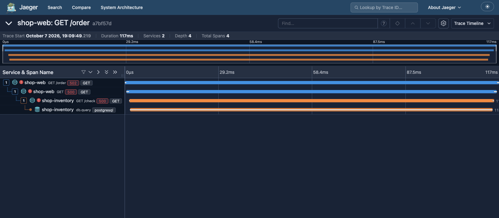

The same trace opened inside Grafana through the provisioned Jaeger data source, so
metrics, logs and traces are all in one tool:

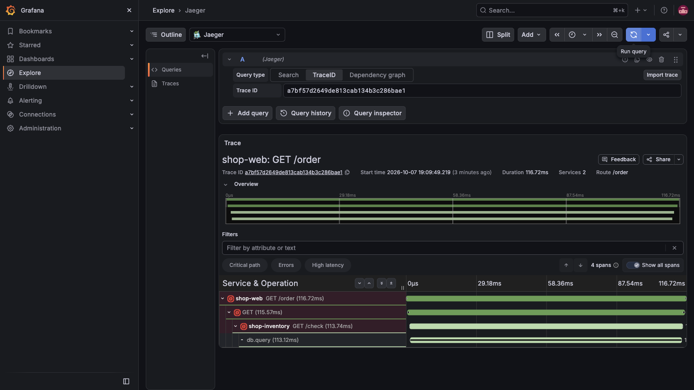

Jaeger's search view lists recent `/order` traces. The 2-span `shop-web`-only traces
with an error marker are from the backend outage: the request never reached
inventory.

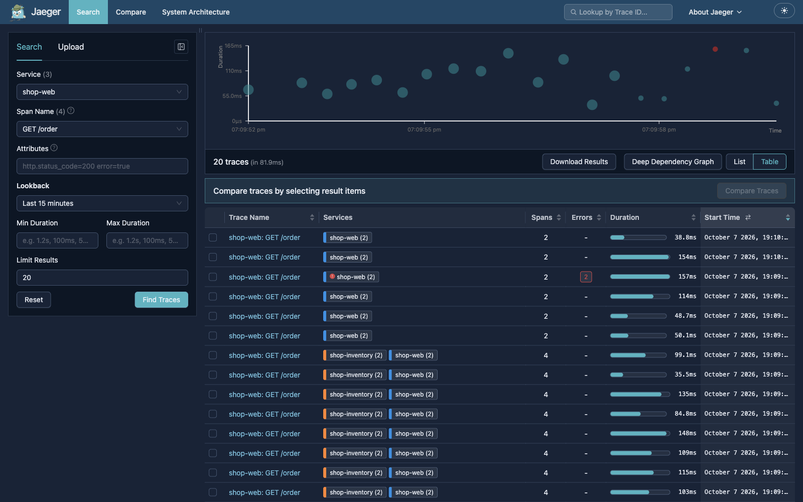

### Why observability is required

- **Distributed systems fail in partial, new ways.** One user request in this tiny
  demo already crosses two services; in production it may cross twenty. "Website is
  slow" can be caused anywhere along that path, and you cannot SSH into a pod that
  Kubernetes has already replaced.
- **Pods are ephemeral.** `kubectl logs` loses a pod's logs when the pod is deleted
  (the old `shop-inventory` pod's logs above exist only in Loki now). Metrics and
  logs must be shipped somewhere central to outlive the workload.
- **Faster MTTD/MTTR.** Alerts on metrics reduce time-to-detect. Correlated logs and
  traces reduce time-to-resolve: in the outage above, alert → log line → trace →
  failing service took a few queries.
- **SLOs and capacity.** Error-rate and latency SLOs, HPA tuning, and right-sizing
  requests/limits all depend on historical metrics (`ShopHighCPU` showed that a
  500m limit throttles the web tier under load).
- **Evidence for change.** After a deploy, comparing before/after error rate and
  latency is how you decide whether to roll back.

### Common tools

| Area | Open source | Managed / commercial |
|---|---|---|
| Metrics | **Prometheus**, Thanos / Cortex / Mimir (long-term, HA), VictoriaMetrics, **metrics-server** (current values only) | CloudWatch, Azure Monitor, Google Cloud Monitoring, Datadog, New Relic |
| Logs | **Loki**, Elasticsearch / OpenSearch (ELK/EFK), collectors: **Alloy** (Promtail's successor), Fluent Bit, Fluentd, Vector | CloudWatch Logs, Splunk, Datadog Logs |
| Traces | **Jaeger**, Grafana Tempo, Zipkin | AWS X-Ray, Datadog APM, Honeycomb, Dynatrace |
| Instrumentation standard | **OpenTelemetry** (SDKs + Collector, vendor-neutral, all three signals) | — |
| Visualisation / alerting | **Grafana**, **Alertmanager**, Kibana | PagerDuty / Opsgenie for on-call routing |
| K8s state | **kube-state-metrics**, **node-exporter**, cAdvisor (in kubelet), blackbox-exporter | — |

### Kubernetes observability

What each Kubernetes layer exposes and how this lab collected it:

```
            ┌──────────────── Grafana (dashboards, Explore) ─────────────────┐
            │   Prometheus           Loki                 Jaeger            │
            └──────▲───────────────────▲─────────────────────▲──────────────┘
   ServiceMonitor  │ scrape            │ push                │ OTLP
 ┌─────────────────┼───────────────────┼─────────────────────┼──────────────┐
 │ app /metrics ───┤  app stdout ──▶ Alloy ─┘   app OTel SDK ──┘             │  application
 │ kube-state-metrics (desired vs actual: replicas, ready, restarts, limits) │  k8s objects
 │ kubelet + cAdvisor (container CPU/mem, probe results)                     │  containers
 │ node-exporter (node CPU/mem/disk/net)                                     │  node
 │ apiserver, CoreDNS /metrics;  metrics-server -> kubectl top / HPA         │  control plane
 │ kubectl get events / describe (scheduling, probe failures, OOMKilled)     │  events
 └───────────────────────────────────────────────────────────────────────────┘
```

Kubernetes-specific points:

- **Labels are the glue.** Prometheus target labels (`namespace`, `pod`, `job`) and
  Alloy's Loki labels (`namespace`, `pod`, `app`) come from the same Kubernetes
  metadata, so a pod name from a metric can be pasted straight into a log query.
- **Service discovery, not static config.** Prometheus watches Endpoints via
  ServiceMonitors and Alloy watches pods, so new replicas are picked up
  automatically. In the outage, the inventory target vanished on its own when the
  pod went away.
- **Usage vs requests vs limits** (cAdvisor + kube-state-metrics) is the most
  useful view in Kubernetes: it shows throttling (CPU limit) and OOM risk (memory
  limit) before they cause incidents.
- **Probes are health signals Kubernetes acts on**: liveness restarts, readiness
  removes from load-balancing. Their results are themselves metrics (`prober_probe_total`).
- **Everything is declarative and lives in Git**: ServiceMonitor, PrometheusRule and
  the dashboard ConfigMap are ordinary manifests, so monitoring config can be
  reviewed and deployed the same way as the app (which leads to Task 3).

---

## Task 3 — GitOps with Argo CD

### What is GitOps?

GitOps is a way of operating infrastructure and applications in which **the desired
state of the system is declared in Git, and an automated agent inside the cluster
continuously makes the real state match it**. The four OpenGitOps principles:

1. **Declarative**: the system is described as data (YAML), not as a script of steps.
2. **Versioned and immutable**: that description is stored in Git, so every change
   has an author, a review, a commit ID and can be reverted.
3. **Pulled automatically**: an agent in the cluster (Argo CD here) *pulls* from Git.
   CI never needs cluster credentials, which removes a big attack surface.
4. **Continuously reconciled**: the agent keeps comparing desired and actual state
   and fixes any drift, not just at deploy time.

```
 push model (classic CI/CD)                pull model (GitOps)
 CI ──kubectl apply──▶ cluster             Git ◀──watch── Argo CD (in cluster) ──apply──▶ cluster
 (CI holds cluster creds; drift unnoticed)  (no creds leave the cluster; drift is corrected)
```

### Setup

Argo CD was installed with Helm (section 0, values in
[`gitops/argocd-values.yaml`](gitops/argocd-values.yaml)). The only `kubectl apply`
in the whole GitOps part is this **one-time** registration of the
[`Application`](gitops/argocd-application.yaml). It deliberately lives *outside*
the synced path, because it describes *where* the desired state is and is not part of it:

```yaml
spec:
  source:
    repoURL: https://github.com/Astro-Dude/devops-assignments.git   # this public repo
    targetRevision: main
    path: DevOps/20-monitoring-observability-gitops/gitops/app
  destination:
    server: https://kubernetes.default.svc
    namespace: gitops-demo
  syncPolicy:
    automated:
      prune: true      # delete cluster objects whose manifests were removed from Git
      selfHeal: true   # revert manual changes made directly in the cluster
    syncOptions:
      - CreateNamespace=true
```

([`evidence/10-argocd-app-create.txt`](evidence/10-argocd-app-create.txt), [`evidence/11-gitops-initial.txt`](evidence/11-gitops-initial.txt))

```
$ kubectl get ns gitops-demo
Error from server (NotFound): namespaces "gitops-demo" not found

$ kubectl apply -f DevOps/20-monitoring-observability-gitops/gitops/argocd-application.yaml
application.argoproj.io/session20-gitops created

$ kubectl get applications -n argocd -o wide
NAME               SYNC STATUS   HEALTH STATUS   REVISION                                   PROJECT
session20-gitops   Synced        Healthy         ecef9703fb5437d231adeffe998e3ac4fa41bb3b   default

$ kubectl get all,cm -n gitops-demo
NAME                              READY   STATUS    RESTARTS   AGE
pod/gitops-web-797fd6ff77-cggdf   1/1     Running   0          67s
pod/gitops-web-797fd6ff77-kpr8f   1/1     Running   0          67s
NAME                 TYPE        CLUSTER-IP    EXTERNAL-IP   PORT(S)   AGE
service/gitops-web   ClusterIP   10.96.68.13   <none>        80/TCP    67s
NAME                         READY   UP-TO-DATE   AVAILABLE   AGE
deployment.apps/gitops-web   2/2     2            2           67s
...
$ kubectl get deploy gitops-web -n gitops-demo -o jsonpath="replicas={.spec.replicas} image={.spec.template.spec.containers[0].image}"
replicas=2 image=nginx:1.27-alpine

$ kubectl run -n gitops-demo curl-check --rm -i --restart=Never --image=curlimages/curl:8.16.0 -- -s http://gitops-web
<html><body style="font-family:sans-serif">
<h1>Session 20 GitOps demo</h1>
<p>Release: v1 - deployed by Argo CD from Git</p>
</body></html>
```

The namespace did not exist. Argo CD fetched the folder from GitHub, created the
namespace, ConfigMap, Service and Deployment, and reports `Synced` (live = Git) and
`Healthy` (all pods ready). The revision is the `main` HEAD at that moment. Other
folders of this repo get commits all the time, which advances the revision without
touching this path.

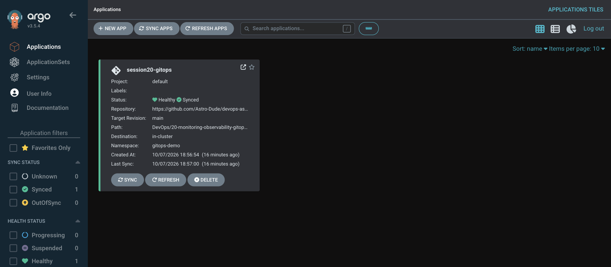

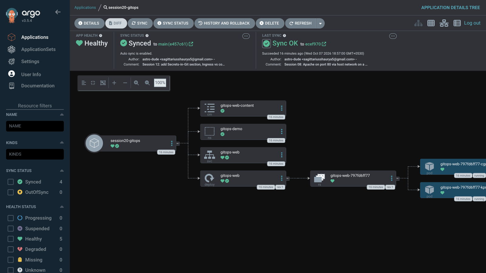

### Git as the source of truth: change the cluster with a commit

One commit changes three things: replicas, image and config.

```diff
--- a/DevOps/20-monitoring-observability-gitops/gitops/app/deployment.yaml
+++ b/DevOps/20-monitoring-observability-gitops/gitops/app/deployment.yaml
-  replicas: 2
+  replicas: 3
...
-          image: nginx:1.27-alpine
+          image: nginx:1.28-alpine
--- a/DevOps/20-monitoring-observability-gitops/gitops/app/configmap.yaml
+++ b/DevOps/20-monitoring-observability-gitops/gitops/app/configmap.yaml
-    <p>Release: v1 - deployed by Argo CD from Git</p>
+    <p>Release: v2 - scaled to 3 replicas and nginx 1.28 via a git commit</p>
```

```bash
git commit -m "gitops demo: scale gitops-web to 3 replicas, bump nginx to 1.28, release v2 page"
git pull --rebase origin main && git push origin main      # -> a489e38
```

Then only watching, no `kubectl apply`, no `argocd` CLI, no Sync button
([`evidence/12-gitops-git-change.txt`](evidence/12-gitops-git-change.txt)):

```
# pushed commit a489e38 to origin/main at 19:13:31; polling every 5s (no kubectl apply, no argocd CLI, no manual sync)
TIME      APP-SYNC  APP-HEALTH   SYNCED-REVISION  DEPLOY(ready/spec)  IMAGE
19:13:39  Synced    Healthy      e457c61          2/2                 nginx:1.27-alpine
...
19:14:20  Synced    Healthy      e457c61          2/2                 nginx:1.27-alpine
19:14:25  Synced    Progressing  a489e38          2/3                 nginx:1.28-alpine
19:14:30  Synced    Progressing  a489e38          2/3                 nginx:1.28-alpine
19:14:35  Synced    Progressing  a489e38          3/3                 nginx:1.28-alpine
...
19:14:56  Synced    Healthy      a489e38          3/3                 nginx:1.28-alpine
```

About **50 s after the push**, Argo CD's Git poll (set to 60 s in the values; the
default is ~3 min, and a GitHub webhook would make it near-instant) saw the new
commit, applied it, and the Deployment rolled to 3 × nginx 1.28. `Progressing` is
the rolling update; it turns `Healthy` once all new pods pass readiness.
([`evidence/13-gitops-after-change.txt`](evidence/13-gitops-after-change.txt)):

```
$ kubectl get deploy,rs -n gitops-demo -o wide
NAME                         READY   UP-TO-DATE   AVAILABLE   AGE   CONTAINERS   IMAGES
deployment.apps/gitops-web   3/3     3            3           27m   web          nginx:1.28-alpine
NAME                                    DESIRED   CURRENT   READY   AGE     IMAGES
replicaset.apps/gitops-web-797fd6ff77   0         0         0       27m     nginx:1.27-alpine
replicaset.apps/gitops-web-b9f65cb48    3         3         3       9m51s   nginx:1.28-alpine

$ kubectl get application session20-gitops -n argocd -o jsonpath="{range .status.history[*]}{.id}  {.revision}  {.deployedAt}{\"\n\"}{end}"
0  ecef9703fb5437d231adeffe998e3ac4fa41bb3b  2026-10-07T13:27:00Z
1  a489e38fd1e7193556f2c8af42a77653da8a7932  2026-10-07T13:44:23Z

$ kubectl run -n gitops-demo curl-check ... -- -s http://gitops-web
<p>Release: v2 - scaled to 3 replicas and nginx 1.28 via a git commit</p>
```

The old ReplicaSet (1.27) is kept at 0 replicas for rollback; the history records
which **Git commit** each deployment came from.

| | Before | After |
|---|---|---|
| Git revision | `ecef970` / `e457c61` | `a489e38` |
| replicas | 2 | 3 |
| image | nginx:1.27-alpine | nginx:1.28-alpine |
| page | Release: v1 | Release: v2 |

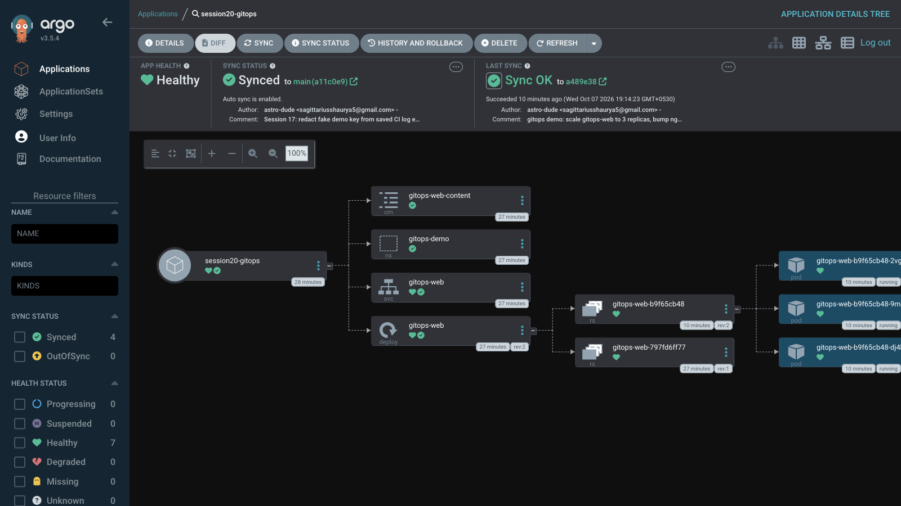

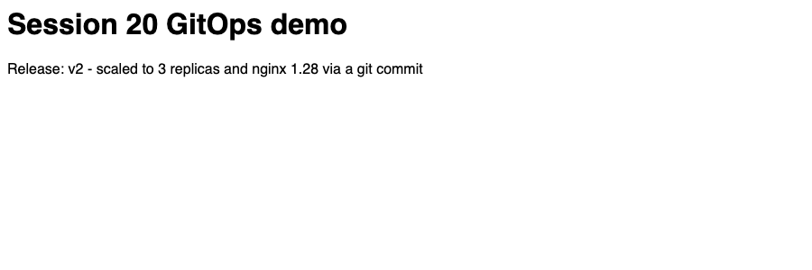

### Continuous reconciliation: self-heal reverts manual drift

Someone changes the cluster by hand: scales the Deployment to 1 and overwrites the
ConfigMap. Git still says 3 replicas and the v2 page
([`evidence/14-gitops-selfheal.txt`](evidence/14-gitops-selfheal.txt), script
[`scripts/selfheal.sh`](scripts/selfheal.sh), sampled every second):

```
# 19:25:23 manual drift #1: scale out-of-band
$ kubectl scale deploy gitops-web -n gitops-demo --replicas=1
deployment.apps/gitops-web scaled
# 19:25:23 manual drift #2: edit the live ConfigMap out-of-band
$ kubectl patch cm gitops-web-content -n gitops-demo --type merge -p '{"data":{"index.html":"hacked by hand\n"}}'
configmap/gitops-web-content patched

TIME      SPEC-REPLICAS  READY  APP-SYNC   CONFIGMAP index.html (first line)
19:25:23  1              1      Synced     hacked by hand
19:25:24  1              1      Synced     hacked by hand
19:25:25  1              1      Synced     hacked by hand
19:25:26  1              1      Synced     hacked by hand
19:25:28  1              1      OutOfSync  <html><body style="font-family:sans-serif">
19:25:29  3              1      Synced     <html><body style="font-family:sans-serif">
19:25:30  3              3      Synced     <html><body style="font-family:sans-serif">

$ kubectl get application session20-gitops -n argocd -o jsonpath='{.status.operationState.operation.initiatedBy} {.status.operationState.phase} {.status.operationState.message}'
{"automated":true} Succeeded successfully synced (all tasks run)
$ kubectl get application ... '{range .status.operationState.syncResult.resources[*]}...'
Namespace/gitops-demo: Synced namespace/gitops-demo unchanged
ConfigMap/gitops-web-content: Synced configmap/gitops-web-content configured
Service/gitops-web: Synced service/gitops-web unchanged
Deployment/gitops-web: Synced deployment.apps/gitops-web configured
```

Within **~5 seconds** Argo CD saw the drift (it watches live objects, so it does
not wait for the Git poll), marked the app `OutOfSync`, and the automated
self-heal sync put both objects back to the Git version. Only the two drifted
objects were `configured`; the rest were `unchanged`. That sync is the
`a11c0e9` entry at 19:25:28 in the history below, "Initiated by: automated sync
policy". The only lasting way to change the cluster is to change Git.

### Prune: deleting from Git deletes from the cluster

Two more commits: add a `feature-flags` ConfigMap, then `git rm` it
([`evidence/15-gitops-prune.txt`](evidence/15-gitops-prune.txt), trimmed):

```
# commit 5ee196c (adds gitops/app/feature-flags.yaml) pushed at 19:25:45
TIME      APP-SYNC   SYNCED-REV  configmap/feature-flags
19:25:53  Synced     a11c0e9     absent
...
19:27:14  Synced     e0eb219     present

# commit 611eb34 (git rm gitops/app/feature-flags.yaml) pushed at 19:27:34
19:27:40  Synced     e0eb219     present
...
19:28:55  Synced     611eb34     absent

$ kubectl get application ... '{range .status.operationState.syncResult.resources[*]}...'
ConfigMap/feature-flags: Pruned pruned
Namespace/gitops-demo: Synced namespace/gitops-demo unchanged
...
```

(`e0eb219` is a commit from another folder that landed on `main` right after
`5ee196c`, so Argo synced the newer HEAD, which includes `5ee196c`.) Without
`prune: true` the ConfigMap would have been left behind as an orphan, the same
`kubectl delete -f` problem described in the Helm assignment.

Every deployment Argo CD made, each tied to a Git commit and author:

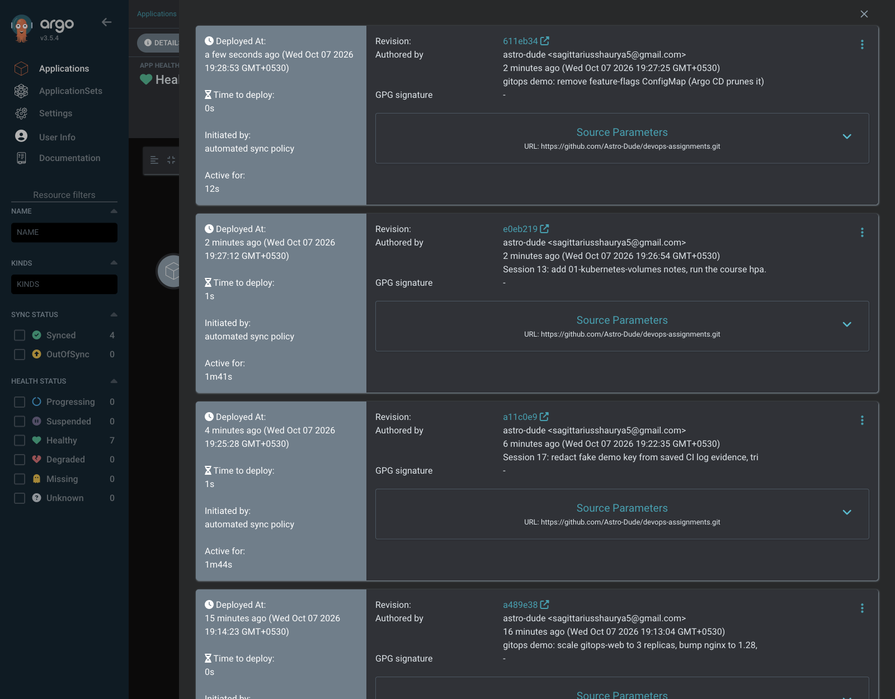

### Declarative configuration

None of the steps above said *how* to get from 2 to 3 replicas or from 1.27 to 1.28.
The YAML in [`gitops/app/`](gitops/app/) only says *what* should exist. Argo CD
computes the diff, and the Deployment controller works out the rolling update. The
same manifest applied to an empty cluster, a drifted cluster or a correct cluster
always gives the same result (idempotent), which is what makes the self-heal and
prune behaviour possible. The files in that folder now say `replicas: 3` and
`nginx:1.28-alpine`, exactly what the cluster runs: **the repo is the documentation
of production.**

### The GitOps workflow

```
 developer          Git (GitHub, main)            Argo CD (in cluster)             Kubernetes
    │  edit YAML         │                              │                              │
    │  commit, PR, review│                              │                              │
    ├──── push ─────────▶│  desired state @ a489e38     │                              │
    │                    │◀──── poll (60s) / webhook ───┤                              │
    │                    │                              │ render manifests             │
    │                    │                              │ diff desired vs live         │
    │                    │                              ├──── apply (sync) ───────────▶│ rolling update
    │                    │                              │◀──── watch live state ───────┤
    │                    │                              │ health: Progressing→Healthy   │
    │      kubectl scale (drift) ─────────────────────────────────────────────────────▶│
    │                    │                              │◀──── drift detected ─────────┤
    │                    │                              ├──── self-heal ──────────────▶│ back to Git
    │  rollback = git revert <sha> + push  (or Argo "History and rollback")             │
```

In a full pipeline, **CI** builds and tests the image, pushes it to a registry, and
then commits the new image tag to the GitOps repo (by hand, via a bot PR, or Argo CD
Image Updater). **CD** is Argo CD pulling that commit. CI never talks to the cluster.

### Kubernetes + GitOps

Kubernetes and GitOps fit together because Kubernetes already works the same way
internally:

- Every Kubernetes object has `spec` (desired) and `status` (actual), and
  controllers run reconcile loops to close the gap. Argo CD is one more reconcile
  loop, one level up, with **Git as the spec of the whole application**:
  `Git → Argo CD → Deployment spec → ReplicaSet → Pods`.
- The Kubernetes API is fully declarative, so the entire app (and the monitoring
  config from Task 1: ServiceMonitor, PrometheusRule, dashboard ConfigMap) can be
  stored as YAML and reconciled.
- Health assessment comes for free: Argo CD reads Deployment/Pod status to report
  `Healthy`/`Progressing`/`Degraded`, as seen during the rollout.
- Multi-environment and multi-cluster setups become directory or branch layouts
  (`envs/dev`, `envs/prod`, Kustomize overlays, Helm values per environment), with
  promotion done by pull request.

### Quick answers to the session's viva questions

| Question | Answer (from this lab) |
|---|---|
| Desired vs actual state | desired = YAML in `gitops/app/` at a commit; actual = objects in `gitops-demo` |
| Reconciliation | Argo CD's loop: diff desired vs actual, apply the difference (seen at 19:14:25 and 19:25:28) |
| Self-healing | manual `kubectl scale --replicas=1` reverted to 3 in ~5 s |
| Replicas 2 → 3 in Git | ~50 s later the Deployment had 3 pods, with no command run against the cluster |
| Why Git is the source of truth | the cluster always converges to Git; every change has a commit, author and history; rollback = revert |

---

## Notes and honest caveats

- **Things I hit along the way.** Image pulls were slow on the shared Docker engine
  (Grafana took ~13 min), so the first Argo CD `helm install` hit Helm's default
  5 min hook timeout on `argocd-redis-secret-init`. A second `helm upgrade --install
  --timeout 15m --wait` (revision 2) succeeded. The app first labelled its metrics
  with `service=...`, which clashed with the `service` target label Prometheus adds
  (it renames the app's label to `exported_service`), so I renamed it to `app=...`
  and rebuilt as `shop-demo:1.1.0`. The `app_info{version="1.0.0"}` value is the
  app's `APP_VERSION` default, not the image tag. The rule-label fix for `absent()`
  is described in 1.6.
- **Jaeger 2.22** no longer serves `/api/services` (404), but its UI, `api/v3`, and
  the `/api/traces/<id>` path Grafana uses all work. Storage is in-memory, so traces
  are lost on restart (fine for a demo, not for production).
- **Alertmanager has no receivers configured** (no Slack/e-mail/PagerDuty secrets on
  a lab machine). Alerts reach Alertmanager and appear in its UI/API as shown, but
  nothing is sent to a person.
- `ShopHighMemory` was defined but never triggered.
- The `kubectl run ... curl` output in evidence 11/13 contains kubectl's own
  attach/cleanup chatter, and in 13 the page body appears twice (attach output +
  log replay). Both are kept as captured.
- Credentials: Grafana uses a lab-only admin password set in the values file for
  this throwaway cluster. The Argo CD admin password was read from
  `argocd-initial-admin-secret` at run time and is not committed.
- The cluster `hw-s20` was deleted after the evidence was captured
  (`kind delete cluster --name hw-s20`). To reproduce, run section 0, then
  `kubectl apply -f gitops/argocd-application.yaml`.
