# Session 21: Final DevOps Project and Troubleshooting

**TicketHub** is a small IT-helpdesk application (FastAPI + React + PostgreSQL), taken from a developer's laptop to a monitored, GitOps-managed Kubernetes deployment. Every arrow in the spec's chain is implemented and was run for real:

```
Application → Git → GitHub → CI Pipeline → Build & Test → Security Scanning → Docker Image
→ Container Registry → Kubernetes → Helm → Monitoring → GitOps          (+ Terraform for the cloud infra)
```

Student: Shaurya Verma (24BCS10151), GitHub `Astro-Dude`. Every command result below is **real captured output**. Full transcripts are in [`evidence/`](evidence/) and browser screenshots are in [`screenshots/`](screenshots/).

The reference project for this session is the instructor's "TicketBoard" capstone. Its `GRADING.md` requires that *"the application domain must be your own"*. TicketHub is a helpdesk ticketing system written from scratch for this assignment: tickets with requester/category/priority/status, a comment thread per ticket, business metrics and an urgent-backlog alert.

## Contents

1. [Project overview](#1-project-overview)
2. [Architecture diagram](#2-architecture-diagram)
3. [Technologies used](#3-technologies-used)
4. [Repository layout](#4-repository-layout)
5. [Application setup](#5-application-setup)
6. [Docker setup](#6-docker-setup)
7. [Kubernetes deployment](#7-kubernetes-deployment)
8. [Helm deployment](#8-helm-deployment)
9. [Terraform infrastructure](#9-terraform-infrastructure)
10. [CI/CD pipeline](#10-cicd-pipeline)
11. [DevSecOps implementation](#11-devsecops-implementation)
12. [Monitoring](#12-monitoring)
13. [GitOps](#13-gitops)
14. [Troubleshooting](#14-troubleshooting)
15. [Screenshots](#15-screenshots)
16. [Lessons learned](#16-lessons-learned)
17. [What was substituted, and why](#17-what-was-substituted-and-why)

---

## 1. Project overview

| Layer | What was built | Verified by |
|---|---|---|
| Application | FastAPI API (14 routes incl. full CRUD, 2 Alembic migrations), React/Vite UI, PostgreSQL | 13 pytest tests + 4 node tests, docker compose, browser |
| Docker | Multi-stage backend and frontend images, non-root, `docker-compose.yml` | `docker compose up --build`, `id` inside containers |
| CI/CD | One GitHub Actions workflow, 12 jobs: test → scan → gate → push → deploy → GitOps bump | green runs [37635560459](https://github.com/Astro-Dude/devops-assignments/actions/runs/37635560459), [37636382434](https://github.com/Astro-Dude/devops-assignments/actions/runs/37636382434), [37638964461](https://github.com/Astro-Dude/devops-assignments/actions/runs/37638964461), [37639170118](https://github.com/Astro-Dude/devops-assignments/actions/runs/37639170118) |
| DevSecOps | Bandit, Semgrep, pip-audit, npm audit, Trivy fs/config/image, Gitleaks, SBOM, security gate | gate closed for real on a finding, then opened |
| Registry | `ghcr.io/astro-dude/s21-tickethub-{backend,frontend}`, git-SHA tags only, public | GHCR package page |
| Kubernetes | Deployment, Service, ConfigMap, Secret, Ingress, HPA, startup/liveness/readiness probes, PVC, NetworkPolicy | raw manifests applied to kind `hw-s21` |
| Helm | `helm/tickethub` chart: install, upgrade, failed upgrade, rollback, `helm test` | Helm history |
| Terraform | VPC, 2 public + 2 private subnets, NAT, SGs, IAM, KMS, EKS + node group, ECR, S3, remote state | init/plan/apply/output/destroy against an AWS API emulator |
| Monitoring | kube-prometheus-stack, ServiceMonitor, 5 alert rules, Grafana dashboard, JSON logs | alert firing, Grafana panels |
| GitOps | Argo CD Application tracking `gitops/` in this public repo; CI bumps the tag | 4 CI-driven syncs recorded in Argo CD history |
| Troubleshooting | 7 planted faults diagnosed and fixed, plus 5 real incidents | [`troubleshooting/README.md`](troubleshooting/README.md) |

## 2. Architecture diagram

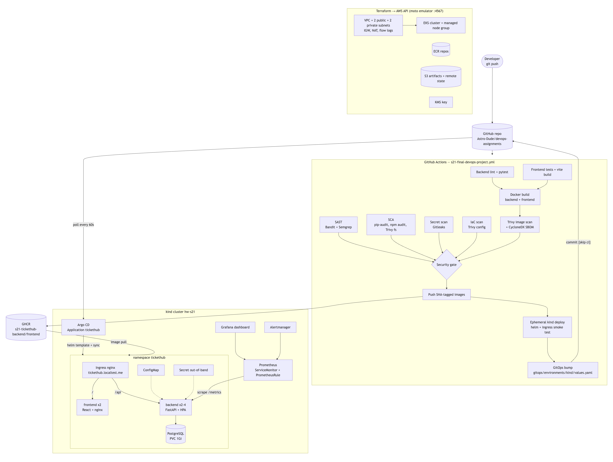

The same diagram as Mermaid source (renders on GitHub):

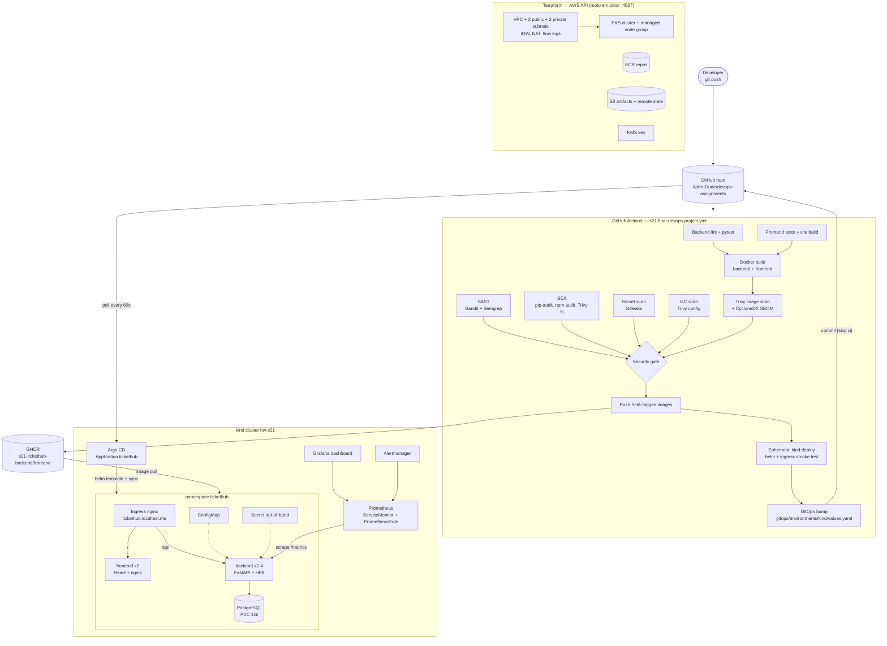

**Request path:** browser → `tickethub.localtest.me:28080` → kind node port 80 → ingress-nginx. `/api/*` goes straight to the backend Service, and everything else goes to the frontend Service (nginx serving the Vite build). The backend talks to PostgreSQL on a PVC. A NetworkPolicy lets only backend pods reach port 5432.

**Delivery path:** push → CI tests, scans and builds → gate → images pushed to GHCR as `:<git-sha>` → the same images are deployed to a throw-away kind cluster inside the runner and smoke-tested through an Ingress → CI commits the new tag into `gitops/` → Argo CD on `hw-s21` sees the commit and rolls the deployment.

## 3. Technologies used

| Area | Tools (versions as used) |
|---|---|
| Backend | Python 3.13, FastAPI 0.142, SQLAlchemy 2.1, Alembic 1.20, psycopg 3.3, pydantic-settings, prometheus-client, uvicorn |
| Frontend | React 19, Vite 8, nginx-unprivileged 1.29 |
| Tests / quality | pytest 9 (SQLite test DB), node:test, Ruff (lint + format) |
| Containers | Docker / BuildKit, multi-stage builds, docker compose |
| CI/CD | GitHub Actions, GHCR, helm/kind-action, yq |
| Security | Bandit, Semgrep, pip-audit, npm audit, Trivy 0.75 (fs, config, image, SBOM), Gitleaks 8.30 |
| Kubernetes | kind v0.33 (Kubernetes v1.37), ingress-nginx v1.15.1, metrics-server 0.9, Helm 4.3 |
| Observability | kube-prometheus-stack 92.1 (Prometheus, Alertmanager, Grafana, kube-state-metrics, node-exporter) |
| GitOps | Argo CD v3.5.4 (Helm chart argo-cd 10.10.0) |
| IaC | Terraform 1.16, hashicorp/aws provider 6.67, S3 remote state with native lockfile; AWS API emulated by motoserver/moto |

## 4. Repository layout

Laid out as the spec's `final-devops-project/` tree:

```
21-final-devops-project/
├── application/
│   ├── backend/          FastAPI app (app/), Alembic migrations, tests/, requirements*.txt, pytest.ini, ruff.toml
│   └── frontend/         React + Vite source, nginx.conf.template, package-lock.json
├── docker/               backend.Dockerfile, frontend.Dockerfile, docker-compose.yml
├── kubernetes/           raw manifests 00-08, namespace.yaml, 02-secret.yaml.example, cluster/ (kind configs, ingress-nginx)
├── helm/tickethub/       Chart.yaml, values{,-dev,-prod}.yaml, templates/, files/ (alert rules, Grafana dashboard)
├── terraform/            *.tf, terraform.tfvars.example, backend-*.hcl, bootstrap/ (remote-state bucket)
├── .github/workflows/    s21-final-devops-project.yml (identical copy of the repo-root workflow)
├── security/             gitleaks.toml, trivyignore.yaml
├── monitoring/           kube-prometheus-stack-values.yaml, metrics-server-values.yaml
├── gitops/               argocd/application.yaml, argocd/argocd-values.yaml, environments/kind/values.yaml
├── troubleshooting/      broken-stack.yaml, fixed-stack.yaml, README.md
├── evidence/             raw command transcripts
├── screenshots/
└── README.md
```

GitHub only runs workflows from the repository root. The pipeline that actually runs is [`/.github/workflows/s21-final-devops-project.yml`](../../.github/workflows/s21-final-devops-project.yml). The copy in this folder is kept byte-identical so that the deliverable tree is complete.

---

## 5. Application setup

### Backend API

| Method | Path | Purpose |
|---|---|---|
| GET | `/health` | liveness: the process answers |
| GET | `/ready` | readiness: `SELECT 1 FROM tickets` succeeds (DB reachable *and* migrated) |
| GET | `/metrics` | Prometheus exposition format |
| GET | `/api/info` | version (git SHA baked into the image), environment, pod name |
| GET / POST | `/api/tickets` | list (filters `status`, `priority`, `q`) / create |
| GET / PUT / DELETE | `/api/tickets/{id}` | read / update / delete |
| GET / POST | `/api/tickets/{id}/comments` | conversation thread |
| GET | `/api/stats` | counts per status + urgent backlog |

Configuration follows twelve-factor style. Non-secret settings (`APP_ENV`, `LOG_LEVEL`, `DEFAULT_TEAM`, `DB_HOST`, `DB_PORT`, `DB_NAME`) come from a **ConfigMap** and credentials (`DB_USER`, `DB_PASSWORD`) come from a **Secret** ([`app/config.py`](application/backend/app/config.py)). The schema is managed by Alembic ([`0001_create_tickets.py`](application/backend/alembic/versions/0001_create_tickets.py), [`0002_create_comments.py`](application/backend/alembic/versions/0002_create_comments.py)). Migrations run in a Kubernetes **initContainer** (`python -m app.migrate`). That helper waits for the database and takes a PostgreSQL **advisory lock**, so two replicas starting together can't both try to create the tables.

Run it locally:

```bash
cd application/backend && python -m venv .venv && . .venv/bin/activate
pip install -r requirements-dev.txt
ruff check . && pytest -v                       # tests use a throw-away SQLite file, never PostgreSQL
DATABASE_URL=postgresql+psycopg://tickethub:pw@localhost:5432/tickethub python -m app.migrate
uvicorn app.main:app --reload                   # http://localhost:8000/docs
cd ../frontend && npm ci && npm test && npm run dev   # http://localhost:5173 (proxies /api to :8000)
```

Tests ([`tests/test_api.py`](application/backend/tests/test_api.py), configured by [`conftest.py`](application/backend/tests/conftest.py) and [`pytest.ini`](application/backend/pytest.ini)) cover every endpoint group, validation errors, 404s, filters, stats and the metrics format. Output from CI run 37636382434:

```
collecting ... collected 13 items
tests/test_api.py::test_health_is_up PASSED                              [  7%]
tests/test_api.py::test_ready_checks_database PASSED                     [ 15%]
tests/test_api.py::test_info_reports_environment PASSED                  [ 23%]
tests/test_api.py::test_create_ticket_defaults PASSED                    [ 30%]
tests/test_api.py::test_create_ticket_rejects_invalid_priority PASSED    [ 38%]
tests/test_api.py::test_create_ticket_rejects_short_subject PASSED       [ 46%]
tests/test_api.py::test_list_and_filter_tickets PASSED                   [ 53%]
tests/test_api.py::test_get_ticket_and_404 PASSED                        [ 61%]
tests/test_api.py::test_update_ticket_status PASSED                      [ 69%]
tests/test_api.py::test_delete_ticket PASSED                             [ 76%]
tests/test_api.py::test_comments_round_trip PASSED                       [ 84%]
tests/test_api.py::test_stats_counts_by_status PASSED                    [ 92%]
tests/test_api.py::test_metrics_endpoint_exposes_prometheus_format PASSED [100%]
======================== 13 passed, 1 warning in 0.29s =========================
```

The frontend has pure helper functions (queue ordering, labels, status workflow) covered by `node --test` (4 tests). The Docker build runs them as well, so an image can't be built from code that fails them.

## 6. Docker setup

| Image | Build | Runtime | User |
|---|---|---|---|
| [`docker/backend.Dockerfile`](docker/backend.Dockerfile) | stage 1 builds a venv on `python:3.13-alpine`, then **removes pip** | stage 2 copies only `/venv` + app code | uid 10001 |
| [`docker/frontend.Dockerfile`](docker/frontend.Dockerfile) | stage 1 `node:24-alpine`: `npm ci`, `npm test`, `npm run build` | stage 2 `nginx-unprivileged`, port 8080, `BACKEND_URL` rendered by envsubst | uid 101 |

```bash
docker compose -f docker/docker-compose.yml up --build      # UI :3000, API :8000 (FRONTEND_PORT/BACKEND_PORT override)
```

Captured run (ports overridden to my assigned range; [`evidence/docker-02-compose-verify.txt`](evidence/docker-02-compose-verify.txt)):

```
$ docker compose -f docker/docker-compose.yml ps
NAME                   IMAGE                COMMAND                  SERVICE    STATUS                             PORTS
tickethub-backend-1    tickethub-backend    "sh -c 'python -m ap…"   backend    Up 27 seconds (health: starting)   0.0.0.0:29011->8000/tcp
tickethub-frontend-1   tickethub-frontend   "/docker-entrypoint.…"   frontend   Up 27 seconds                      0.0.0.0:29010->8080/tcp
tickethub-postgres-1   postgres:17-alpine   "docker-entrypoint.s…"   postgres   Up 32 seconds (healthy)            5432/tcp

backend-1  | INFO  [alembic.runtime.migration] Running upgrade  -> 0001_create_tickets, create tickets table
backend-1  | INFO  [alembic.runtime.migration] Running upgrade 0001_create_tickets -> 0002_create_comments, create comments table
backend-1  | migrations applied (alembic head)

$ docker compose exec backend id ; docker compose exec frontend id
uid=10001(app) gid=10001(app) groups=10001(app)
uid=101(nginx) gid=101(nginx) groups=101(nginx)
```

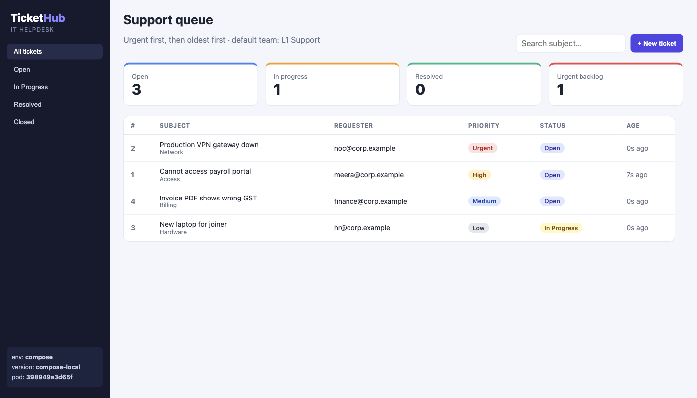

## 7. Kubernetes deployment

**Cluster.** kind cluster `hw-s21` (single node, [`kubernetes/cluster/kind-hw-s21.yaml`](kubernetes/cluster/kind-hw-s21.yaml)). Host ports 28080/28443 map to ingress-nginx, and 32080-32089 are reserved for NodePorts. Add-ons: ingress-nginx v1.15.1 (vendored manifest), metrics-server, kube-prometheus-stack and Argo CD.

**Raw manifests** ([`kubernetes/`](kubernetes/)), applied with plain `kubectl` into namespace `tickethub-raw`:

| File | Objects | Notes |
|---|---|---|
| `00-namespace.yaml` | Namespace | PSA `warn: restricted` |
| `01-configmap.yaml` | ConfigMap | non-secret config |
| `02-secret.yaml.example` | Secret (example only) | **not applied**. The real one is created with `kubectl create secret … $(openssl rand -hex 16)` |
| `03-postgres.yaml` | PVC (1Gi), Deployment (`Recreate`), Service | runs as uid 70, read-only root FS, `pg_isready` probes |
| `04-backend.yaml` | Deployment (migrate initContainer), Service | **startup** `/health`, **liveness** `/health`, **readiness** `/ready`; requests/limits; preStop drain |
| `05-frontend.yaml` | Deployment, Service | startup/liveness/readiness `/nginx-health` |
| `06-ingress.yaml` | Ingress | `/api` → backend, `/` → frontend; ports referenced by **name** |
| `07-hpa.yaml` | HPA (autoscaling/v2) | CPU 70% / memory 85%, 2-5 replicas, 60s scale-down window |
| `08-networkpolicy.yaml` | NetworkPolicy | only backend pods may open 5432 on postgres |

All app containers run with `runAsNonRoot`, `allowPrivilegeEscalation: false`, `readOnlyRootFilesystem: true`, `capabilities.drop: [ALL]` and the `RuntimeDefault` seccomp profile, and service-account tokens are not mounted.

```
$ kubectl apply -f kubernetes/00-namespace.yaml
$ kubectl -n tickethub-raw create secret generic tickethub-db --from-literal=DB_USER=tickethub --from-literal=DB_PASSWORD="$(openssl rand -hex 16)"
$ kubectl apply -f kubernetes/
configmap/tickethub-config created
persistentvolumeclaim/tickethub-postgres-data created
deployment.apps/tickethub-postgres created
...
horizontalpodautoscaler.autoscaling/tickethub-backend created
networkpolicy.networking.k8s.io/tickethub-postgres created

$ kubectl -n tickethub-raw get pods,endpoints,hpa,pvc
pod/tickethub-backend-644799b847-5nfks    1/1     Running   0          17s
pod/tickethub-backend-644799b847-rggmm    1/1     Running   0          17s
pod/tickethub-frontend-7f7659c547-cw8zw   1/1     Running   0          17s
pod/tickethub-frontend-7f7659c547-hts44   1/1     Running   0          17s
pod/tickethub-postgres-5dc6977fdf-gcn99   1/1     Running   0          17s
endpoints/tickethub-backend    10.244.0.40:8000,10.244.0.43:8000
endpoints/tickethub-frontend   10.244.0.41:8080,10.244.0.42:8080
endpoints/tickethub-postgres   10.244.0.44:5432
horizontalpodautoscaler.autoscaling/tickethub-backend   Deployment/tickethub-backend   cpu: <unknown>/70%, memory: 48%/85%   2   5   2
persistentvolumeclaim/tickethub-postgres-data   Bound    pvc-1e4a6c39-…   1Gi   RWO   standard

$ curl -s http://raw.tickethub.localtest.me:28080/api/info
{"service":"TicketHub API","version":"c9ba4c7","environment":"raw-manifests","pod":"tickethub-backend-644799b847-5nfks","default_team":"L1 Support"}
```

The first `/api` request right after `apply` returned a 503, because ingress-nginx had not yet synced the brand-new Ingress (its ADDRESS was still empty). Ten seconds later it worked. Both results are in [`evidence/k8s-03-raw-manifests.txt`](evidence/k8s-03-raw-manifests.txt), together with the migrate initContainer's log (`waiting for database ...` ×3, then both migrations).

**Secrets.** Neither git nor the chart's GitOps values contain a credential. The GitOps deployment uses `database.existingSecret: tickethub-db`, created out-of-band. In production you would use one of these instead of `kubectl create secret`:
- **Sealed Secrets**: `kubeseal` encrypts the Secret with the cluster's public key. The resulting `SealedSecret` is safe to commit, and only the in-cluster controller can decrypt it. This fits a pure-GitOps flow.
- **External Secrets Operator**: an `ExternalSecret` object (safe to commit) tells the operator to fetch the value from AWS Secrets Manager / SSM / Vault and create the Secret. The KMS key from the Terraform section additionally envelope-encrypts Secrets in etcd on EKS (`encryption_config`). `values-prod.yaml` is written for this setup.

**HPA scale-out** ([`evidence/k8s-04-hpa-scale-out.txt`](evidence/k8s-04-hpa-scale-out.txt)). I ran a busybox load generator (six parallel `wget` loops against `/api/tickets`) on the GitOps-managed release:

```
--- t+40s   tickethub-backend   Deployment/tickethub-backend   cpu: 28%/70%,  memory: 70%/85%   2   4   2
--- t+60s   tickethub-backend   Deployment/tickethub-backend   cpu: 852%/70%, memory: 73%/85%   2   4   4
--- t+240s  tickethub-backend   Deployment/tickethub-backend   cpu: 680%/70%, memory: 73%/85%   2   4   4
  Normal   SuccessfulRescale   3m38s   horizontal-pod-autoscaler  New size: 4; reason: cpu resource utilization (percentage of request) above target
```

It did **not** scale back down after the load stopped. CPU recommended 2 replicas, but memory recommended `ceil(4 × 68/85) = 4`, and the HPA takes the maximum. See [Lessons learned](#16-lessons-learned).

## 8. Helm deployment

The chart [`helm/tickethub`](helm/tickethub) templates everything in section 7, plus:
- `checksum/config` pod annotation, so a ConfigMap change rolls the pods.
- A Secret with a random password, kept across upgrades via `lookup` and `helm.sh/resource-policy: keep`. `database.existingSecret` skips it for GitOps.
- **ServiceMonitor**, **PrometheusRule** and a **Grafana dashboard ConfigMap**, rendered only when the Prometheus Operator CRDs exist (`.Capabilities.APIVersions.Has`). The same chart therefore installs on a bare CI kind cluster.
- No `replicas:` on the backend when the HPA is enabled, so Argo CD and the HPA don't fight over it.
- A `helm test` pod that checks `/ready`, `/api/stats` and the frontend.
- `values-dev.yaml` (1 replica) and `values-prod.yaml` (EKS: 3 replicas, gp3 PVC, TLS, existing secret).

Lifecycle on `hw-s21`, namespace `tickethub-helm` ([`helm-01`](evidence/helm-01-install.txt), [`helm-02`](evidence/helm-02-verify-upgrade-rollback.txt)):

```
$ helm upgrade --install tickethub helm/tickethub -n tickethub-helm --create-namespace -f helm/tickethub/values-dev.yaml \
    --set image.backend.tag=c9ba4c7… --set image.frontend.tag=c9ba4c7… --set ingress.host=helm.tickethub.localtest.me --wait
STATUS: deployed
REVISION: 1

$ helm test tickethub -n tickethub-helm --logs
Phase:          Succeeded
POD LOGS: tickethub-smoke-test (smoke)
{"status":"READY"}{"total":0,"open":0,"in_progress":0,"resolved":0,"closed":0,"urgent_open":0}ok

# rev 2: config change; rev 3: deliberately bad image tag
$ helm upgrade tickethub ... --set image.backend.tag=does-not-exist --wait --timeout 60s
Error: UPGRADE FAILED: resource Deployment/tickethub-helm/tickethub-backend not ready. status: InProgress, message: Pending termination: 1

$ helm rollback tickethub 2 -n tickethub-helm --wait
$ helm history tickethub -n tickethub-helm
REVISION  STATUS      CHART            DESCRIPTION
1         superseded  tickethub-1.0.1  Install complete
2         superseded  tickethub-1.0.1  Upgrade complete
3         failed      tickethub-1.0.1  Upgrade "tickethub" failed: resource Deployment/tickethub-helm/tickethub-backend not ready...
4         deployed    tickethub-1.0.1  Rollback to 2

$ curl -s http://helm.tickethub.localtest.me:28080/api/info
{"service":"TicketHub API","version":"c9ba4c7","environment":"dev","pod":"tickethub-backend-78dbbb7457-7hkmm","default_team":"Service-Desk-L2"}
```

`maxUnavailable: 0` kept the old pod serving throughout the failed upgrade. During the revision-2 upgrade, however, a `curl` returned **502**. I added a `preStop` sleep (chart 1.0.2) and measured it with a request loop running during two rollouts ([`helm-03`](evidence/helm-03-zero-downtime-rollout.txt)):

```
# rollouts that replaced pods WITHOUT the hook (introducing it):   119 200 / 1 502   (request #14, during rev 5)
# rollouts once every pod carried preStop:                         120 200
```

`helm uninstall` keeps the PVC and the generated Secret because of the `keep` policy ([`helm-04`](evidence/helm-04-uninstall.txt)).

## 9. Terraform infrastructure

[`terraform/`](terraform/) describes the AWS infrastructure that would host the production deployment (`values-prod.yaml`):

| File | Resources |
|---|---|
| `network.tf` | VPC `10.21.0.0/16`, **2 public + 2 private subnets** in 2 AZs (EKS/ELB tags), IGW, EIP + NAT gateway, route tables, VPC flow logs → S3 |
| `security_groups.tf` | ALB SG (80/443 from the internet), node SG (NodePorts only from the ALB SG, egress tcp/443 + intra-VPC) |
| `iam.tf` | EKS cluster role, node role + managed policy attachments |
| `eks.tf` | KMS key (rotation on), **EKS cluster** (private API endpoint, Secrets envelope encryption, control-plane logs), **managed node group** t3.medium 2-4 |
| `ecr.tf` | 2 ECR repos: immutable tags, scan-on-push, KMS, lifecycle policy |
| `s3.tf` | artifacts bucket: versioning, KMS SSE, public-access block, lifecycle |
| `bootstrap/` | the remote-state bucket (versioned, KMS) the main stack uses as its S3 backend with native `use_lockfile` locking |
| `providers.tf` | one provider block for both targets. `aws_endpoint=""` means real AWS; a URL routes every service to an emulator |

**Target used.** No AWS account was used. LocalStack, the suggested emulator, now refuses to start without an auth token ([`evidence/terraform-00-localstack-auth-required.txt`](evidence/terraform-00-localstack-auth-required.txt): `License activation failed! … set the LOCALSTACK_AUTH_TOKEN`). As instructed, I fell back to **motoserver/moto** in container `hw-localstack-s21` on host port **4567**, with `MOTO_IAM_LOAD_MANAGED_POLICIES=true` so the AWS-managed EKS policies exist. `terraform.tfvars.example` holds no credentials. The emulator accepts the dummy `test` keys, and `*.tfvars`, state and `.terraform/` are git-ignored.

```
$ cd terraform/bootstrap && terraform init && terraform apply -auto-approve -var aws_endpoint=http://localhost:4567
Apply complete! Resources: 5 added, 0 changed, 0 destroyed.
state_bucket = "tickethub-tfstate-24bcs10151"

$ cd .. && terraform init -backend-config=backend-emulator.hcl
Successfully configured the backend "s3"! ...
- Installed hashicorp/aws v6.67.0 (signed by HashiCorp)
$ terraform fmt -check -recursive && terraform validate
Success! The configuration is valid.

$ terraform plan -out=tfplan
Plan: 43 to add, 0 to change, 0 to destroy.
$ terraform apply tfplan
aws_eks_cluster.main: Creation complete after 2s [id=tickethub-dev-eks]
aws_eks_node_group.main: Creation complete after 0s [id=tickethub-dev-eks:tickethub-dev-workers]
Apply complete! Resources: 43 added, 0 changed, 0 destroyed.
```

Verified with the AWS CLI against the same API ([`terraform-05`](evidence/terraform-05-output-verify.txt)):

```
|  tickethub-dev-private-ap-south-1a |  10.21.128.0/20  |  ap-south-1a |
|  tickethub-dev-public-ap-south-1a  |  10.21.0.0/20    |  ap-south-1a |
|  tickethub-dev-public-ap-south-1b  |  10.21.16.0/20   |  ap-south-1b |
|  tickethub-dev-private-ap-south-1b |  10.21.144.0/20  |  ap-south-1b |
$ aws --endpoint-url http://localhost:4567 eks describe-cluster --name tickethub-dev-eks --query 'cluster.{...}'
{ "name": "tickethub-dev-eks", "version": "1.33", "status": "ACTIVE", "publicEndpoint": false, "encryptedSecrets": ["secrets"] }
$ aws ... eks describe-nodegroup ...
{ "status": "ACTIVE", "instanceTypes": ["t3.medium"], "scaling": {"minSize": 2, "maxSize": 4, "desiredSize": 2}, "subnets": 2 }
|  tickethub/frontend |  IMMUTABLE  |  True |
|  tickethub/backend  |  IMMUTABLE  |  True |
$ aws --endpoint-url http://localhost:4567 s3 ls s3://tickethub-tfstate-24bcs10151/dev/
2026-10-07 19:17:59      78225 terraform.tfstate          <- remote state really lives in S3
```

```
$ terraform destroy -auto-approve
Destroy complete! Resources: 43 destroyed.
```

Two emulator limitations showed up, and I am reporting them rather than hiding them:
- **Drift check** ([`terraform-06`](evidence/terraform-06-drift-check.txt)): a plan straight after apply is not empty (`exit code: 2`). moto returns a `remote_access { ec2_ssh_key = "eksKeypair" }` block that was never requested, which forces node-group replacement, and it prefixes security-group references with the account id (`"123456789012/sg-…" -> "sg-…"`). Both are emulator artefacts, not configuration drift.
- **Bootstrap destroy**: deleting the versioned state bucket loops forever. Its moto log shows `AttributeError: 'FakeDeleteMarker' object has no attribute 'dispose'` on the delete markers that `use_lockfile` leaves behind. I interrupted it after ~9 minutes. Everything else, including the KMS key, was destroyed, and the leftover emulated bucket disappeared with the container ([`terraform-07`](evidence/terraform-07-destroy.txt)).

The first apply attempt also failed for two other emulator reasons: the managed policies weren't loaded, and flow logs to a bucket *prefix* weren't supported. Those were fixed with the moto flag and by logging to the bucket root.

## 10. CI/CD pipeline

Workflow: [`.github/workflows/s21-final-devops-project.yml`](../../.github/workflows/s21-final-devops-project.yml). It triggers on `push` to `main`, on `pull_request` (filtered by `paths:` to this folder and the workflow file) and on `workflow_dispatch`.

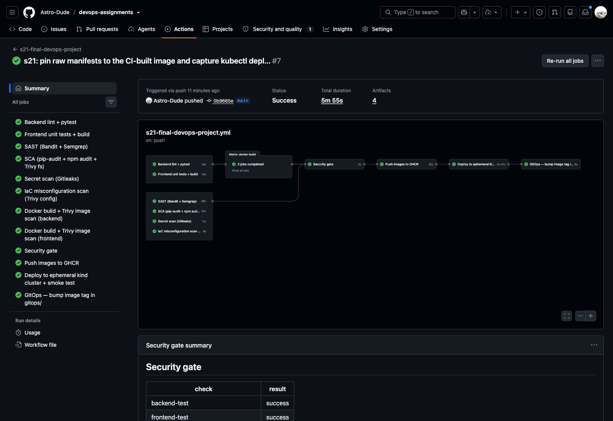

| Job | What it does |
|---|---|
| Backend lint + pytest | `ruff check`, `ruff format --check`, `pytest -v --junitxml` (artifact) |
| Frontend unit tests + build | `npm ci`, `npm test`, `npm run build` (artifact) |
| SAST / SCA / Secret scan / IaC scan | see section 11 |
| Docker build + Trivy (matrix backend, frontend) | `docker build --build-arg APP_VERSION=<sha7>`, Trivy gate, CycloneDX SBOM, `docker save` artifact |
| Security gate | `if: always()`; fails unless **every** upstream job is `success`; writes a results table to the run summary |
| Push images to GHCR | `packages: write`, login with `GITHUB_TOKEN`, push **`:<full git sha>` only** (never `:latest`) |
| Deploy to ephemeral kind + smoke test | `helm/kind-action` creates a cluster in the runner, installs ingress-nginx, creates a GHCR pull secret from `GITHUB_TOKEN` and a random DB secret, runs `helm upgrade --install --wait` with the just-pushed SHA, asserts `/api/info.version == sha7`, POSTs a ticket and checks the UI **through the Ingress**, then runs `helm test` |
| GitOps — bump image tag | `contents: write`; `yq` writes the SHA into `gitops/environments/kind/values.yaml`; commits as `github-actions[bot]` with `[skip ci]`; `git pull --rebase` + retry loop because other agents push to `main` concurrently |

**No loops:** three mechanisms keep the bot commit from re-triggering the pipeline. The `[skip ci]` marker, the `!DevOps/21-final-devops-project/gitops/**` negative path filter, and the fact that pushes made with `GITHUB_TOKEN` never start new workflow runs. `concurrency` (no cancel-in-progress) serialises runs so that bumps land in commit order.

Smoke-test step of run 37636382434 ([full key-step log](evidence/ci-01-run-37636382434-key-steps.txt)):

```
{"service":"TicketHub API","version":"0b9665e","environment":"dev","pod":"tickethub-backend-6f7d6f4759-wb7vg","default_team":"L1 Support"}
true
{ "id": 1, "subject": "CI smoke test ticket", ... "status": "OPEN", "team": "L1 Support", ... }
true
UI and API reachable through ingress-nginx
```
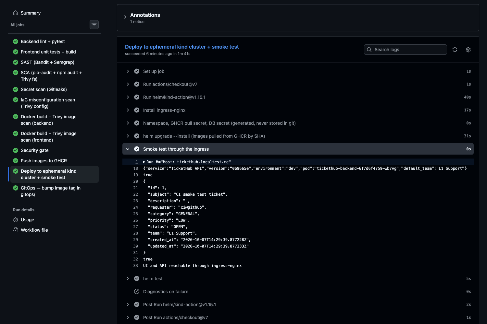

Run history. Every red run was a real problem, fixed in the next commit:

| Run | Result | Cause → fix |
|---|---|---|
| 37630746970 | ✗ deploy | `kubectl wait job --all` found no jobs (ingress-nginx admission jobs are TTL-deleted) → wait on the admission Service endpoints instead |
| 37633166811 | ✗ **security gate** | Gitleaks `generic-api-key` on an evidence file → triaged as a false positive, see section 11 |
| 37634927186, 37635095602 | ✗ deploy | `helm test` passed, but `--logs` failed because `hook-succeeded` had already deleted the test pod → keep the pod (`before-hook-creation` only) |
| 37635560459, 37636382434, 37638964461, 37639170118 | ✓ all 12 jobs | each one ended with a GitOps bump commit |

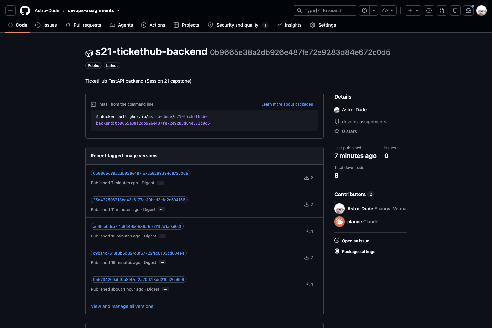

The GHCR packages became **public** automatically (they inherit the visibility of the public source repo), so the kind cluster pulls them anonymously. CI still uses a pull secret so that it would also work with private packages.

## 11. DevSecOps implementation

| Control | Tool | Scope | Fails on |
|---|---|---|---|
| **SAST** | Bandit | `application/backend/app` | medium+ severity |
| **SAST** | Semgrep (`p/python`, `p/javascript`, `p/react`, `p/dockerfile`) | `application/`, `docker/` | any finding (`--error`) |
| **SCA** | pip-audit `--strict` | `requirements.txt` | any known vuln |
| **SCA** | npm audit | `package-lock.json` | high+ |
| **SCA** | Trivy fs | lockfiles | fixable HIGH/CRITICAL |
| **Secret scanning** | Gitleaks 8.30 (`dir` + `git --log-opts -- <folder>`) | this folder's working tree **and** its git history | any leak not allowlisted in [`security/gitleaks.toml`](security/gitleaks.toml) |
| **IaC scanning** | Trivy config | Dockerfiles, raw manifests, Helm chart (rendered), Terraform | HIGH/CRITICAL not in [`security/trivyignore.yaml`](security/trivyignore.yaml) |
| **Container scanning** | Trivy image | both built images | fixable HIGH/CRITICAL (`--ignore-unfixed`) |
| SBOM | Trivy CycloneDX | both images | n/a (artifact) |
| **Security gate** | workflow job | all of the above + tests | anything ≠ `success` |

What these controls actually caught:

1. **Container scan (local, before the first push).** The first backend image had 4 HIGH CVEs, none in my dependencies. They were in **pip's own vendored libraries** (`msgpack` GHSA-6v7p-g79w-8964, `urllib3` CVE-2026-97687/97689, `setuptools` CVE-2025-47273), found through `pip/_vendor` in the runtime venv. pip is not needed at runtime, so the Dockerfile now uninstalls it, and the scan is clean ([`security-01`](evidence/security-01-trivy-local-before-after.txt)):
   ```
   Total: 4 (HIGH: 4, CRITICAL: 0)    ...    exit code: 1
   # after removing pip from the runtime virtualenv:
   │ tickethub-backend:latest (alpine 3.24.2) │ alpine │ 0 │ - │      exit code: 0
   ```
   In CI both images now report `0` vulnerabilities (Alpine 3.24.2 / 3.23.4, Python packages clean). A clean result means no *fixable* HIGH/CRITICAL CVE in OS packages or language dependencies at scan time. It is not a guarantee: unfixed CVEs are deliberately ignored, and new CVEs appear daily, which is why every build rescans.
   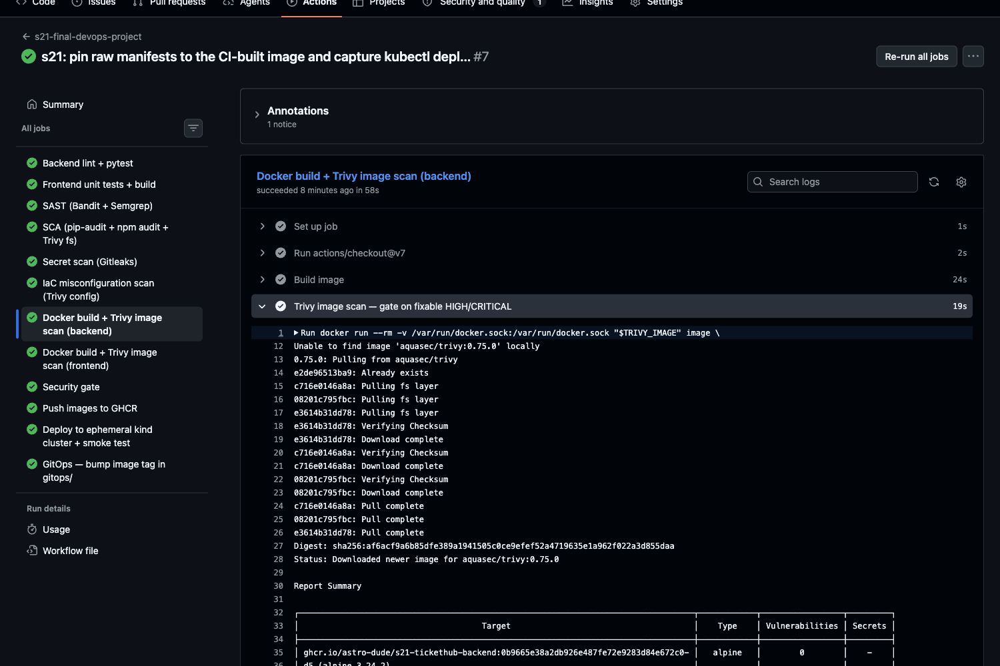
2. **IaC scan (local).** It initially failed with CRITICAL **AWS-0040/0041** (public EKS API endpoint), CRITICAL **AWS-0104** (unrestricted node egress), HIGH **AWS-0132** (state bucket without a customer-managed key) and HIGH **KSV-0014** (postgres root FS writable). Fixes: a private-only EKS endpoint, a KMS key for the state bucket, postgres running as uid 70 with a read-only root FS plus emptyDirs for its socket and `/tmp`, and node egress narrowed to tcp/443 plus intra-VPC. The one remaining egress rule is accepted in `trivyignore.yaml` with a written justification. The vendored upstream ingress-nginx manifest is excluded from the scan.
3. **Secret scan (CI run 37633166811).** The gate **closed**: `Gate CLOSED - failed/skipped: secret-scan`. The finding was `remote_access_security_group_id = "sg-yrzglhnyi9rkjkjql"` in a Terraform transcript, a fake security-group id generated by the emulator. I verified it was not a secret, then added a narrow allowlist regex `^sg-[a-z0-9]{17}$` rather than excluding the evidence directory ([`security-02`](evidence/security-02-gitleaks-false-positive.txt)).

## 12. Monitoring

Stack: kube-prometheus-stack, slimmed down for a shared laptop ([`monitoring/kube-prometheus-stack-values.yaml`](monitoring/kube-prometheus-stack-values.yaml)). The chart discovers ServiceMonitors and rules from every namespace, the Grafana sidecar loads dashboards from labelled ConfigMaps, and the control-plane scrapers are disabled because kind doesn't expose them.

**Metrics** (custom, [`app/observability.py`](application/backend/app/observability.py)):
- `tickethub_http_requests_total{method,route,status}` and `tickethub_http_request_duration_seconds` (histogram), labelled by **route template** (e.g. `/api/tickets/{ticket_id}`) rather than raw path, so label cardinality stays bounded.
- `tickethub_tickets_created_total{priority,category}`.
- `tickethub_tickets_open{priority}`, a business gauge read from the database at scrape time by a custom collector.

**Logs.** Each request is logged as one JSON line with method, path, status, duration, environment and version. `kubectl logs` / `stern` can filter it directly, and Loki could ingest it without a parser.

**Alerts** ([`helm/tickethub/files/alert-rules.yaml`](helm/tickethub/files/alert-rules.yaml), shipped as a PrometheusRule): `TicketHubBackendDown` (critical), `TicketHubHighErrorRate` (>5% 5xx), `TicketHubSlowRequests` (p95 > 500ms), `TicketHubPodRestarting`, and `TicketHubUrgentBacklog` (more than 3 URGENT tickets open). For a demo I raised three urgent tickets on top of the existing one. The alert fired and reached Alertmanager ([`monitoring-03`](evidence/monitoring-03-metrics-targets-alerts.txt)):

```
$ curl -s 'localhost:29090/api/v1/targets?state=active' | jq -r '... select(.labels.namespace=="tickethub") ...'
tickethub-backend	tickethub-backend-658bbbfc4-db66v	up	http://10.244.0.51:8000/metrics
tickethub-backend	tickethub-backend-658bbbfc4-mzptz	up	http://10.244.0.53:8000/metrics

$ curl -s 'localhost:29090/api/v1/rules?type=alert' | jq -r '...'
TicketHubBackendDown	inactive	critical
TicketHubHighErrorRate	inactive	warning
TicketHubSlowRequests	inactive	warning
TicketHubPodRestarting	inactive	warning
TicketHubUrgentBacklog	firing	warning

$ curl -s localhost:29093/api/v2/alerts | jq -r '...'
TicketHubUrgentBacklog	active	4 URGENT tickets are open (threshold 3)

$ kubectl -n tickethub logs deploy/tickethub-backend --tail=4
{"ts": "2026-10-07T14:32:17", "level": "INFO", "logger": "tickethub", "msg": "request", "env": "kind-gitops", "version": "0b9665e", "method": "GET", "path": "/api/tickets", "status": 200, "duration_ms": 10.21}
```

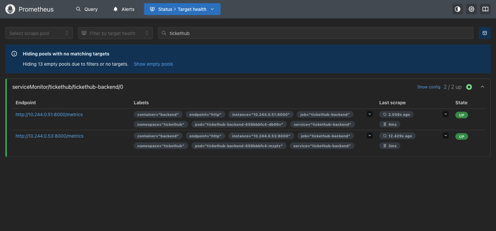
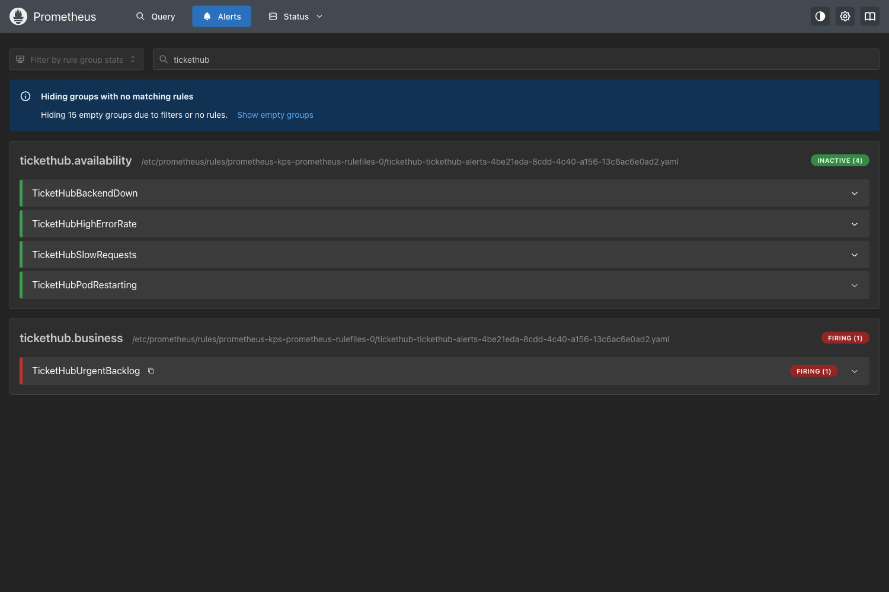

**Grafana dashboard** "TicketHub — Service Overview" ([JSON](helm/tickethub/files/grafana-dashboard.json)). It is deployed by the chart, so it is versioned and reconciled with the app. Panels: request rate, 5xx ratio, urgent backlog, ready pods, request rate by route, p50/p95 latency, open tickets by priority, responses by status, CPU and memory per pod, and HPA replicas. The screenshot was taken during the load test: ~397 req/s, the HPA at 4/4 replicas, 0% errors and p95 rising to ~60 ms before settling.

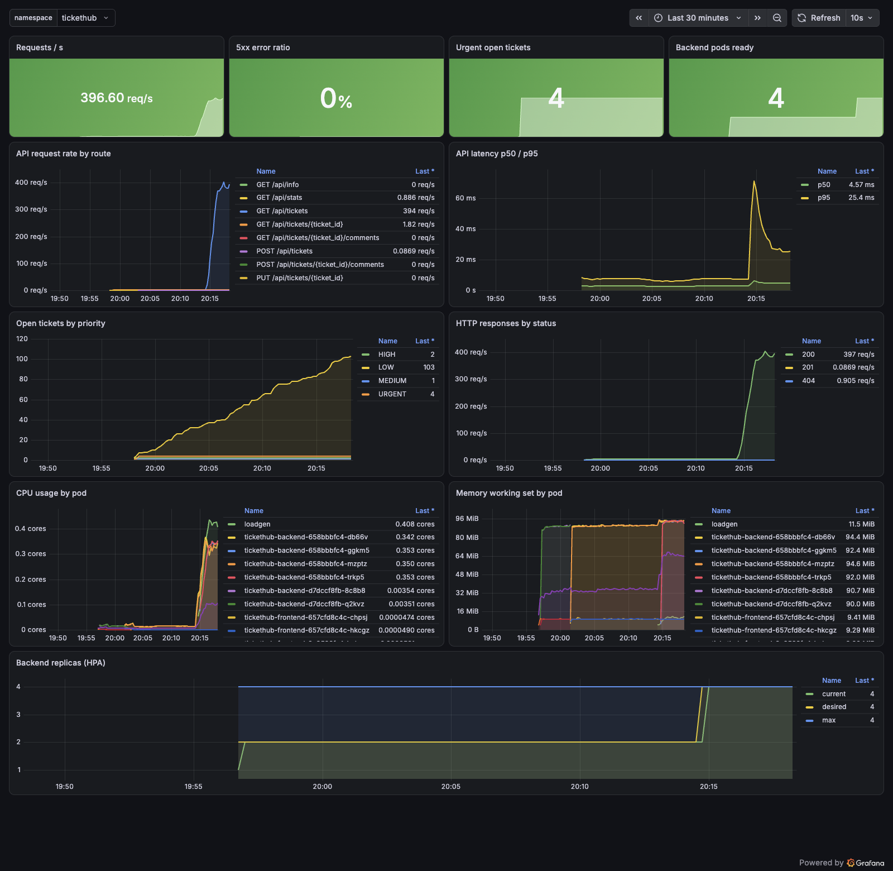

## 13. GitOps

* **Source of truth:** [`gitops/environments/kind/values.yaml`](gitops/environments/kind/values.yaml), which holds image tags and environment overrides and is written only by CI.
* **Application:** [`gitops/argocd/application.yaml`](gitops/argocd/application.yaml) is a multi-source Argo CD Application. Source 1 is the chart path `helm/tickethub`. Source 2 is this repo as `$values`, providing the values file above. It uses automated sync with `prune` and `selfHeal`, and `CreateNamespace`.
* **Argo CD** ([`gitops/argocd/argocd-values.yaml`](gitops/argocd/argocd-values.yaml)): dex, notifications and the ApplicationSet controller are disabled to keep it lean, and `timeout.reconciliation: 60s` makes it poll Git every minute.

Flow observed end to end ([`gitops-02`](evidence/gitops-02-application.txt), [`gitops-03`](evidence/gitops-03-ci-bump-synced.txt)):

```
# CI run 37636382434 (commit 0b9665e) finished green; its gitops-bump job pushed:
4e92794 github-actions[bot] s21 gitops: deploy tickethub 0b9665e to kind [skip ci]
-    tag: "25d422506213bc43a6177ea19bdd3efd2c504156"
+    tag: "0b9665e38a2db926e487fe72e9283d84e672c0d5"

# Argo CD noticed the commit and synced:
$ kubectl -n tickethub get deploy -o custom-columns='NAME:.metadata.name,IMAGE:.spec.template.spec.containers[0].image'
tickethub-backend    ghcr.io/astro-dude/s21-tickethub-backend:0b9665e38a2db926e487fe72e9283d84e672c0d5
tickethub-frontend   ghcr.io/astro-dude/s21-tickethub-frontend:0b9665e38a2db926e487fe72e9283d84e672c0d5
$ kubectl -n tickethub get rs -l app.kubernetes.io/name=tickethub-backend
tickethub-backend-658bbbfc4   2         2         2       42s
tickethub-backend-d7dccf8fb   0         0         0       5m20s
$ curl -s http://tickethub.localtest.me:28080/api/stats    # data survived the rollout (PVC)
{"total":34,"open":32,"in_progress":1,"resolved":1,"closed":0,"urgent_open":4}

# two more green runs later, Argo CD's own sync history:
0 2026-10-07T14:26:34Z c5e5eef…   (25d4225)
1 2026-10-07T14:31:11Z 2964e8f…   (0b9665e)
2 2026-10-07T14:48:08Z a11c1a6…   (a175793)
3 2026-10-07T14:53:20Z b8e7556…   (4350724)
tickethub   Synced        Healthy
{"service":"TicketHub API","version":"4350724","environment":"kind-gitops",...}
```

No one ran `kubectl apply` or `helm upgrade` against the `tickethub` namespace after the Application was created. Every image change arrived through Git.

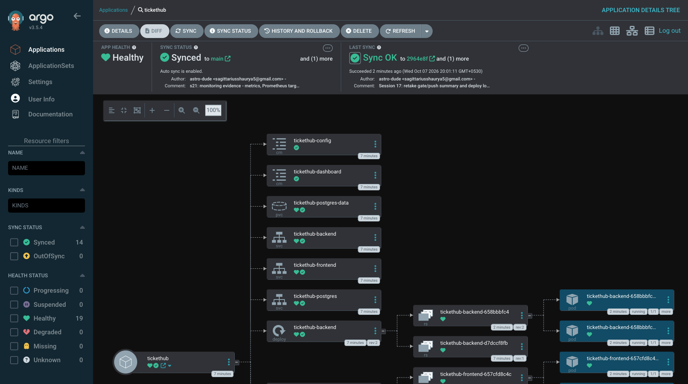

## 14. Troubleshooting

The full challenge is in **[`troubleshooting/README.md`](troubleshooting/README.md)**. I planted seven faults in [`broken-stack.yaml`](troubleshooting/broken-stack.yaml), and each was identified, investigated, root-caused, fixed and verified with real output. The final state is [`fixed-stack.yaml`](troubleshooting/fixed-stack.yaml).

| # | Fault | Symptom |
|---|---|---|
| 1 | Secret key `password` vs `DB_PASSWORD` | `CreateContainerConfigError` |
| 2 | `:latest` tag that CI never publishes | `ImagePullBackOff` (NotFound) |
| 3 | ConfigMap missing `DB_HOST` | initContainer loops, app uses `localhost` |
| 4 | readiness probe `/readyz` | Running, 0/1 Ready, 404 in access log |
| 5 | Service `targetPort: 80` (nginx on 8080) | 502; then a *stale ingress-nginx backend* even after the fix |
| 6 | Ingress → Service port 8080 (Service has 8000) | 503 on `/api` |
| 7 | HPA without resource requests | `cpu: <unknown>`, `missing request for cpu` |

The same file also documents five **real** incidents found while building the project: frontend OOMKill from nginx auto workers, a Grafana OOM/CPU spin, a 502 during rollout, an HPA memory target too close to idle usage, and the Gitleaks false positive.

## 15. Screenshots

| | |
|---|---|
| Architecture | [00-architecture.png](screenshots/00-architecture.png) |
| App on docker compose | [01-app-docker-compose.png](screenshots/01-app-docker-compose.png) |
| App via Ingress (GitOps-managed release) | [02-app-via-ingress.png](screenshots/02-app-via-ingress.png) |
| GitHub Actions run graph + security gate summary | [03-github-actions-run.png](screenshots/03-github-actions-run.png) |
| GHCR package with SHA tags | [04-ghcr-package.png](screenshots/04-ghcr-package.png) |
| Argo CD application tree (Synced / Healthy) | [05-argocd-application.png](screenshots/05-argocd-application.png) |
| Grafana dashboard during load test | [06-grafana-dashboard.png](screenshots/06-grafana-dashboard.png) |
| Prometheus alerts (UrgentBacklog firing) | [07-prometheus-alerts.png](screenshots/07-prometheus-alerts.png) |
| Prometheus targets (both backend pods UP) | [08-prometheus-targets.png](screenshots/08-prometheus-targets.png) |
| CI Trivy image scan step | [09-ci-trivy-image-scan.png](screenshots/09-ci-trivy-image-scan.png) |
| CI kind smoke test step | [10-ci-kind-smoke-test.png](screenshots/10-ci-kind-smoke-test.png) |

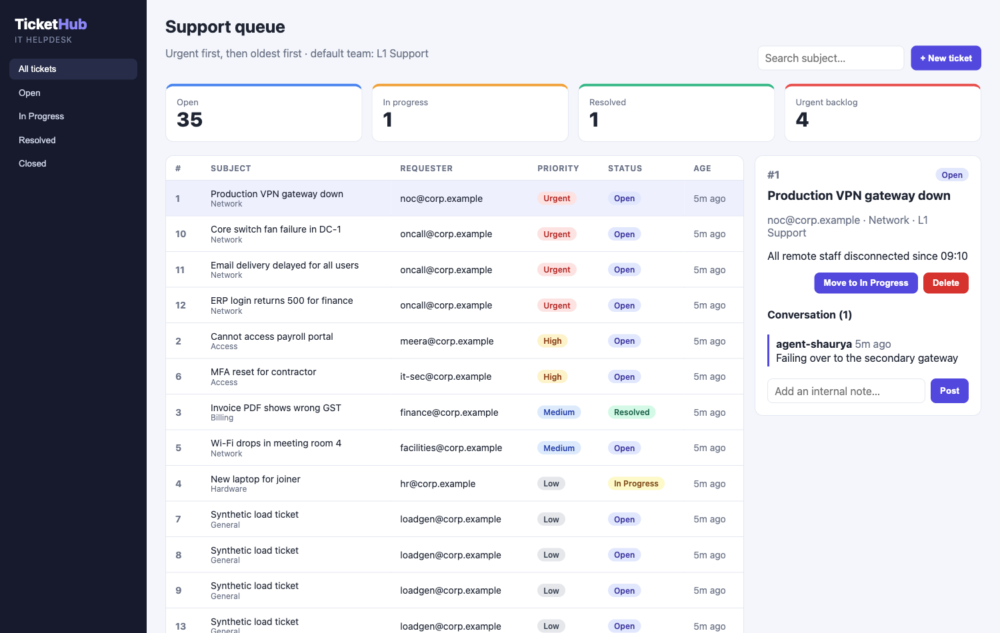

## 16. Lessons learned

1. **A security gate is only useful if it can close.** It closed once for real (Gitleaks). The correct response was a *narrow* allowlist after triage, not muting the scanner or excluding the folder.
2. **Your CVEs are often not in your code.** The four HIGH findings came from pip's vendored libraries, a tool that had no business being in the runtime image. Multi-stage builds help only if you also delete what the build stage left behind.
3. **"Auto" settings read the host, not the cgroup.** nginx `worker_processes auto` and the Go runtime in Grafana both sized themselves to the 15-CPU VM instead of the container limit, and both ended up OOM-killed. Pin worker counts / `GOMAXPROCS`.
4. **Readiness ≠ liveness ≠ startup.** `/health` (process alive) and `/ready` (DB reachable) are separate endpoints for a reason. Pointing liveness at `/ready` would restart healthy pods whenever the database blips.
5. **Zero-downtime rollouts need more than `maxUnavailable: 0`.** Without a short `preStop` drain, ingress-nginx can still route to a terminating pod. I measured this: 1 failed request out of 120, then 0 out of 120 with the drain.
6. **HPA memory targets don't scale back down for Python.** The interpreter keeps its heap after the load spike, so the memory recommendation (`ceil(4×68/85)=4`) pinned the deployment at 4 replicas long after CPU had dropped to 16%. For this service CPU (or request rate) should be the only scaling signal. I'm leaving it in the chart as a documented finding rather than quietly removing it.
7. **Immutable SHA tags make every step traceable.** The UI shows the commit, the GHCR tag is the commit, and the Argo CD history maps each sync to the bot commit that named it. The `:latest` fault in the challenge was found and fixed in two commands *because* only SHA tags exist.
8. **When the objects are right and traffic isn't, ask the controller.** In issue 5 the Service and EndpointSlice were correct, but ingress-nginx's dynamic backend still held the old `targetPort`.
9. **Emulators are useful but imperfect.** LocalStack now needs a licence. moto worked for 43 resources, including EKS, but produced fake drift and could not empty a versioned bucket. A real AWS account (or plan-only against real APIs) is needed before trusting `plan` output fully.
10. **Shared machines need lean defaults.** The laptop crashed once while several agents each ran a monitoring + Argo stack. Requests/limits on everything, disabled unneeded components (dex, notifications, ApplicationSets, control-plane scrapers), and tearing down namespaces as soon as their evidence was captured kept this project at roughly 4-6 GiB.

## 17. What was substituted, and why

| Spec / rubric item | What I did instead | Reason |
|---|---|---|
| Real AWS VPC + EKS (screenshots of the AWS console) | Same Terraform applied to an AWS API emulator (moto) on port 4567, verified with the AWS CLI | No AWS account; LocalStack now requires an auth token |
| EKS as the runtime cluster | kind cluster `hw-s21` (local) and an ephemeral kind cluster in CI | Same reason. `values-prod.yaml` and `outputs.kubeconfig_command` show the EKS path |
| Live presentation | This README, the CI runs and the Argo CD history | Written submission |
| Terraform drift-free re-plan / bootstrap destroy | Documented emulator bugs (fake `remote_access`, delete-marker crash) | moto limitations, not configuration problems |

All local resources (kind cluster `hw-s21`, emulator container `hw-localstack-s21`, port-forwards) were deleted after the evidence was captured.
